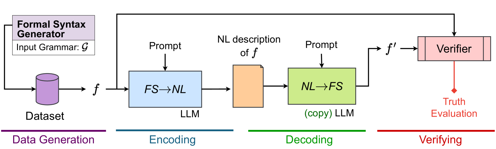
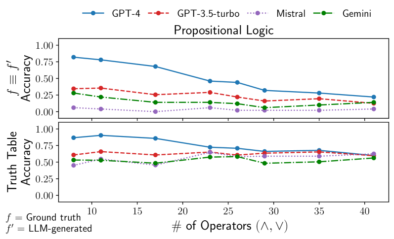
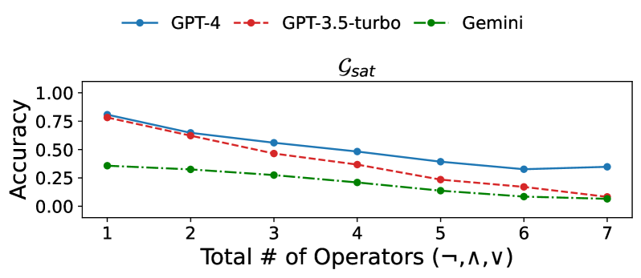
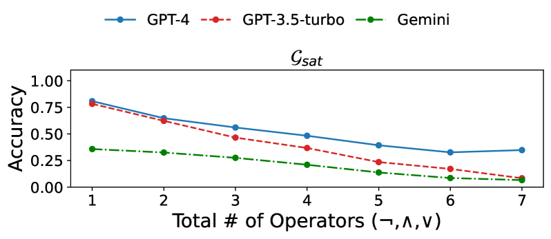

# 大型语言模型能否进行正式的交流？本研究旨在自动评估这些模型在翻译及解释正式规范方面的表现。

发布时间：2024年03月27日

`LLM应用` `软件开发`

> Can LLMs Converse Formally? Automatically Assessing LLMs in Translating and Interpreting Formal Specifications

# 摘要

> 利益相关者习惯于用自然语言阐述系统需求，接着由专业人士转换成规范的代码，这往往导致设计成本上升。本研究探讨了大型语言模型（LLMs）在自然语言描述与正式规范之间转换的能力。以往的研究多聚焦于LLMs生成代码等正式语法的性能，但这些实验往往依赖于人工数据集和特定的训练集问题。我们提出了一种新方法，通过结合两个LLM副本和一款现成验证器，无需额外人工参与即可自动评估模型的翻译能力。通过利用语言语法自动生成数据集，我们对这一转换任务的准确性进行了实证分析。结果显示，即使是最先进的LLMs也难以胜任这一任务，这限制了它们在复杂系统设计领域的应用潜力。

> Stakeholders often describe system requirements using natural language which are then converted to formal syntax by a domain-expert leading to increased design costs. This paper assesses the capabilities of Large Language Models (LLMs) in converting between natural language descriptions and formal specifications. Existing work has evaluated the capabilities of LLMs in generating formal syntax such as source code but such experiments are typically hand-crafted and use problems that are likely to be in the training set of LLMs, and often require human-annotated datasets. We propose an approach that can use two copies of an LLM in conjunction with an off-the-shelf verifier to automatically evaluate its translation abilities without any additional human input. Our approach generates formal syntax using language grammars to automatically generate a dataset. We conduct an empirical evaluation to measure the accuracy of this translation task and show that SOTA LLMs cannot adequately solve this task, limiting their current utility in the design of complex systems.

[Arxiv](https://arxiv.org/abs/2403.18327)