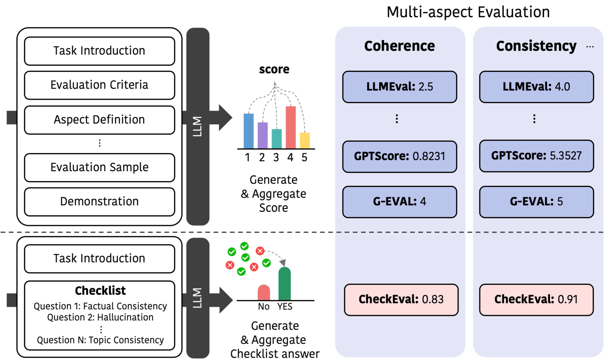
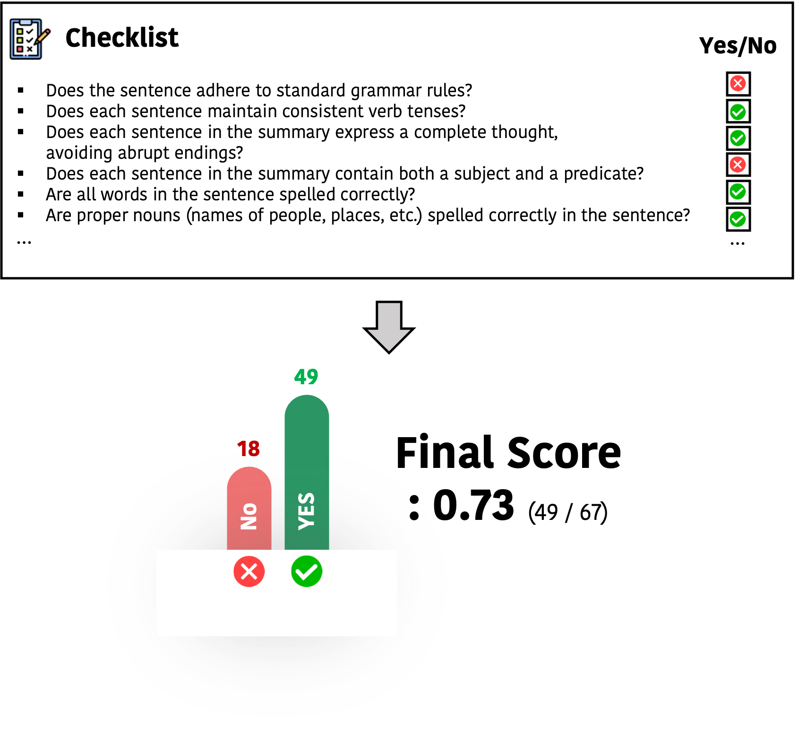

# CheckEval：借助大型语言模型，通过清单实现的强效评估框架

发布时间：2024年03月27日

`LLM理论` `评估框架` `大型语言模型`

> CheckEval: Robust Evaluation Framework using Large Language Model via Checklist

# 摘要

> 我们推出了CheckEval，这是一种创新的大型语言模型评估框架，旨在解决现有评估方法中的不确定性和不稳定性问题。CheckEval通过细化评估指标，为每个子项制定布尔问题清单，从而使评估流程更为简化和易于理解。这一方法通过专注于明确的评估维度，不仅提高了评估过程的透明度，还大幅提升了结果的稳健性和可信度。通过SummEval基准测试的针对性案例分析，CheckEval与人类的评判呈现出强烈的相关性，并展现出高度的注释者一致性。这些成果证明了CheckEval在进行客观、灵活和精确评估方面的高效性。CheckEval提供了一个可定制和互动性强的框架，为LLMs在评估领域的应用树立了新的标杆，满足了该领域不断演进的需求，并为将来基于LLM的评估提供了明确的方法论。

> We introduce CheckEval, a novel evaluation framework using Large Language Models, addressing the challenges of ambiguity and inconsistency in current evaluation methods. CheckEval addresses these challenges by dividing evaluation criteria into detailed sub-aspects and constructing a checklist of Boolean questions for each, simplifying the evaluation. This approach not only renders the process more interpretable but also significantly enhances the robustness and reliability of results by focusing on specific evaluation dimensions. Validated through a focused case study using the SummEval benchmark, CheckEval indicates a strong correlation with human judgments. Furthermore, it demonstrates a highly consistent Inter-Annotator Agreement. These findings highlight the effectiveness of CheckEval for objective, flexible, and precise evaluations. By offering a customizable and interactive framework, CheckEval sets a new standard for the use of LLMs in evaluation, responding to the evolving needs of the field and establishing a clear method for future LLM-based evaluation.

[Arxiv](https://arxiv.org/abs/2403.18771)