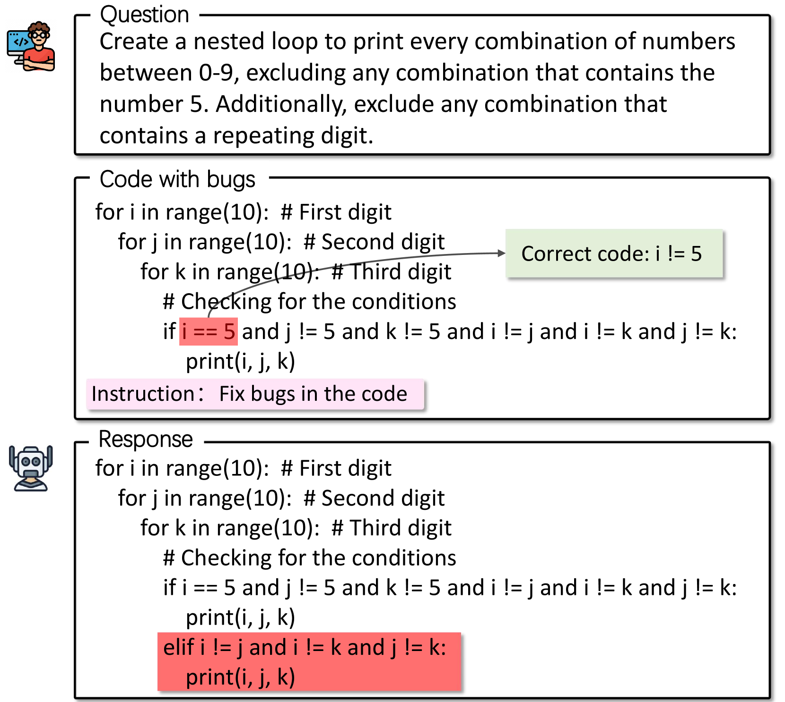
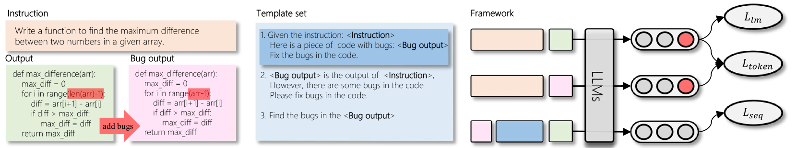
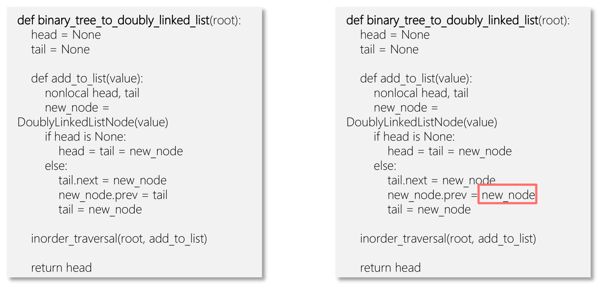
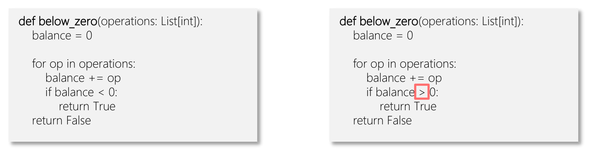
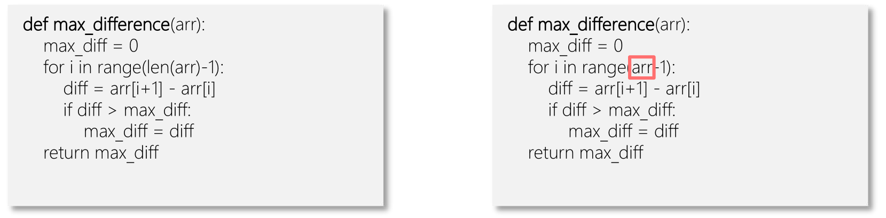

# 针对大型语言模型的代码比较调整技术

发布时间：2024年03月27日

`LLM应用` `软件工程` `代码审查`

> Code Comparison Tuning for Code Large Language Models

# 摘要

> 本文介绍了代码比较调整（CCT），这是一种针对大型代码语言模型（Code LLMs）的调整方法，旨在更有效地处理细微的代码错误。我们通过在指令调整中加入比较机制，让模型能够在标记和序列层面精准捕捉代码的微小差异。为了细致比较原始代码与含有人为引入错误的版本，我们采用了标记级偏好损失方法。同时，我们还合并代码片段，形成新的指令调整样本，以便在序列层面进行比较，从而提升模型修正错误的技能。在HumanEvalFix基准测试中，CCT在首次通过分数上比传统指令调整高出最多4分，充分证明了我们方法的优越性。

> We present Code Comparison Tuning (CCT), a simple and effective tuning method for code large language models (Code LLMs) to better handle subtle code errors. Specifically, we integrate the concept of comparison into instruction tuning, both at the token and sequence levels, enabling the model to discern even the slightest deviations in code. To compare the original code with an erroneous version containing manually added code errors, we use token-level preference loss for detailed token-level comparisons. Additionally, we combine code segments to create a new instruction tuning sample for sequence-level comparisons, enhancing the model's bug-fixing capability. Experimental results on the HumanEvalFix benchmark show that CCT surpasses instruction tuning in pass@1 scores by up to 4 points across diverse code LLMs, and extensive analysis demonstrates the effectiveness of our method.

[Arxiv](https://arxiv.org/abs/2403.19121)