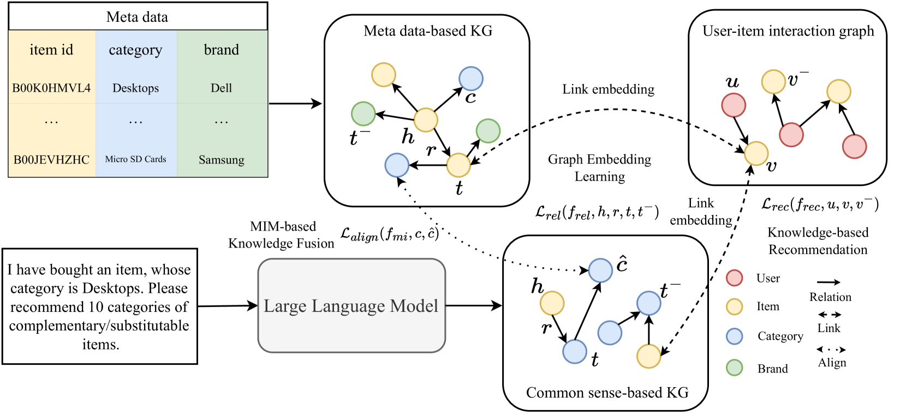
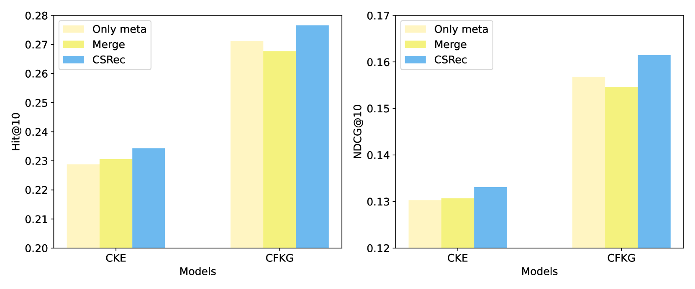
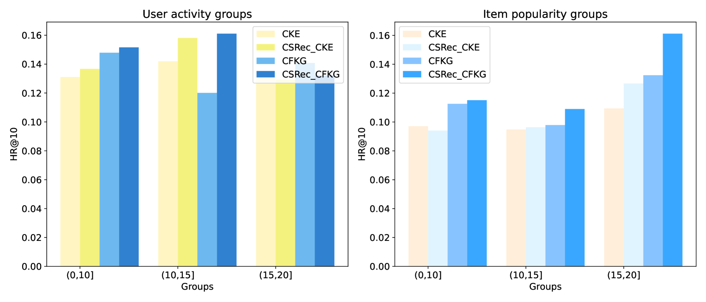
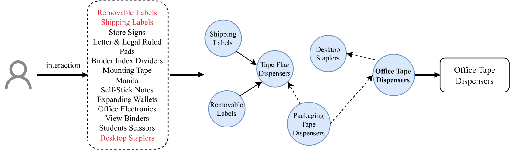

# 通过结合大型语言模型，打造富有常识的智慧推荐系统。

发布时间：2024年03月27日

`LLM应用` `推荐系统` `知识图谱`

> Common Sense Enhanced Knowledge-based Recommendation with Large Language Model

# 摘要

> 知识推荐模型通过挖掘知识图谱的侧信息，有效解决了数据稀疏问题，并取得了显著成效。然而，传统基于元数据的知识图谱，基于项目属性和共现关系构建，信息量有限，且依赖大量交互数据，难以应对冷启动问题。常识，作为一种普遍且通用的知识，能够补充元数据知识图谱的不足，为用户偏好建模提供新视角。得益于大型语言模型的世界知识，我们现在能够高效获取常识。本文提出了一种创新的常识融合推荐框架CSRec，可与现有推荐方法灵活结合。面对常识知识图谱与元数据知识图谱间的知识差异，我们采用基于互信息最大化的知识融合策略。实验证明，该方法能显著提升现有知识推荐模型的性能。

> Knowledge-based recommendation models effectively alleviate the data sparsity issue leveraging the side information in the knowledge graph, and have achieved considerable performance. Nevertheless, the knowledge graphs used in previous work, namely metadata-based knowledge graphs, are usually constructed based on the attributes of items and co-occurring relations (e.g., also buy), in which the former provides limited information and the latter relies on sufficient interaction data and still suffers from cold start issue. Common sense, as a form of knowledge with generality and universality, can be used as a supplement to the metadata-based knowledge graph and provides a new perspective for modeling users' preferences. Recently, benefiting from the emergent world knowledge of the large language model, efficient acquisition of common sense has become possible. In this paper, we propose a novel knowledge-based recommendation framework incorporating common sense, CSRec, which can be flexibly coupled to existing knowledge-based methods. Considering the challenge of the knowledge gap between the common sense-based knowledge graph and metadata-based knowledge graph, we propose a knowledge fusion approach based on mutual information maximization theory. Experimental results on public datasets demonstrate that our approach significantly improves the performance of existing knowledge-based recommendation models.

[Arxiv](https://arxiv.org/abs/2403.18325)