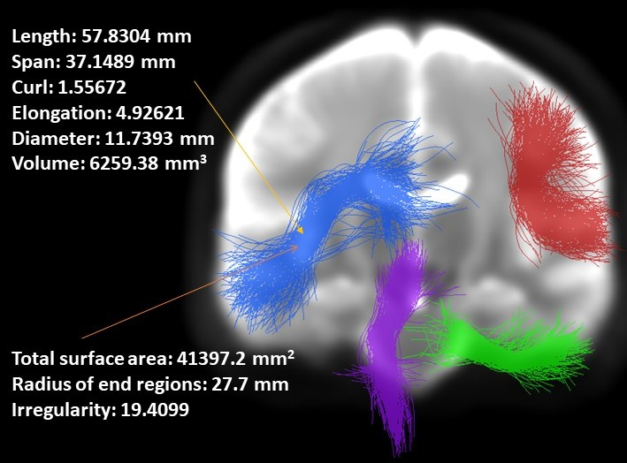
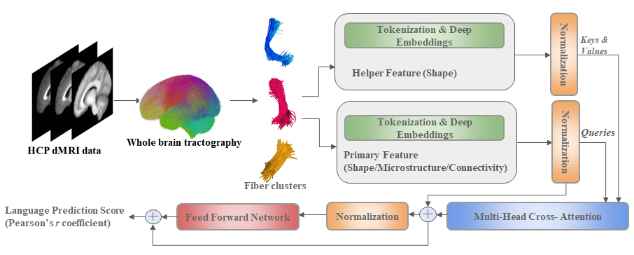

# 跨领域纤维束形态分析在语言性能认知评分预测中的应用

发布时间：2024年03月27日

`Agent` `计算机图形学` `大脑成像`

> Cross--domain Fiber Cluster Shape Analysis for Language Performance Cognitive Score Prediction

# 摘要

> 在计算机图形学里，形状是关键元素，它传递着物体的形态和功能等关键信息。在大脑成像领域，通过对形状的分析，我们能更好地理解人脑结构与功能的相互关系。本研究聚焦于大脑三维白质连接的形状，并探讨其与人类认知功能的潜在联系。我们运用扩散磁共振成像技术，将大脑连接重建成一系列三维点位，并通过提取12种形状描述符，结合传统的dMRI连接和组织微结构特征，来描绘每个连接。我们提出了一个创新框架——SFFormer，该框架采用多头交叉注意力特征融合模块，根据dMRI轨迹追踪结果预测个体的语言能力。在对1065名健康年轻成人的大数据集进行测试后，我们发现，基于变换器的SFFormer模型及其融合形状、微结构和连接特征的方法，均能提供丰富的信息，并共同提升了对个体语言能力预测的准确性。综上所述，大脑连接的形状对人类语言功能具有预测价值。

> Shape plays an important role in computer graphics, offering informative features to convey an object's morphology and functionality. Shape analysis in brain imaging can help interpret structural and functionality correlations of the human brain. In this work, we investigate the shape of the brain's 3D white matter connections and its potential predictive relationship to human cognitive function. We reconstruct brain connections as sequences of 3D points using diffusion magnetic resonance imaging (dMRI) tractography. To describe each connection, we extract 12 shape descriptors in addition to traditional dMRI connectivity and tissue microstructure features. We introduce a novel framework, Shape--fused Fiber Cluster Transformer (SFFormer), that leverages a multi-head cross-attention feature fusion module to predict subject-specific language performance based on dMRI tractography. We assess the performance of the method on a large dataset including 1065 healthy young adults. The results demonstrate that both the transformer-based SFFormer model and its inter/intra feature fusion with shape, microstructure, and connectivity are informative, and together, they improve the prediction of subject-specific language performance scores. Overall, our results indicate that the shape of the brain's connections is predictive of human language function.

[Arxiv](https://arxiv.org/abs/2403.19001)