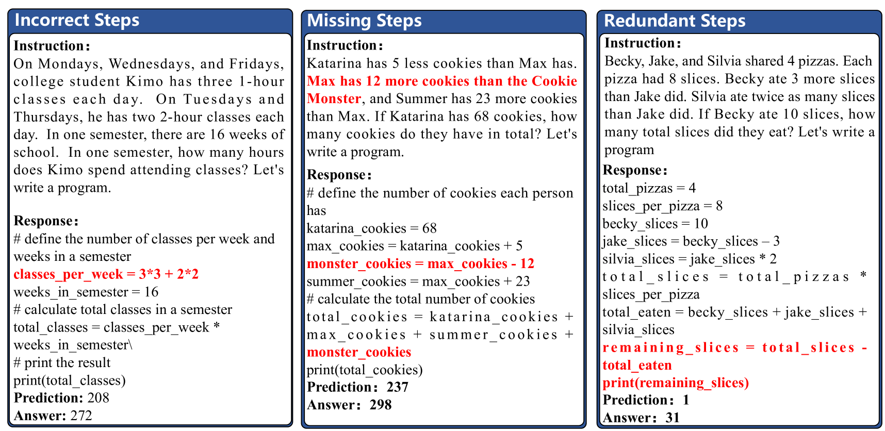
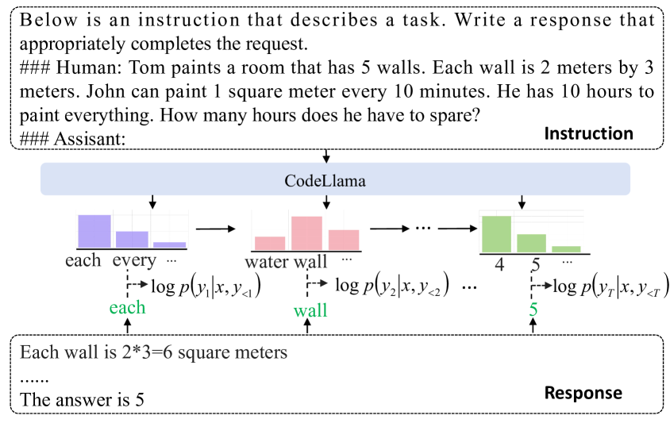
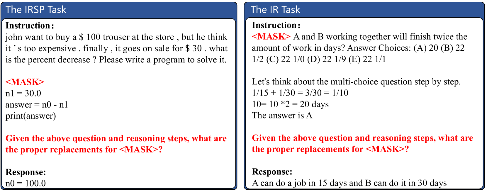
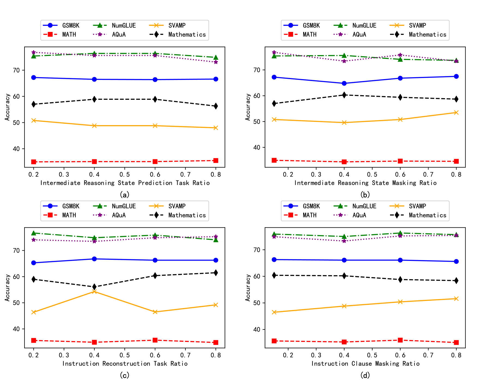
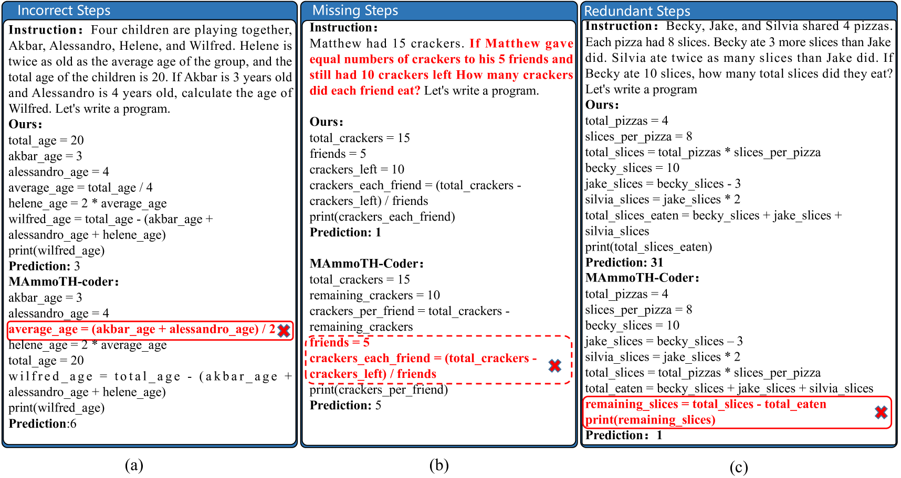
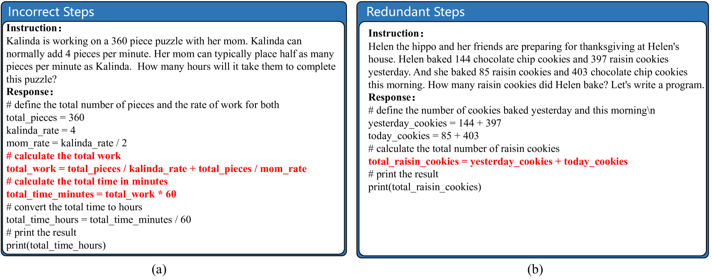

# 通过大型语言模型实现双重指导调整，以提升数学推理能力

发布时间：2024年03月27日

`LLM应用` `人工智能`

> Dual Instruction Tuning with Large Language Models for Mathematical Reasoning

# 摘要

> 最新研究显示，通过大型语言模型（LLMs）进行指令调整并利用思维链（CoT）数据，在数学推理任务上取得了显著成果。尽管LLMs已经过精心调优，但仍面临诸如CoT生成过程中的错误、遗漏和重复步骤等问题，这些问题影响了答案预测的准确性。为了解决这一问题，我们提出了一种双向精细调整策略，通过正向推理和反向推理两个维度，深入挖掘数学推理的本质。这包括引入中间推理状态预测（正向推理）和指令重构（反向推理）任务，旨在提升LLMs对指令的把握和执行能力。这些训练样本是基于现有的数学指令调整数据集精心设计的。接着，LLMs会通过现有数学指令和新生成的数据进行多任务精细调整。广泛的实验表明，这种双向调整策略在各类数学推理任务中都表现出了卓越的效果和广泛的适用性。

> Recent advancements highlight the success of instruction tuning with large language models (LLMs) utilizing Chain-of-Thought (CoT) data for mathematical reasoning tasks. Despite the fine-tuned LLMs, challenges persist, such as incorrect, missing, and redundant steps in CoT generation leading to inaccuracies in answer predictions. To alleviate this problem, we propose a dual instruction tuning strategy to meticulously model mathematical reasoning from both forward and reverse directions. This involves introducing the Intermediate Reasoning State Prediction task (forward reasoning) and the Instruction Reconstruction task (reverse reasoning) to enhance the LLMs' understanding and execution of instructions. Training instances for these tasks are constructed based on existing mathematical instruction tuning datasets. Subsequently, LLMs undergo multi-task fine-tuning using both existing mathematical instructions and the newly created data. Comprehensive experiments validate the effectiveness and domain generalization of the dual instruction tuning strategy across various mathematical reasoning tasks.

[Arxiv](https://arxiv.org/abs/2403.18295)