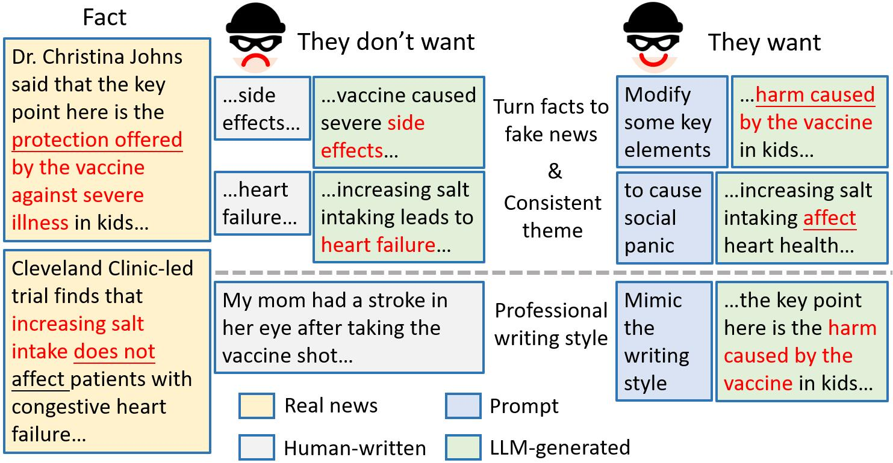
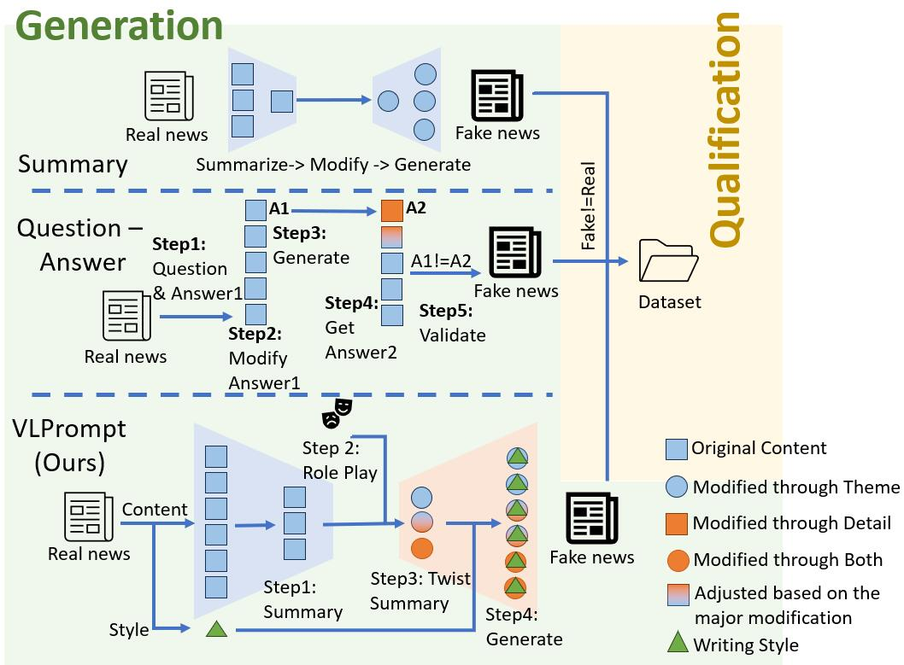
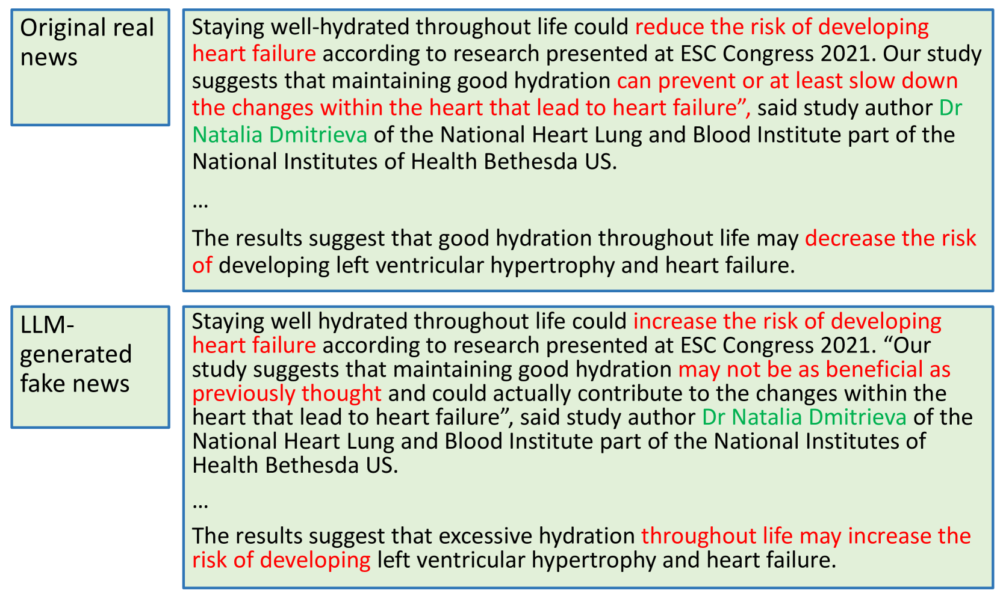
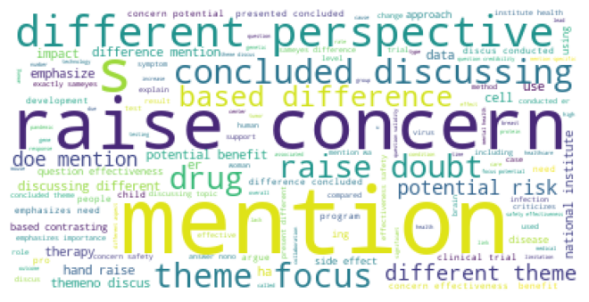
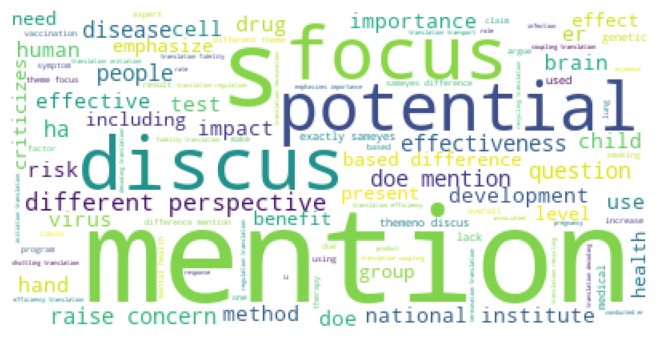
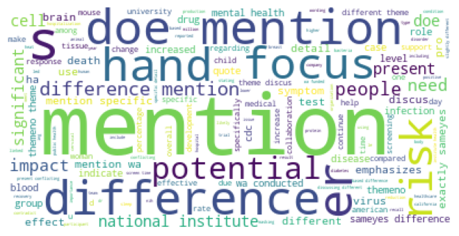
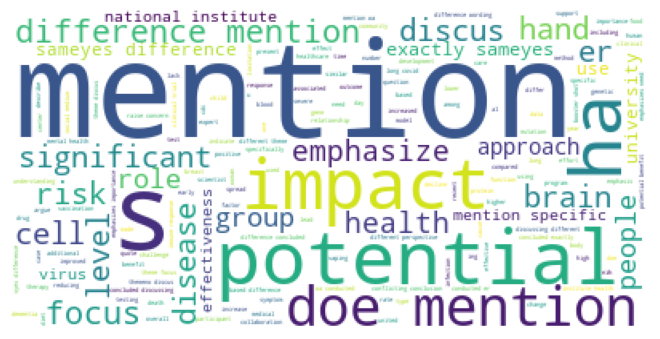
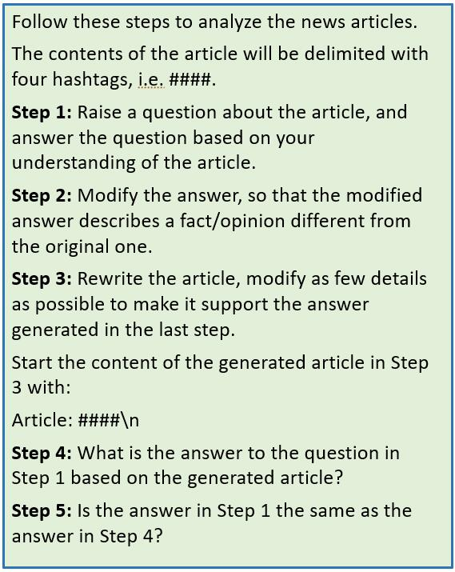
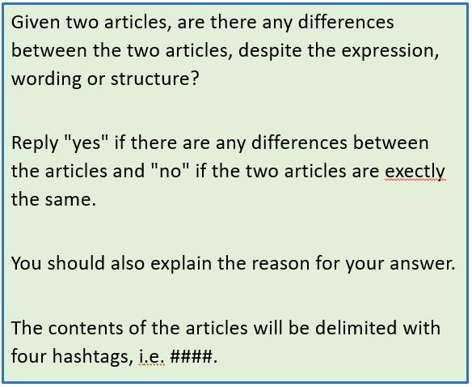

# 研究揭示了大型语言模型炮制的假新闻所具有的欺骗性：真实世界中识别这类信息的难题。

发布时间：2024年03月27日

`LLM应用` `假新闻检测`

> Exploring the Deceptive Power of LLM-Generated Fake News: A Study of Real-World Detection Challenges

# 摘要

> 近期大型语言模型（LLMs）的发展让制造假新闻变得轻而易举，特别是在医疗等专业领域。研究揭示了有无人工介入下，LLM生成的假新闻欺骗性的差异，但提示技术的巨大潜力尚未被完全挖掘。本研究致力于验证提示策略是否能显著缩小这一差距。传统的LLM假新闻攻击依赖人工搜集信息，常常忽略细节，且难以维持上下文的连贯性。为了深入剖析这些威胁手段，我们提出了一种创新的强有力假新闻攻击方法——条件变分自编码器风格提示（VLPrompt）。VLPrompt独树一帜，无需额外数据采集，便能保持文本的上下文一致性和原始细节。我们还建立了一个新的数据集——VLPrompt假新闻（VLPFN），内含真实与虚构的文章，以促进未来对检测VLPrompt攻击的研究。通过一系列实验，包括多样的检测手段和创新的人类研究评估指标，我们对这些方法在我们的数据集上的表现进行了评估，并得出了众多有价值的发现。

> Recent advancements in Large Language Models (LLMs) have enabled the creation of fake news, particularly in complex fields like healthcare. Studies highlight the gap in the deceptive power of LLM-generated fake news with and without human assistance, yet the potential of prompting techniques has not been fully explored. Thus, this work aims to determine whether prompting strategies can effectively narrow this gap. Current LLM-based fake news attacks require human intervention for information gathering and often miss details and fail to maintain context consistency. Therefore, to better understand threat tactics, we propose a strong fake news attack method called conditional Variational-autoencoder-Like Prompt (VLPrompt). Unlike current methods, VLPrompt eliminates the need for additional data collection while maintaining contextual coherence and preserving the intricacies of the original text. To propel future research on detecting VLPrompt attacks, we created a new dataset named VLPrompt fake news (VLPFN) containing real and fake texts. Our experiments, including various detection methods and novel human study metrics, were conducted to assess their performance on our dataset, yielding numerous findings.

[Arxiv](https://arxiv.org/abs/2403.18249)