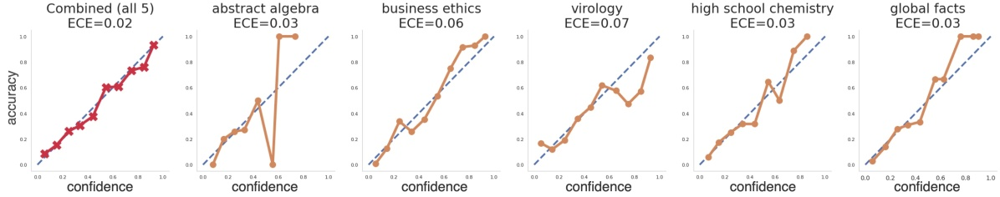
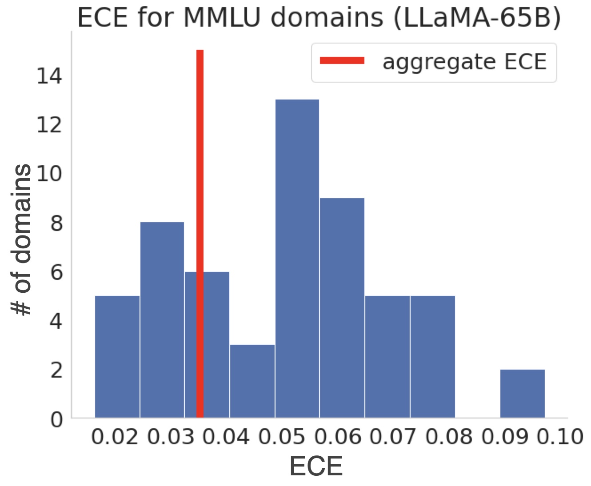
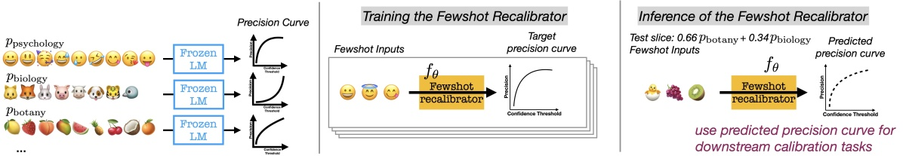
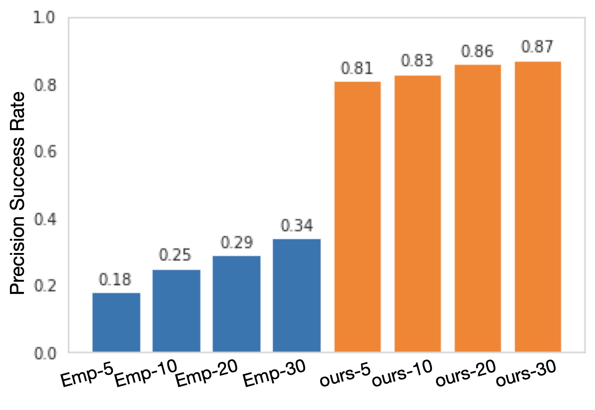
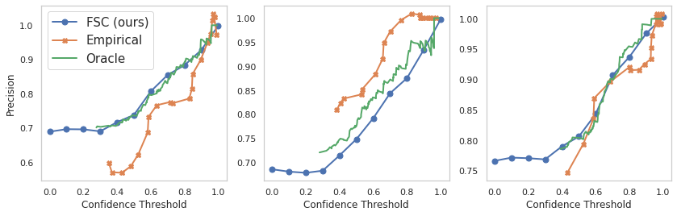

# 在语言模型中，通过少量样本进行重新校准的方法

发布时间：2024年03月27日

`LLM理论` `机器学习` `自信度评估`

> Few-Shot Recalibration of Language Models

# 摘要

> 最新研究发现了从语言模型中获取可靠自信度评估的有效途径，模型的自信度分数能反映其准确性。然而，语言模型在广泛领域看似准确的校准，常常掩盖了特定领域内的失衡，比如数学题目的过度自信可能与历史题目的低自信相互抵消，导致整体看似准确。为了针对分布的特定部分获得准确的自信度评估，我们提出了一种新的少样本特定领域重校准方法。该方法训练一个重校准模型，仅需几个未标记的特定领域样本，就能预测出一条曲线，将模型的置信度分数调整得更加精确。此模型能够对全新的领域进行重校准，无需该领域的标记数据。这让我们能够设定特定领域的置信度阈值，超过该阈值的模型预测值得信赖，低于该阈值则应谨慎。实验显示，这种少样本重校准技术在诸如PaLM2-Large模型的MMLU数据集上，较传统温度缩放方法，校准误差降低了16%，表现更为出色。

> Recent work has uncovered promising ways to extract well-calibrated confidence estimates from language models (LMs), where the model's confidence score reflects how likely it is to be correct. However, while LMs may appear well-calibrated over broad distributions, this often hides significant miscalibration within narrower slices (e.g., systemic over-confidence in math can balance out systemic under-confidence in history, yielding perfect calibration in aggregate). To attain well-calibrated confidence estimates for any slice of a distribution, we propose a new framework for few-shot slice-specific recalibration. Specifically, we train a recalibration model that takes in a few unlabeled examples from any given slice and predicts a curve that remaps confidence scores to be more accurate for that slice. Our trained model can recalibrate for arbitrary new slices, without using any labeled data from that slice. This enables us to identify domain-specific confidence thresholds above which the LM's predictions can be trusted, and below which it should abstain. Experiments show that our few-shot recalibrator consistently outperforms existing calibration methods, for instance improving calibration error for PaLM2-Large on MMLU by 16%, as compared to temperature scaling.

[Arxiv](https://arxiv.org/abs/2403.18286)