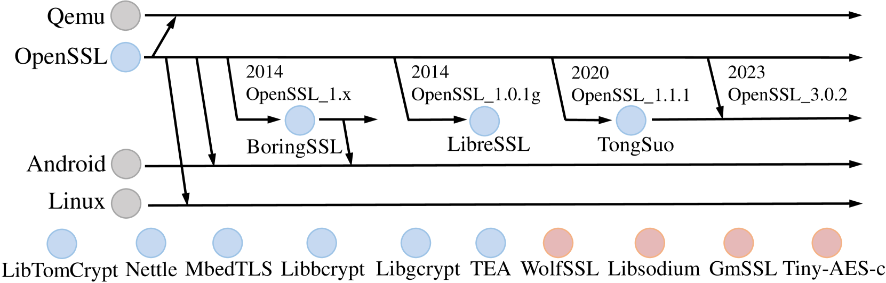
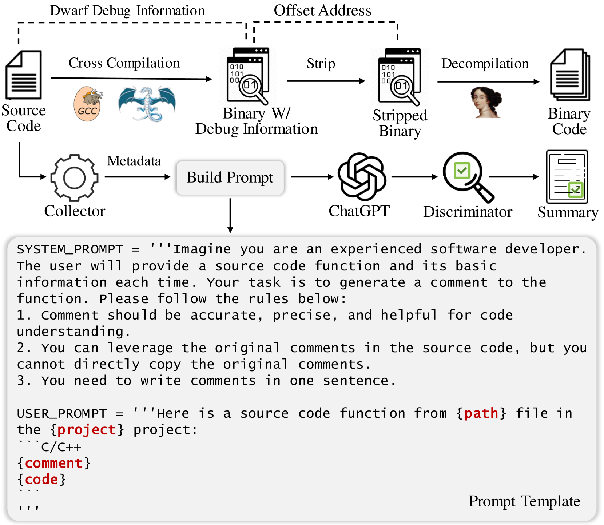
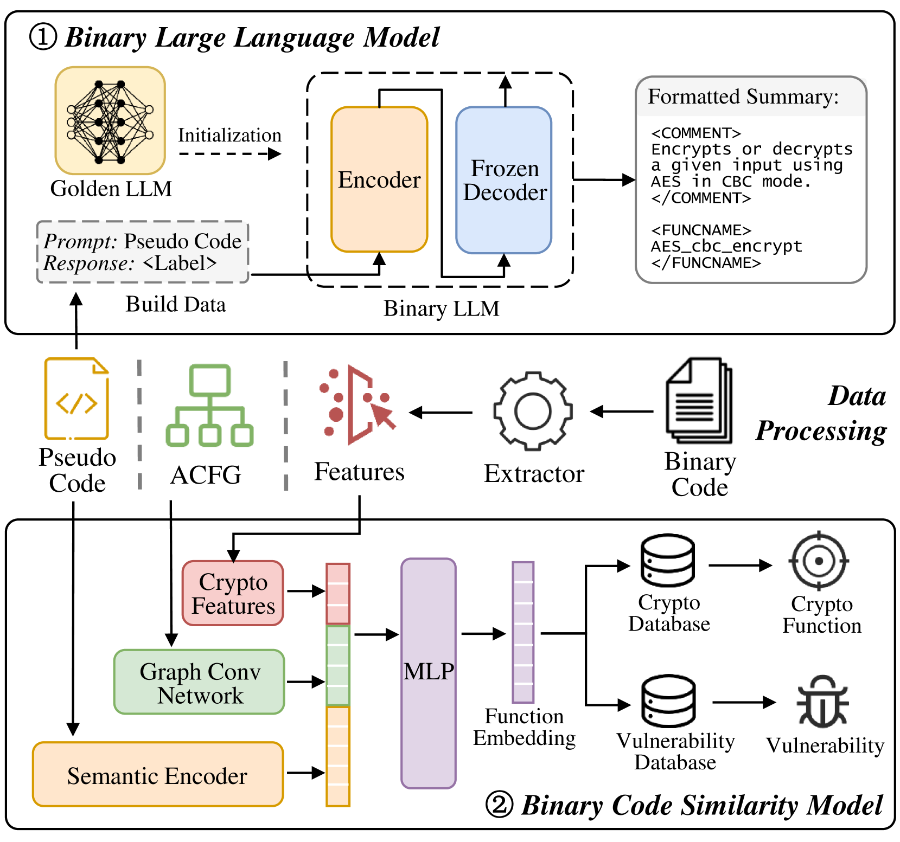
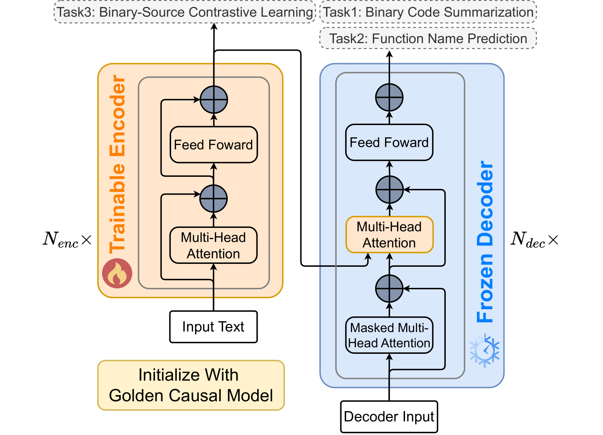
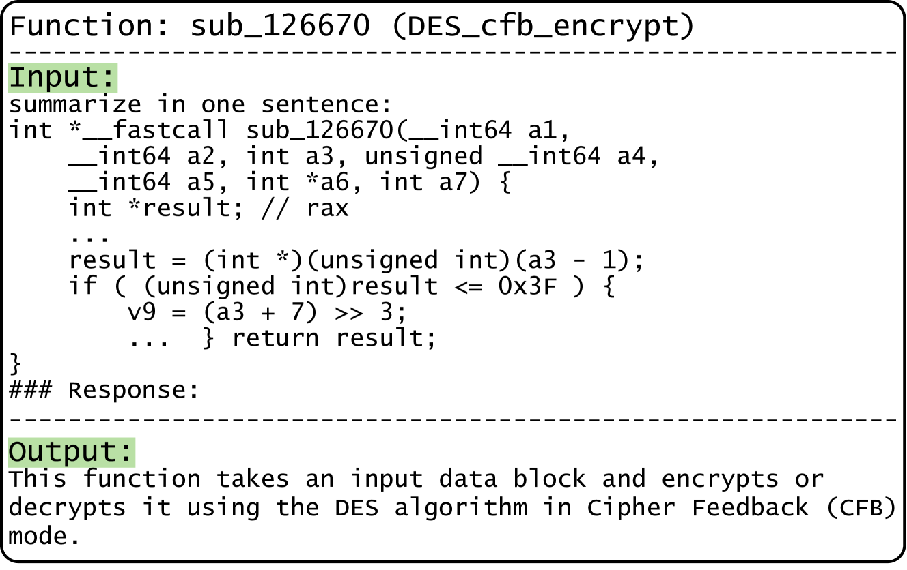
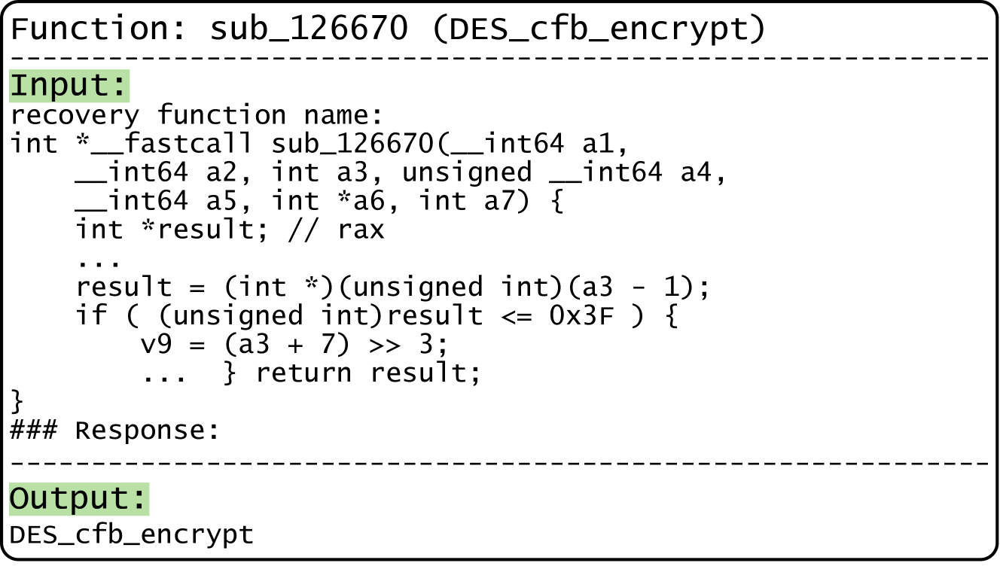
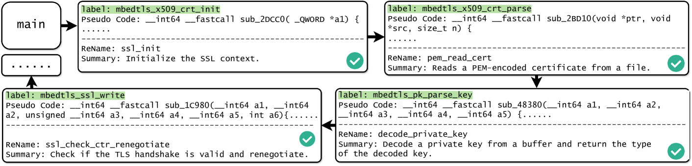
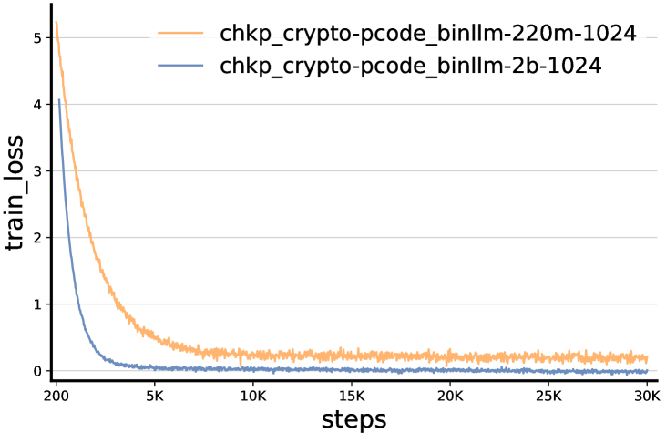
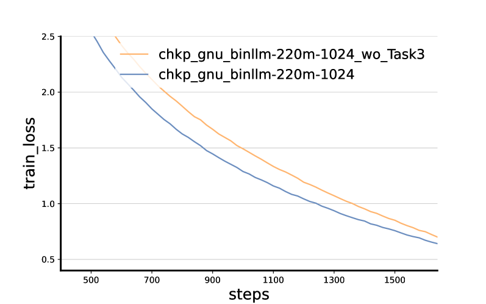

# FoC：揭秘经剥离的二进制文件中，借助大型语言模型（LLMs）恢复加密功能之谜。

发布时间：2024年03月27日

`LLM应用` `信息安全` `软件分析`

> FoC: Figure out the Cryptographic Functions in Stripped Binaries with LLMs

# 摘要

> 探究加密函数在剥离二进制中的行为，虽具挑战性，却至关重要。加密算法相较于常规代码，逻辑复杂度更高，但其分析在病毒检测和旧代码审查等关键领域不可或缺。现有方法多依赖于数据或结构模式匹配，泛化效果不理想，且劳动强度大。本文提出了一个创新框架——FoC，旨在揭示剥离二进制中的加密函数。我们首先建立了一个二进制大型语言模型（FoCBinLLM），用自然语言概括加密函数的语义。FoC-BinLLM对微小变动，如漏洞修补，不敏感。为此，我们进一步构建了一个二进制代码相似性模型（FoC-Sim），基于FoC-BinLLM，创建对变动敏感的表示，并检索数据库中相似的未知加密函数实现。此外，我们还构建了一个加密二进制数据集，以评估和推动该领域的研究。我们还设计了一种自动化方法，为众多二进制函数生成语义标签。评估结果显示，FoC-BinLLM在ROUGE-L评分上超越ChatGPT达14.61%，FoC-Sim的召回率@1提升了50%，超越了以往的最佳方法。而且，我们的方法在病毒分析和一日漏洞检测中也展现了其实战潜力。

> Analyzing the behavior of cryptographic functions in stripped binaries is a challenging but essential task. Cryptographic algorithms exhibit greater logical complexity compared to typical code, yet their analysis is unavoidable in areas such as virus analysis and legacy code inspection. Existing methods often rely on data or structural pattern matching, leading to suboptimal generalizability and suffering from manual work. In this paper, we propose a novel framework called FoC to Figure out the Cryptographic functions in stripped binaries. In FoC, we first build a binary large language model (FoCBinLLM) to summarize the semantics of cryptographic functions in natural language. The prediction of FoC-BinLLM is insensitive to minor changes, such as vulnerability patches. To mitigate it, we further build a binary code similarity model (FoC-Sim) upon the FoC-BinLLM to create change-sensitive representations and use it to retrieve similar implementations of unknown cryptographic functions in a database. In addition, we construct a cryptographic binary dataset for evaluation and to facilitate further research in this domain. And an automated method is devised to create semantic labels for extensive binary functions. Evaluation results demonstrate that FoC-BinLLM outperforms ChatGPT by 14.61% on the ROUGE-L score. FoC-Sim outperforms the previous best methods with a 52% higher Recall@1. Furthermore, our method also shows practical ability in virus analysis and 1-day vulnerability detection.

[Arxiv](https://arxiv.org/abs/2403.18403)