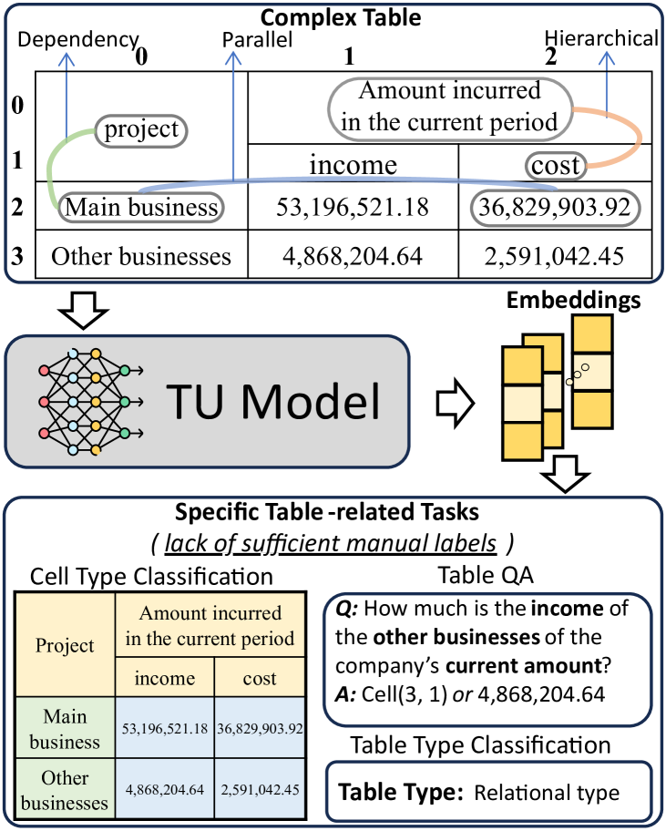
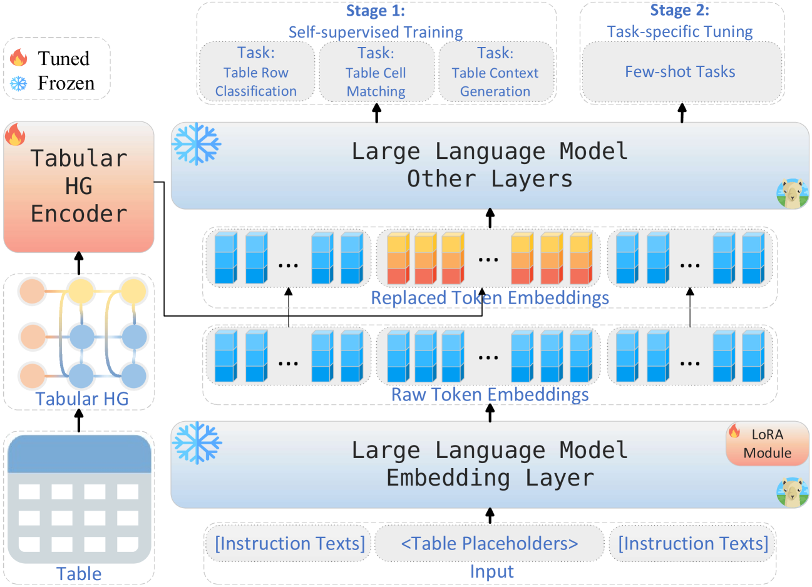
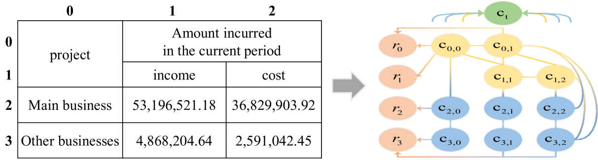
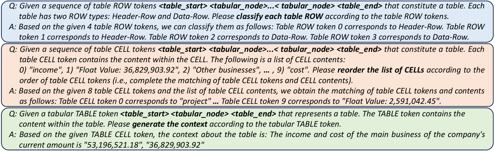
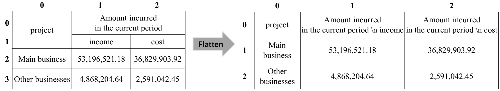
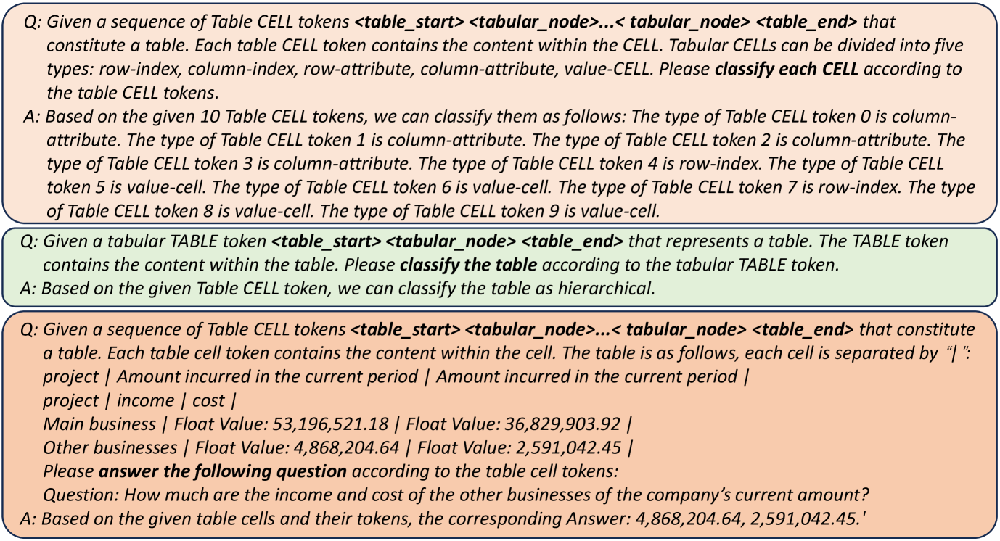

# HGT：借助异构图强化的大型语言模型，实现对复杂表格的少样本精准解读。

发布时间：2024年03月27日

`LLM应用` `表格理解`

> HGT: Leveraging Heterogeneous Graph-enhanced Large Language Models for Few-shot Complex Table Understanding

# 摘要

> 表格理解技术虽取得显著进展，却受限于手动标注表格的匮乏和复杂结构的难题。为此，我们设计了HGT框架，它结合异构图强化的大型语言模型，专攻少样本表格理解任务。该框架通过软提示和指令转换技术，将表格语义与LLM的丰富知识库相融合，并通过创新的多粒度自监督预训练策略，有效处理复杂表格结构。实践证明，HGT在多项基准测试中超越了现有最先进技术，展现出卓越的性能。

> Table understanding (TU) has achieved promising advancements, but it faces the challenges of the scarcity of manually labeled tables and the presence of complex table structures.To address these challenges, we propose HGT, a framework with a heterogeneous graph (HG)-enhanced large language model (LLM) to tackle few-shot TU tasks.It leverages the LLM by aligning the table semantics with the LLM's parametric knowledge through soft prompts and instruction turning and deals with complex tables by a multi-task pre-training scheme involving three novel multi-granularity self-supervised HG pre-training objectives.We empirically demonstrate the effectiveness of HGT, showing that it outperforms the SOTA for few-shot complex TU on several benchmarks.

[Arxiv](https://arxiv.org/abs/2403.19723)