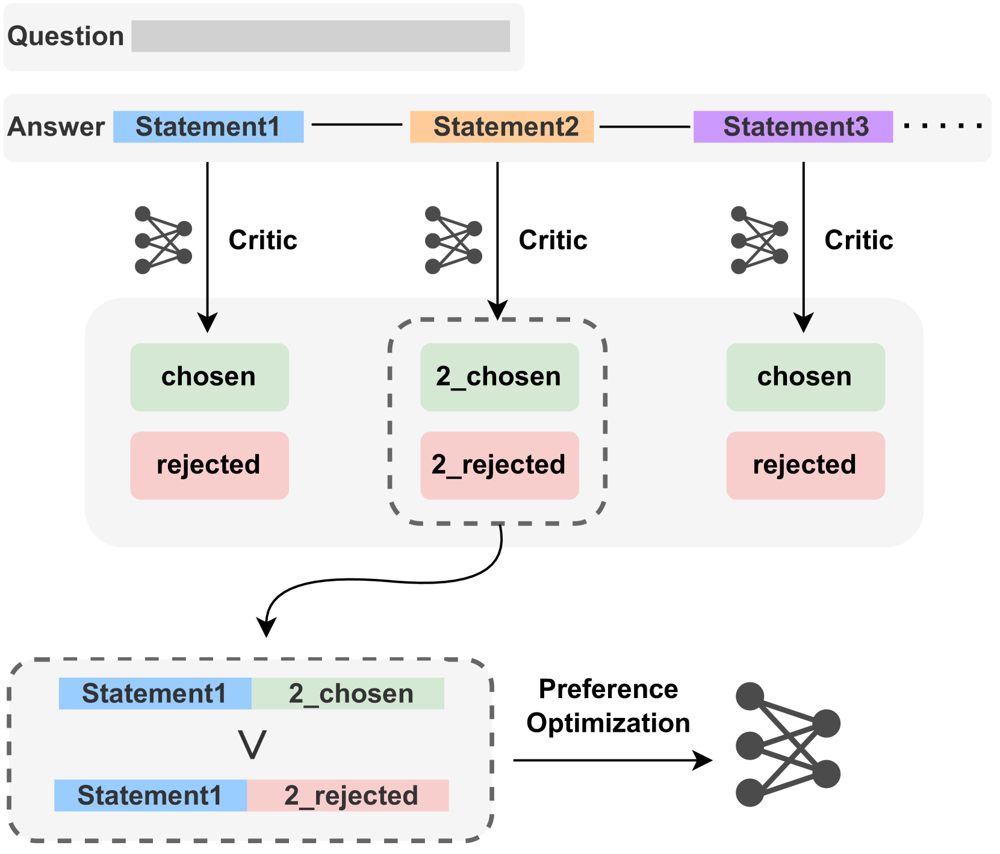
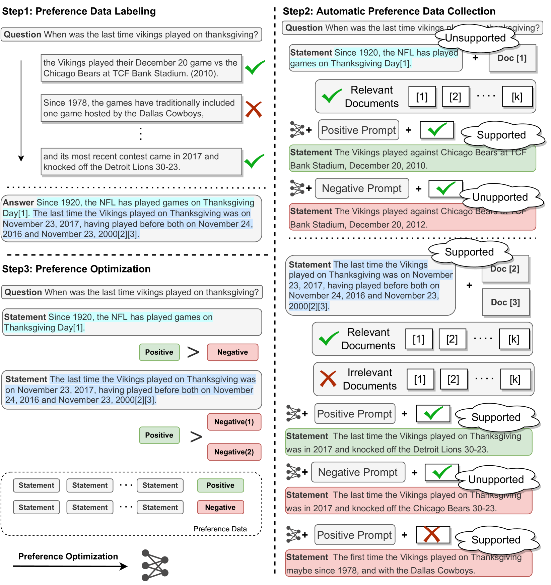

# 借助偏好学习技术，提升大型语言模型在属性文本生成方面的表现。

发布时间：2024年03月27日

`LLM应用` `问答系统`

> Improving Attributed Text Generation of Large Language Models via Preference Learning

# 摘要

> 大型语言模型在自然语言处理领域得到了广泛应用，但它们在生成内容的可靠性上仍面临挑战。近期研究尝试通过归因技术减少错误信息和虚构内容，将归因视为提供证据的方式。然而，现有的归因方法主要关注检索和自动评估阶段，忽略了模仿人类学术写作中的引用机制来提升可信度。本文通过将归因任务视作偏好学习，并提出了一个自动偏好优化（APO）框架来解决这些问题。我们首先从现有数据集中筛选出6,330个案例，创建了一个精选的训练集。考虑到标记偏好数据成本高昂，我们提出了一种自动生成归因偏好数据的方法，生成了95,263对数据。此外，借鉴人类引用过程，我们提出了一种基于细粒度信息的渐进式偏好优化方法。在ASQA、StrategyQA和ELI5三个数据集上的广泛实验显示，APO在引用F1上达到了最先进的水平，并提高了答案的质量。

> Large language models have been widely adopted in natural language processing, yet they face the challenge of generating unreliable content. Recent works aim to reduce misinformation and hallucinations by resorting to attribution as a means to provide evidence (i.e., citations). However, current attribution methods usually focus on the retrieval stage and automatic evaluation that neglect mirroring the citation mechanisms in human scholarly writing to bolster credibility. In this paper, we address these challenges by modelling the attribution task as preference learning and introducing an Automatic Preference Optimization (APO) framework. First, we create a curated collection for post-training with 6,330 examples by collecting and filtering from existing datasets. Second, considering the high cost of labelling preference data, we further propose an automatic method to synthesize attribution preference data resulting in 95,263 pairs. Moreover, inspired by the human citation process, we further propose a progressive preference optimization method by leveraging fine-grained information. Extensive experiments on three datasets (i.e., ASQA, StrategyQA, and ELI5) demonstrate that APO achieves state-of-the-art citation F1 with higher answer quality.

[Arxiv](https://arxiv.org/abs/2403.18381)