# 指令驱动的超图预训练技术

发布时间：2024年03月27日

`RAG` `图学习` `预训练`

> Instruction-based Hypergraph Pretraining

# 摘要

> 预训练技术已被广泛研究，目的是让图学习模型能更好地适应新任务，比如预测链接或进行分类。但是，训练目标的差异和预训练数据与实际任务数据分布的不匹配，常常阻碍了知识的迁移。本文借鉴了预训练语言模型中常见的指令式提示，将其应用于图的预训练过程。我们提出了一个创新的预训练框架——基于指令的超图预训练（IHP），旨在缩小预训练与下游任务之间的差异。通过使用基于文本的指令，我们为表示学习提供了针对特定任务的明确指导。与依赖训练数据质量和多样性的可学习提示不同，文本指令天生包含了任务信息，帮助模型超越预训练时的结构限制。为了在情境感知的基础上捕获带有任务信息的高阶关系，我们设计了一种新颖的超图卷积层，将指令与超图中的信息传播相结合。通过在三个公共数据集上的广泛实验，我们证实了IHP在多种场景下的优势。

> Pretraining has been widely explored to augment the adaptability of graph learning models to transfer knowledge from large datasets to a downstream task, such as link prediction or classification. However, the gap between training objectives and the discrepancy between data distributions in pretraining and downstream tasks hinders the transfer of the pretrained knowledge. Inspired by instruction-based prompts widely used in pretrained language models, we introduce instructions into graph pretraining. In this paper, we propose a novel pretraining framework named Instruction-based Hypergraph Pretraining. To overcome the discrepancy between pretraining and downstream tasks, text-based instructions are applied to provide explicit guidance on specific tasks for representation learning. Compared to learnable prompts, whose effectiveness depends on the quality and the diversity of training data, text-based instructions intrinsically encapsulate task information and support the model to generalize beyond the structure seen during pretraining. To capture high-order relations with task information in a context-aware manner, a novel prompting hypergraph convolution layer is devised to integrate instructions into information propagation in hypergraphs. Extensive experiments conducted on three public datasets verify the superiority of IHP in various scenarios.

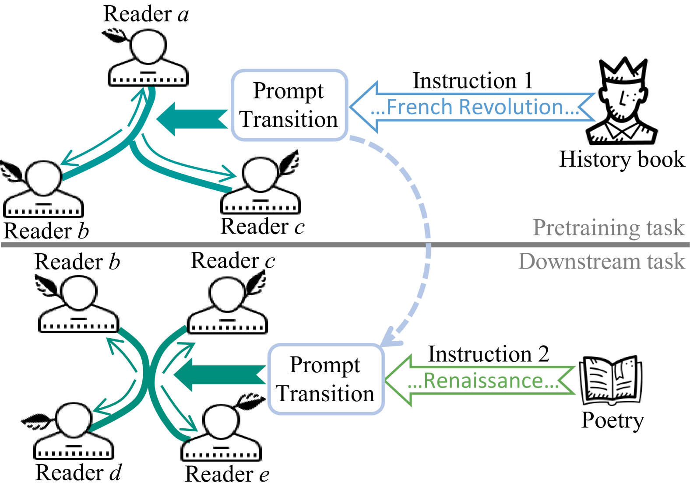

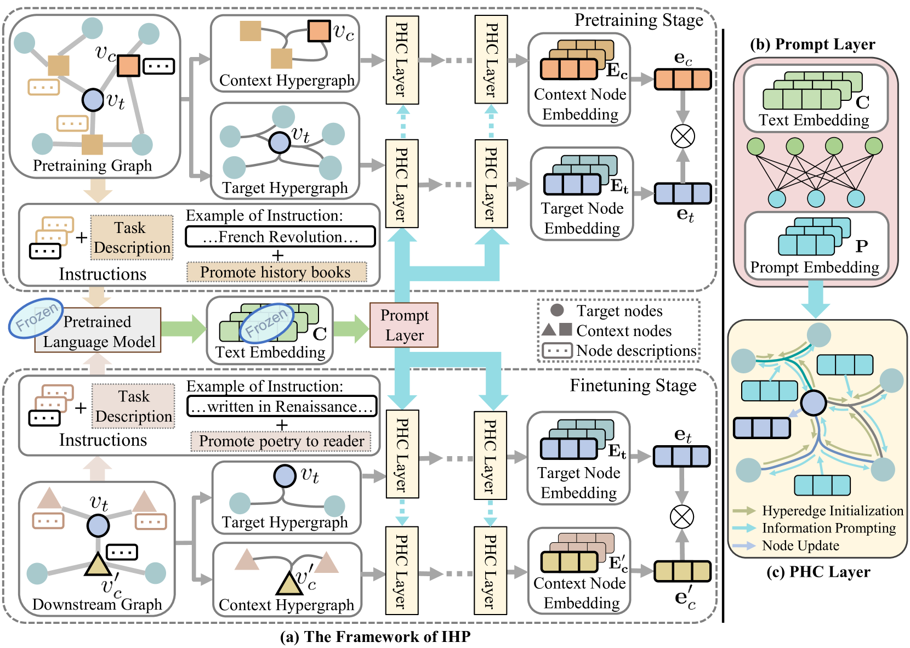

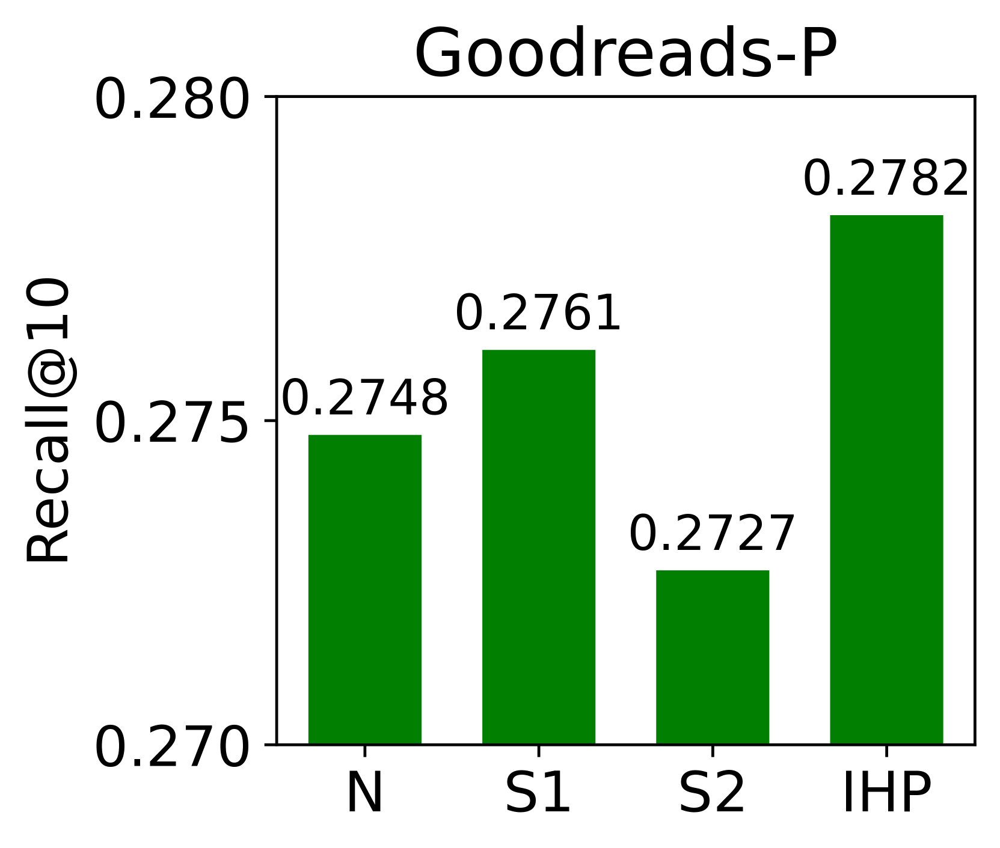

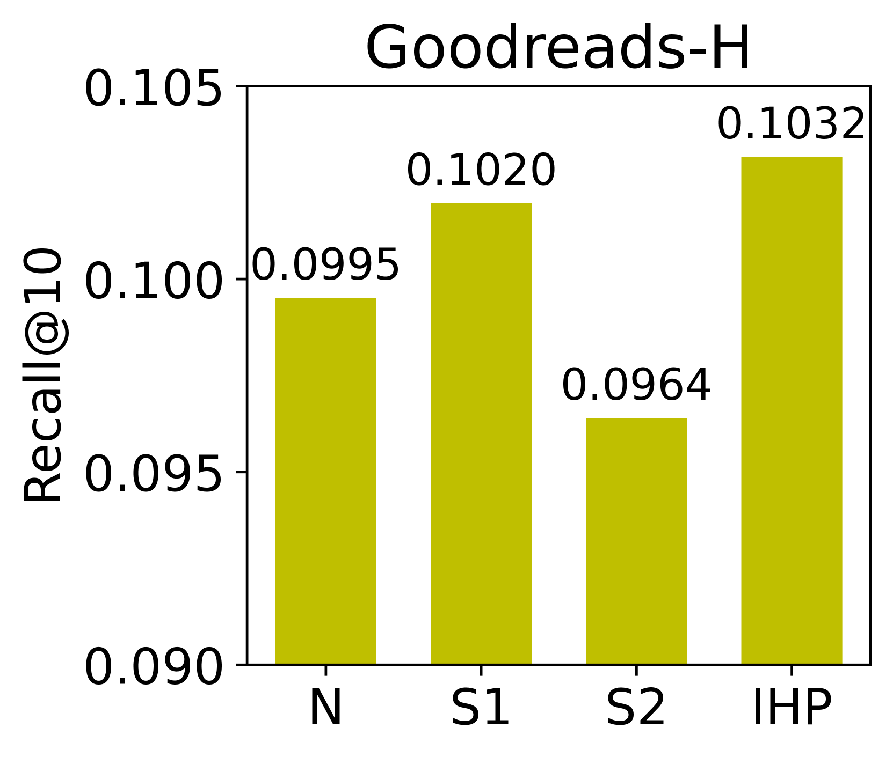

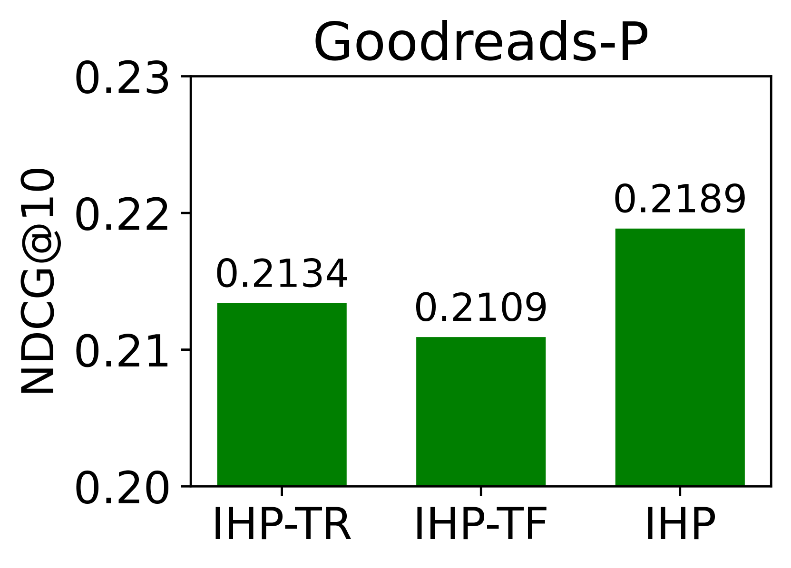

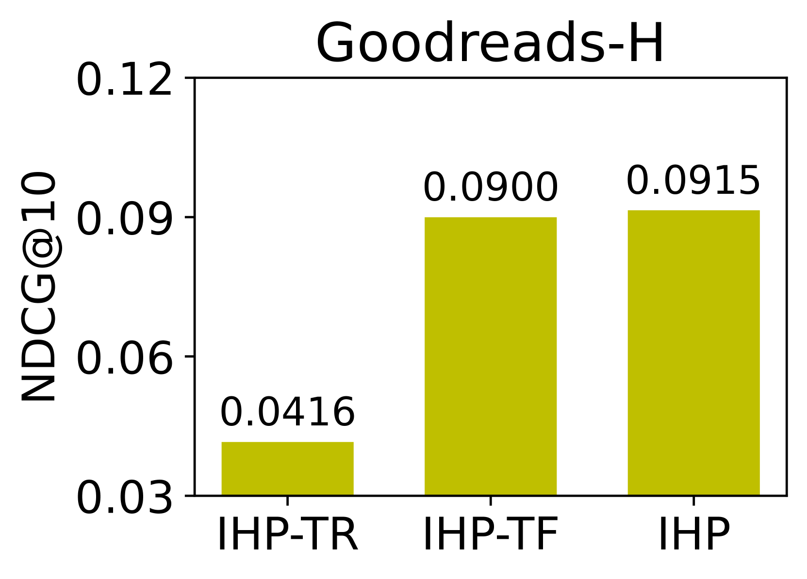

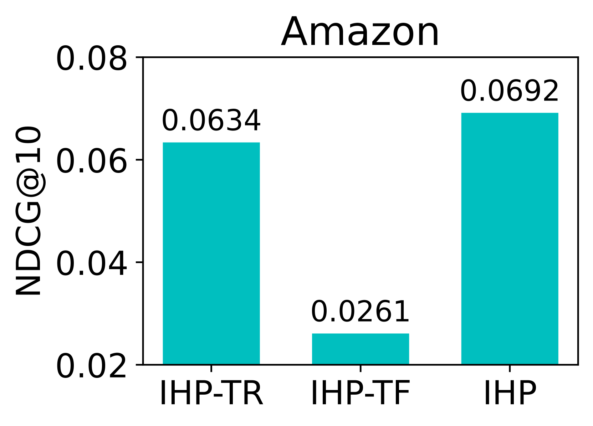

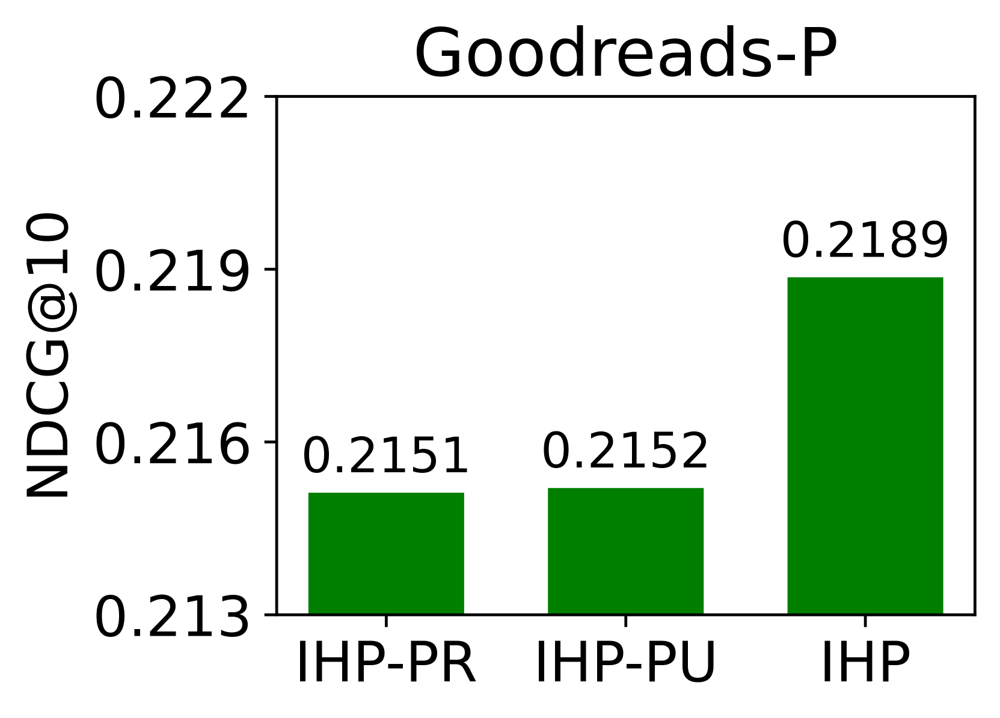

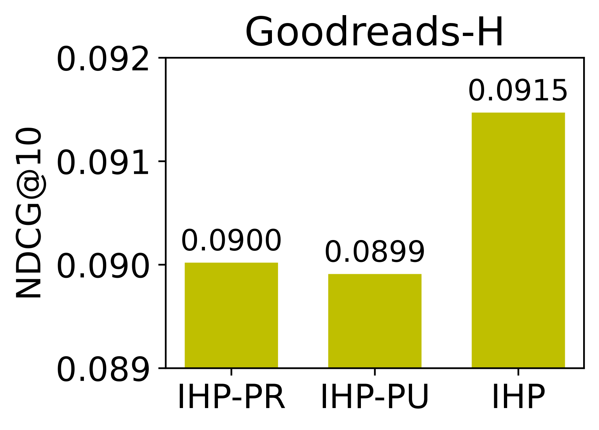

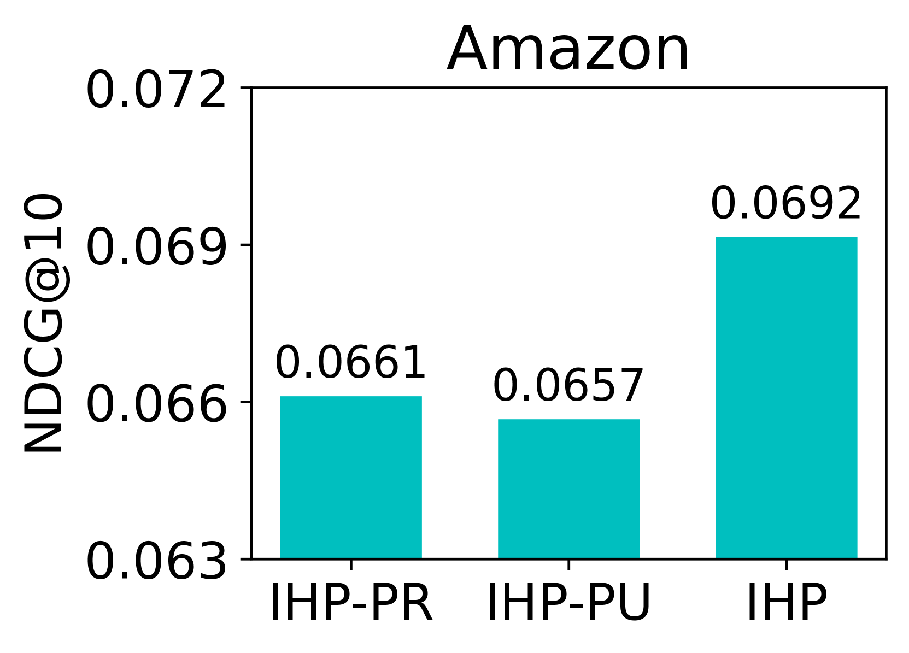

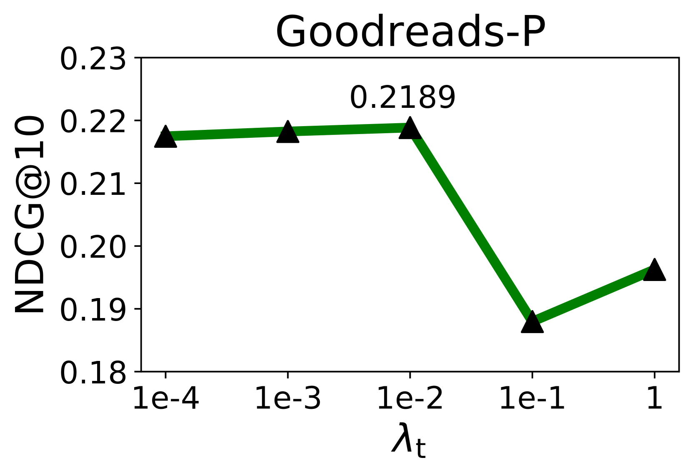

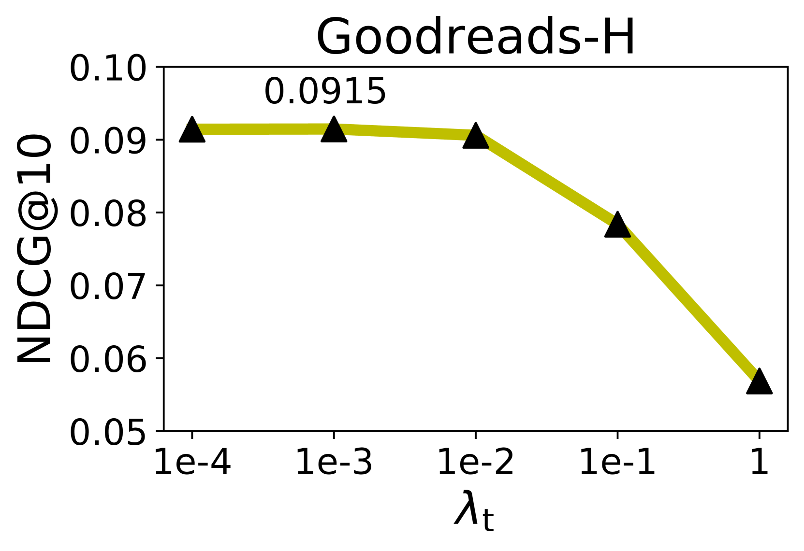

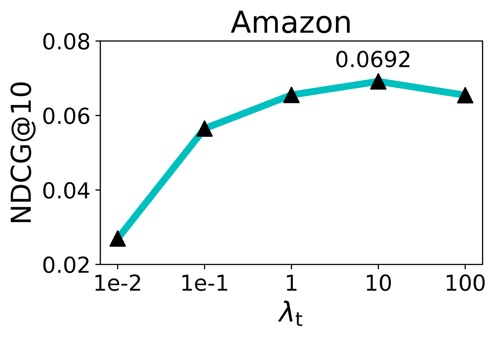

[Arxiv](https://arxiv.org/abs/2403.19063)