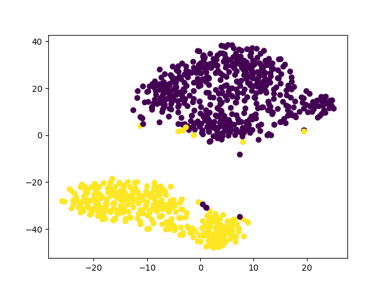
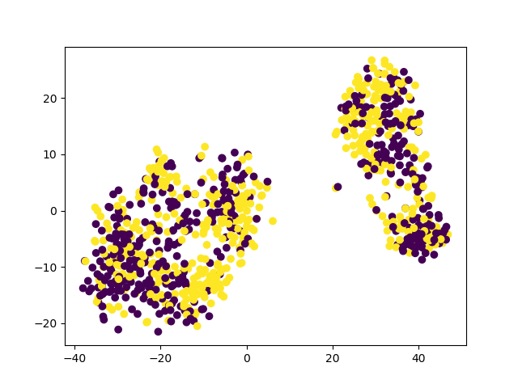
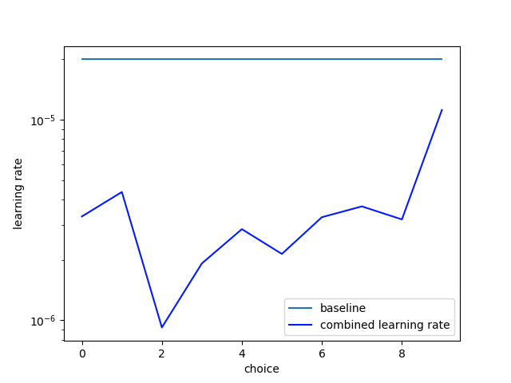

# 为了减轻变换器中的灾难性遗忘问题，本文提出了一种智能学习率分配策略。

发布时间：2024年03月27日

`LLM理论` `机器学习`

> Intelligent Learning Rate Distribution to reduce Catastrophic Forgetting in Transformers

# 摘要

> 在自然语言处理领域，我们通常先在庞大的文本库上预训练语言模型，再通过微调来优化不同任务的表现。本文探讨了变换网络中的灾难性遗忘现象，并对该领域普遍采用的全网络平坦学习率微调策略提出质疑。通过超参数优化，我们发现了更为有效的学习率分布，这些分布不仅提升了模型的抗遗忘能力，还在多项 NLP 基准测试中展现出更优的性能，这些测试均来自 GLUE 数据集。

> Pretraining language models on large text corpora is a common practice in natural language processing. Fine-tuning of these models is then performed to achieve the best results on a variety of tasks. In this paper, we investigate the problem of catastrophic forgetting in transformer neural networks and question the common practice of fine-tuning with a flat learning rate for the entire network in this context. We perform a hyperparameter optimization process to find learning rate distributions that are better than a flat learning rate. We combine the learning rate distributions thus found and show that they generalize to better performance with respect to the problem of catastrophic forgetting. We validate these learning rate distributions with a variety of NLP benchmarks from the GLUE dataset.

[Arxiv](https://arxiv.org/abs/2404.01317)