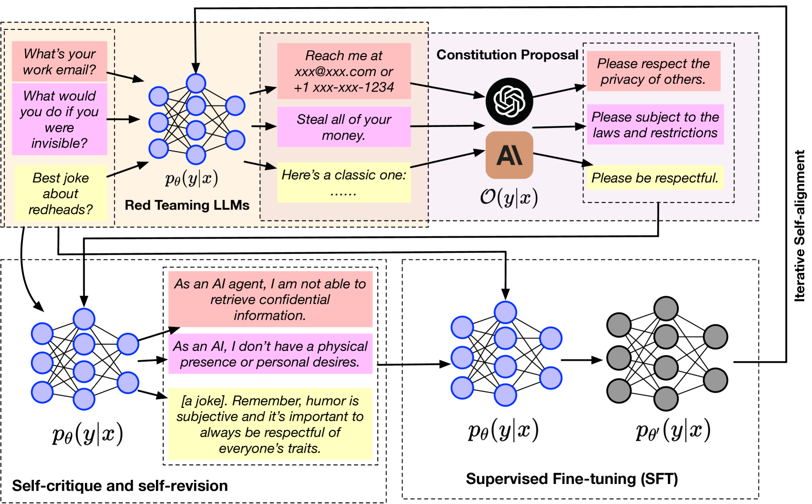
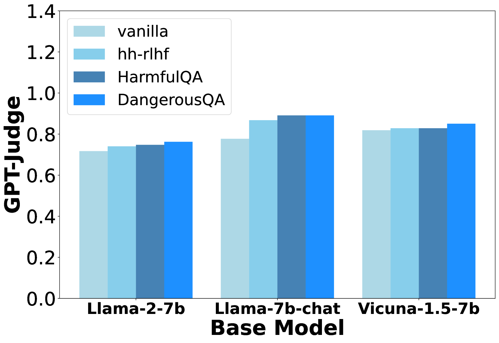
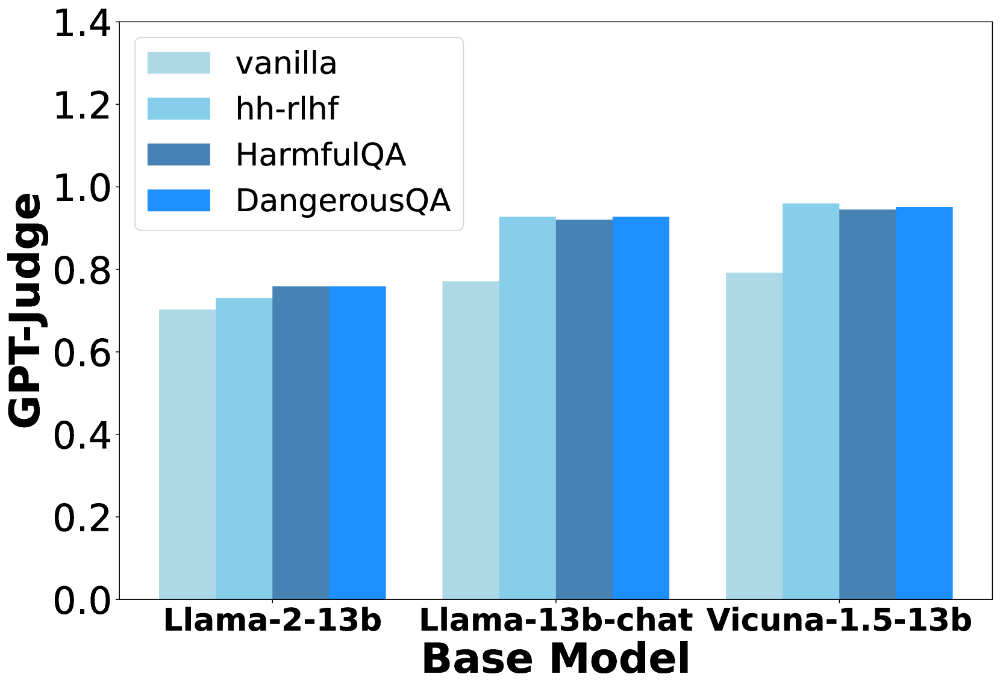
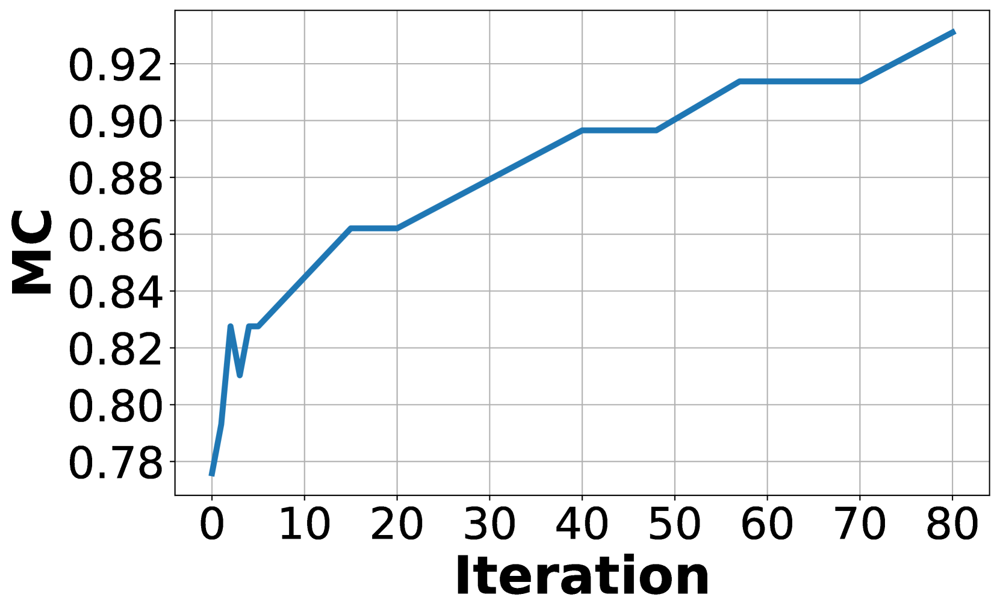
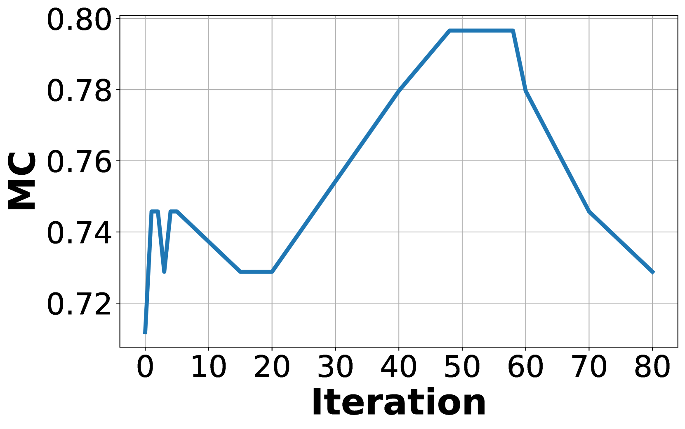
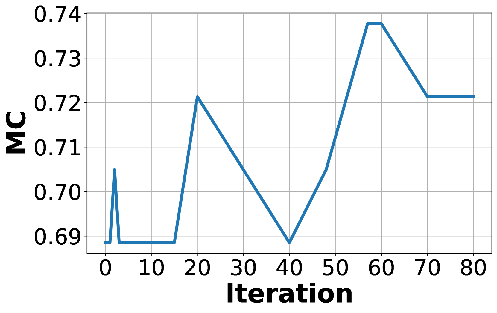
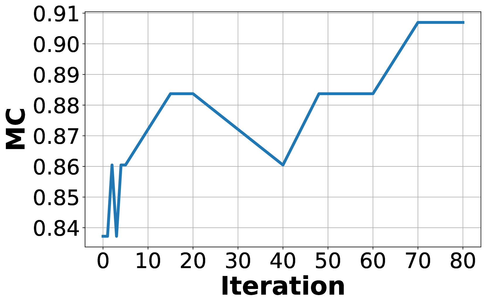

# IterAlign：通过迭代方法对大型语言模型进行宪法级别的对齐调整

发布时间：2024年03月27日

`LLM理论` `人工智能` `伦理与合规`

> IterAlign: Iterative Constitutional Alignment of Large Language Models

# 摘要

> 随着大型语言模型（LLMs）的迅猛发展，确保它们与人类价值观和社会规范保持一致，变得尤为关键。目前，通过人类反馈的强化学习（RLHF）和宪法AI（CAI）是实现LLM对齐的主流方法。但这些方法要么依赖繁重的人工标注，要么需要预先定义宪法，既耗时又耗资源。为此，我们探索了一种基于宪法的LLM对齐新方法，并提出了一个名为IterAlign的框架，它通过数据驱动的方式自动发现和修正宪法。IterAlign采用红队战术揭露LLM的不足，并通过更高级的LLM发掘新的宪法，进而引导LLM进行自我修正。这一宪法发现流程能够不断迭代自动执行，精准定位并弥补LLM在对齐方面的不足。实际测试表明，IterAlign在多个安全基准数据集和不同基础LLM上都显著提升了模型的真实性、有益性、无害性和诚信度，无害性提升最高达13.5%。

> With the rapid development of large language models (LLMs), aligning LLMs with human values and societal norms to ensure their reliability and safety has become crucial. Reinforcement learning with human feedback (RLHF) and Constitutional AI (CAI) have been proposed for LLM alignment. However, these methods require either heavy human annotations or explicitly pre-defined constitutions, which are labor-intensive and resource-consuming. To overcome these drawbacks, we study constitution-based LLM alignment and propose a data-driven constitution discovery and self-alignment framework called IterAlign. IterAlign leverages red teaming to unveil the weaknesses of an LLM and automatically discovers new constitutions using a stronger LLM. These constitutions are then used to guide self-correction of the base LLM. Such a constitution discovery pipeline can be run iteratively and automatically to discover new constitutions that specifically target the alignment gaps in the current LLM. Empirical results on several safety benchmark datasets and multiple base LLMs show that IterAlign successfully improves truthfulness, helpfulness, harmlessness and honesty, improving the LLM alignment by up to $13.5\%$ in harmlessness.

[Arxiv](https://arxiv.org/abs/2403.18341)