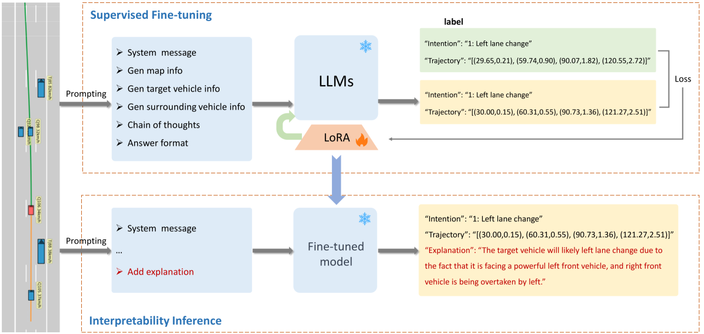
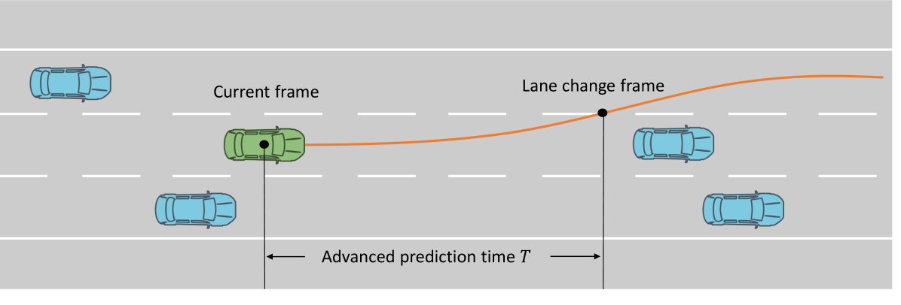
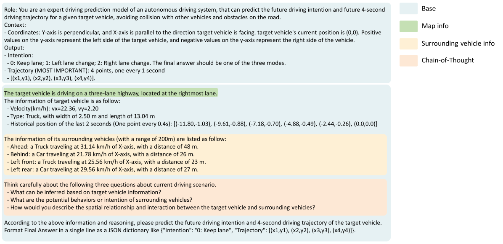
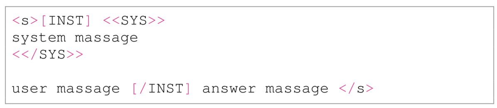
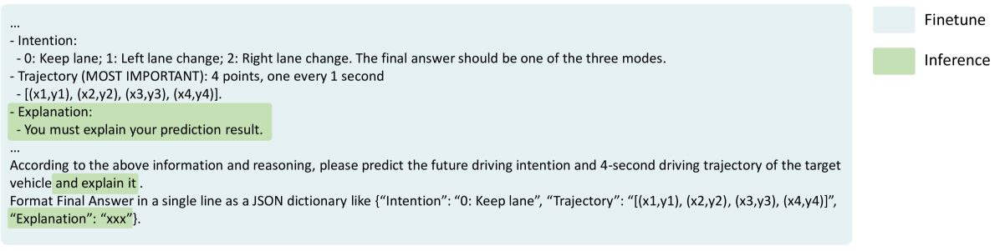
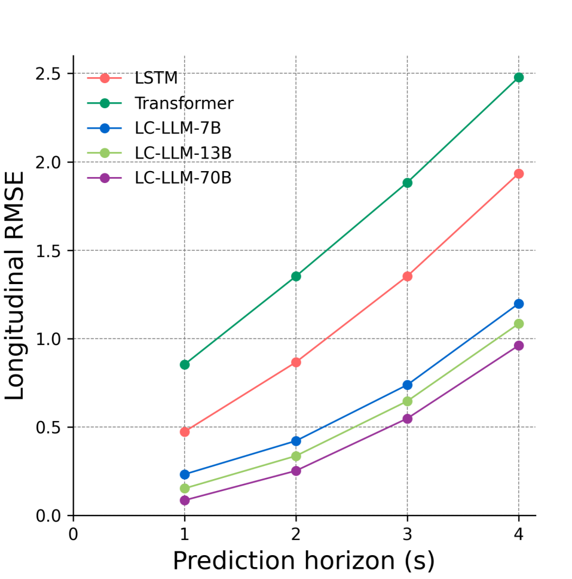

# LC-LLM：借助大型语言模型，实现车道变换意图与轨迹预测的可解释性分析

发布时间：2024年03月27日

`LLM应用` `自动驾驶` `交通预测`

> LC-LLM: Explainable Lane-Change Intention and Trajectory Predictions with Large Language Models

# 摘要

> 自动驾驶车辆要在多变的路况中确保行车安全，必须能够准确预判周围车辆的变道动向并预测它们的行驶轨迹。目前的运动预测方法还有很大的提升空间，尤其是在提高长期预测的精确度和解释性方面。本研究提出了LC-LLM模型，这是一个基于大型语言模型（LLMs）的可解释变道预测模型，充分利用了LLMs出色的推理和自我解释能力。我们将变道预测问题转化为语言建模任务，将复杂的驾驶场景信息转换为自然语言提示，输入到LLM中，并采用监督微调技术，使LLM专门针对变道预测任务进行优化。这样，我们就能利用LLM的常识推理能力来理解复杂的交互信息，进而提升长期预测的准确度。此外，我们还为推理阶段的提示加入了解释性要求。因此，LC-LLM模型不仅能预测变道意图和轨迹，还能提供预测的解释，增强了模型的可解释性。通过在大规模高D数据集上的广泛实验，我们证明了LC-LLM在变道预测任务上的优越性能和解释性。这是首次尝试利用LLMs预测变道行为，我们的研究显示LLMs能够编码全面的交互信息，以深入理解驾驶行为。

> To ensure safe driving in dynamic environments, autonomous vehicles should possess the capability to accurately predict the lane change intentions of surrounding vehicles in advance and forecast their future trajectories. Existing motion prediction approaches have ample room for improvement, particularly in terms of long-term prediction accuracy and interpretability. In this paper, we address these challenges by proposing LC-LLM, an explainable lane change prediction model that leverages the strong reasoning capabilities and self-explanation abilities of Large Language Models (LLMs). Essentially, we reformulate the lane change prediction task as a language modeling problem, processing heterogeneous driving scenario information in natural language as prompts for input into the LLM and employing a supervised fine-tuning technique to tailor the LLM specifically for our lane change prediction task. This allows us to utilize the LLM's powerful common sense reasoning abilities to understand complex interactive information, thereby improving the accuracy of long-term predictions. Furthermore, we incorporate explanatory requirements into the prompts in the inference stage. Therefore, our LC-LLM model not only can predict lane change intentions and trajectories but also provides explanations for its predictions, enhancing the interpretability. Extensive experiments on the large-scale highD dataset demonstrate the superior performance and interpretability of our LC-LLM in lane change prediction task. To the best of our knowledge, this is the first attempt to utilize LLMs for predicting lane change behavior. Our study shows that LLMs can encode comprehensive interaction information for driving behavior understanding.

[Arxiv](https://arxiv.org/abs/2403.18344)