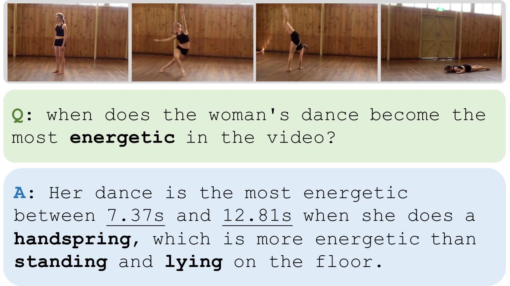
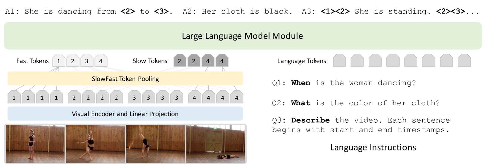
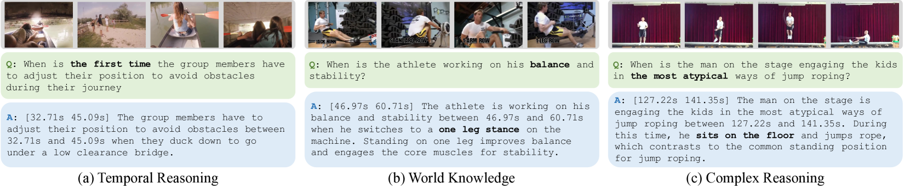
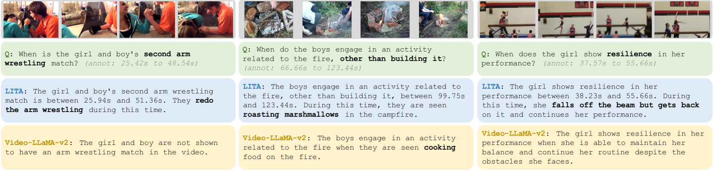
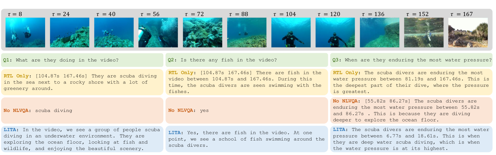

# LITA：受语言指令驱动的时间定位辅助工具

发布时间：2024年03月27日

`LLM应用` `视频分析` `多模态学习`

> LITA: Language Instructed Temporal-Localization Assistant

# 摘要

> 多模态大型语言模型（LLMs）的研究已取得显著成果，近期研究更是将模型应用到视频输入，展现出令人期待的指令执行能力。然而，模型在回答“何时发生？”这一问题时仍显不足。我们识别出影响时间定位能力的三大关键因素：（i）时间的表征方式，（ii）模型架构设计，以及（iii）数据处理方法。为了克服这些局限，我们提出了语言指导时间定位助手（LITA），它具备以下特性：（1）引入了能够根据视频长度相对编码时间戳的时间标记，以便更精准地描述视频中的时间信息。（2）在架构中融入了SlowFast标记，用以捕获更为细致的时间信息。（3）特别强调了对LITA进行时间定位数据的训练。我们不仅利用了已有的带时间戳的视频数据集，还提出了一项新任务——推理时间定位（RTL），并为之开发了ActivityNet-RTL数据集，以便更好地学习和评估这一任务。推理时间定位不仅要求视频LLMs具备推理能力，还需精确进行时间定位。LITA在这一高难度任务中表现卓越，将基线的时均交并比（mIoU）提升了近一倍。此外，我们的研究还表明，对时间定位的重视显著提升了基于视频的文本生成性能，相较于现有的视频LLMs，包括时间理解方面也有了36%的相对提升。相关代码已在GitHub上公开：https://github.com/NVlabs/LITA。

> There has been tremendous progress in multimodal Large Language Models (LLMs). Recent works have extended these models to video input with promising instruction following capabilities. However, an important missing piece is temporal localization. These models cannot accurately answer the "When?" questions. We identify three key aspects that limit their temporal localization capabilities: (i) time representation, (ii) architecture, and (iii) data. We address these shortcomings by proposing Language Instructed Temporal-Localization Assistant (LITA) with the following features: (1) We introduce time tokens that encode timestamps relative to the video length to better represent time in videos. (2) We introduce SlowFast tokens in the architecture to capture temporal information at fine temporal resolution. (3) We emphasize temporal localization data for LITA. In addition to leveraging existing video datasets with timestamps, we propose a new task, Reasoning Temporal Localization (RTL), along with the dataset, ActivityNet-RTL, for learning and evaluating this task. Reasoning temporal localization requires both the reasoning and temporal localization of Video LLMs. LITA demonstrates strong performance on this challenging task, nearly doubling the temporal mean intersection-over-union (mIoU) of baselines. In addition, we show that our emphasis on temporal localization also substantially improves video-based text generation compared to existing Video LLMs, including a 36% relative improvement of Temporal Understanding. Code is available at: https://github.com/NVlabs/LITA

[Arxiv](https://arxiv.org/abs/2403.19046)