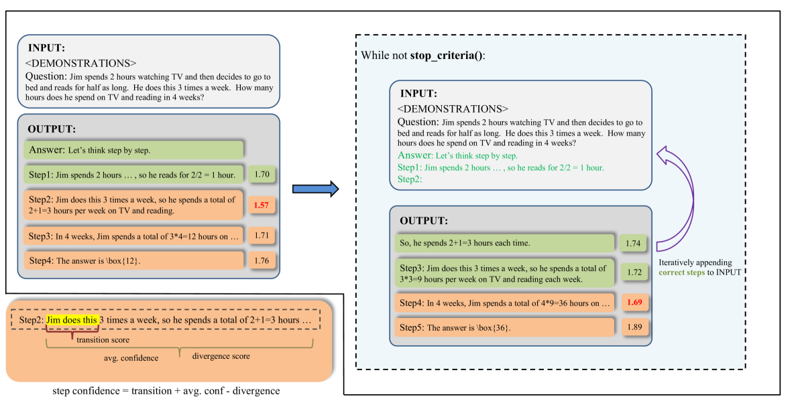
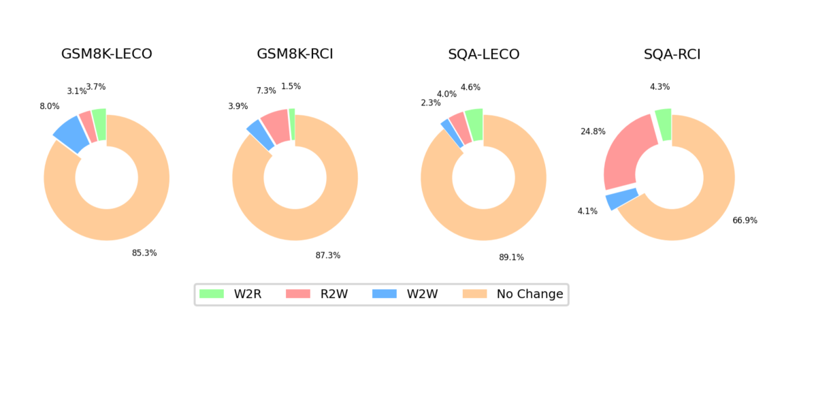
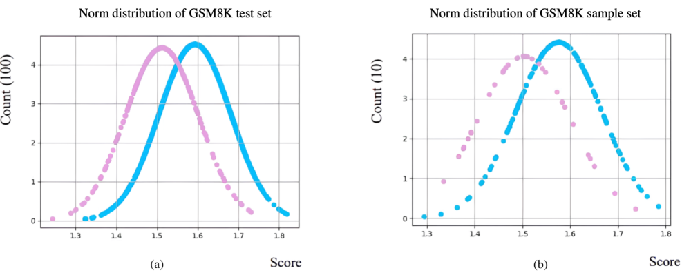

# 通过正确答案自我学习，无需额外提示，大型语言模型（LLM）展现出高效的推理能力。

发布时间：2024年03月27日

`LLM理论` `计算机科学` `人工智能`

> Learning From Correctness Without Prompting Makes LLM Efficient Reasoner

# 摘要

> 大型语言模型（LLMs）在众多任务上展现了卓越能力，但仍受限于幻觉、偏颇推理和不良内容等问题。本文提出了一种新颖的自我修正推理框架，无需依赖人工反馈或外部辅助工具，也无需手工设计提示。这一框架名为“从正确性学习”（LeCo），通过多步推理方法，避免了从错误中学习的需要，转而强调从正确的推理过程中吸取经验。它还独创性地利用生成logits来衡量每一步推理的信心水平。多项多步推理任务的实验结果显示，LeCo框架能有效提升推理效果，同时降低token的使用量。

> Large language models (LLMs) have demonstrated outstanding performance across various tasks, yet they still exhibit limitations such as hallucination, unfaithful reasoning, and toxic content. One potential approach to mitigate these issues is learning from human or external feedback (e.g. tools). In this paper, we introduce an intrinsic self-correct reasoning framework for LLMs that eliminates the need for human feedback, external tools, and handcraft prompts. The proposed framework, based on a multi-step reasoning paradigm \textbf{Le}arning from \textbf{Co}rrectness (\textsc{LeCo}), improves reasoning performance without needing to learn from errors. This paradigm prioritizes learning from correct reasoning steps, and a unique method to measure confidence for each reasoning step based on generation logits. Experimental results across various multi-step reasoning tasks demonstrate the effectiveness of the framework in improving reasoning performance with reduced token consumption.

[Arxiv](https://arxiv.org/abs/2403.19094)