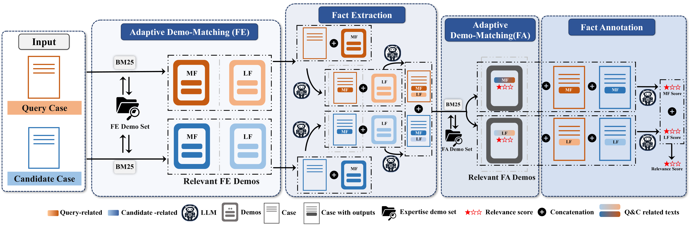
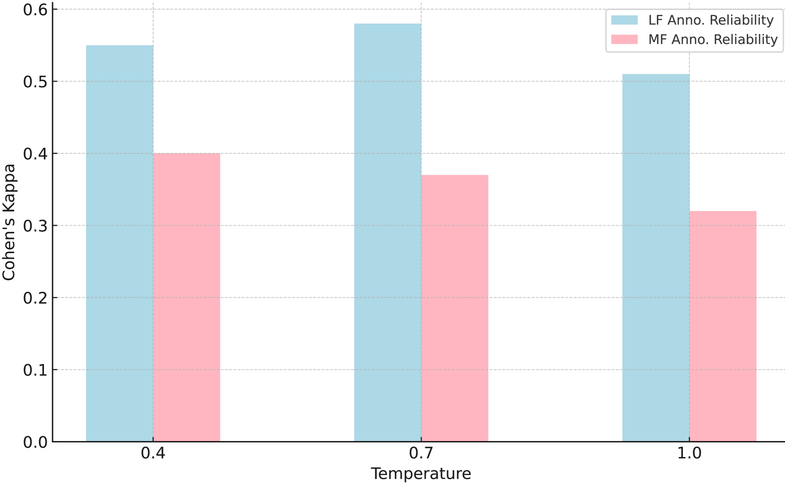
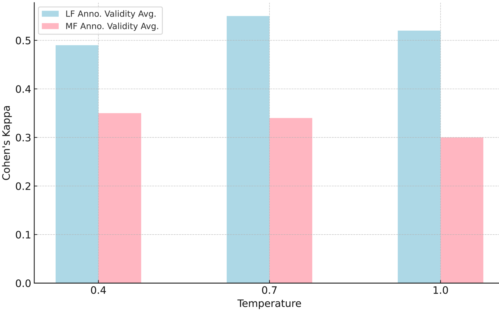
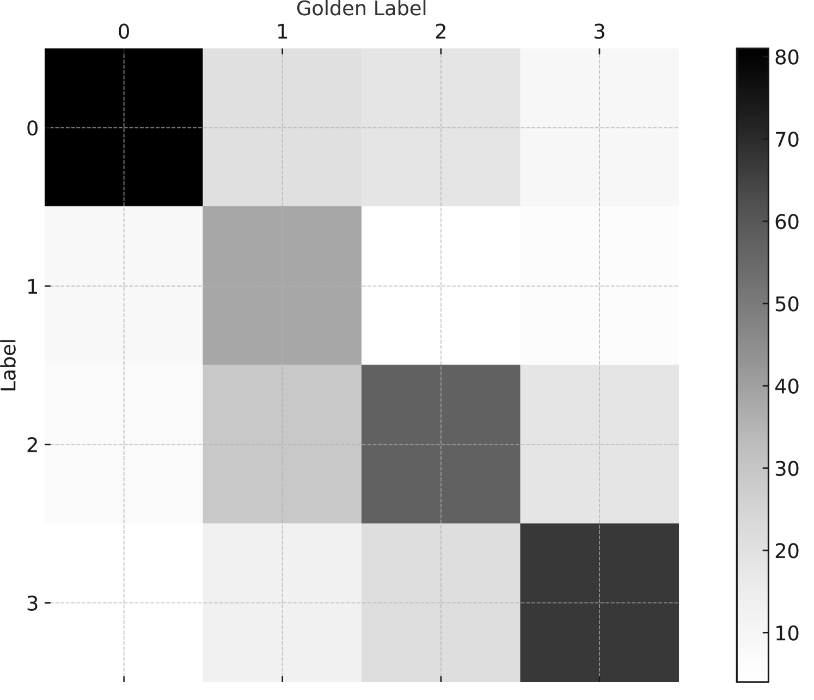
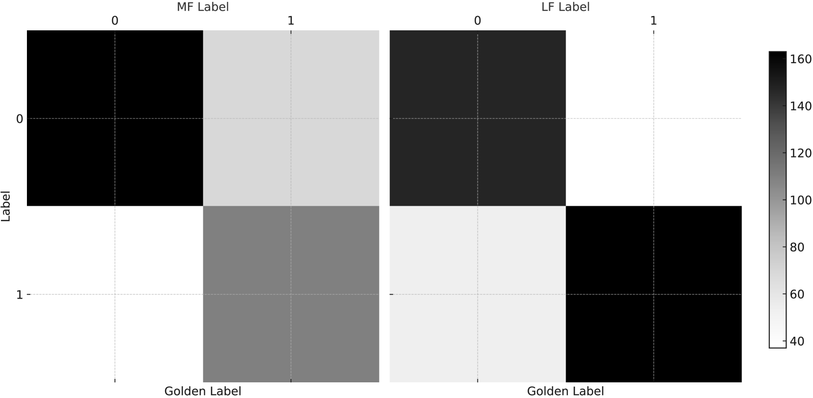

# 在法律案例检索中，借助大型语言模型进行相关性评估

发布时间：2024年03月27日

`LLM应用` `案例检索`

> Leveraging Large Language Models for Relevance Judgments in Legal Case Retrieval

# 摘要

> 法律案例检索中，搜集恰当的判断标准既费时又具挑战性。要准确评估两宗法律案件的相关性，不仅需费力阅读长篇文件，还需深厚法学知识来提炼法律事实及作出法律裁决。随着大型语言模型技术的兴起，最新研究发现，利用LLMs进行相关性评估前景广阔。然而，如何有效利用通用的大型语言模型为法律案例检索提供可靠的判断，尚待进一步研究。为解决这一问题，我们创新性地设计了一个针对法律案例判断的少量样本工作流程。该流程将标注任务分解成多个阶段，模拟人类评估者的步骤，同时融入专家推理，以提升判断的准确性。通过对比LLMs与人类专家的判断结果，我们实证证明了这一流程能够带来可靠的相关性评估。此外，我们还证实了通过整合LLMs生成的数据，能够提升现有法律案例检索模型的性能。

> Collecting relevant judgments for legal case retrieval is a challenging and time-consuming task. Accurately judging the relevance between two legal cases requires a considerable effort to read the lengthy text and a high level of domain expertise to extract Legal Facts and make juridical judgments. With the advent of advanced large language models, some recent studies have suggested that it is promising to use LLMs for relevance judgment. Nonetheless, the method of employing a general large language model for reliable relevance judgments in legal case retrieval is yet to be thoroughly explored. To fill this research gap, we devise a novel few-shot workflow tailored to the relevant judgment of legal cases. The proposed workflow breaks down the annotation process into a series of stages, imitating the process employed by human annotators and enabling a flexible integration of expert reasoning to enhance the accuracy of relevance judgments. By comparing the relevance judgments of LLMs and human experts, we empirically show that we can obtain reliable relevance judgments with the proposed workflow. Furthermore, we demonstrate the capacity to augment existing legal case retrieval models through the synthesis of data generated by the large language model.

[Arxiv](https://arxiv.org/abs/2403.18405)