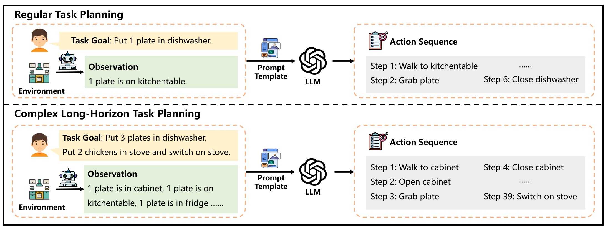
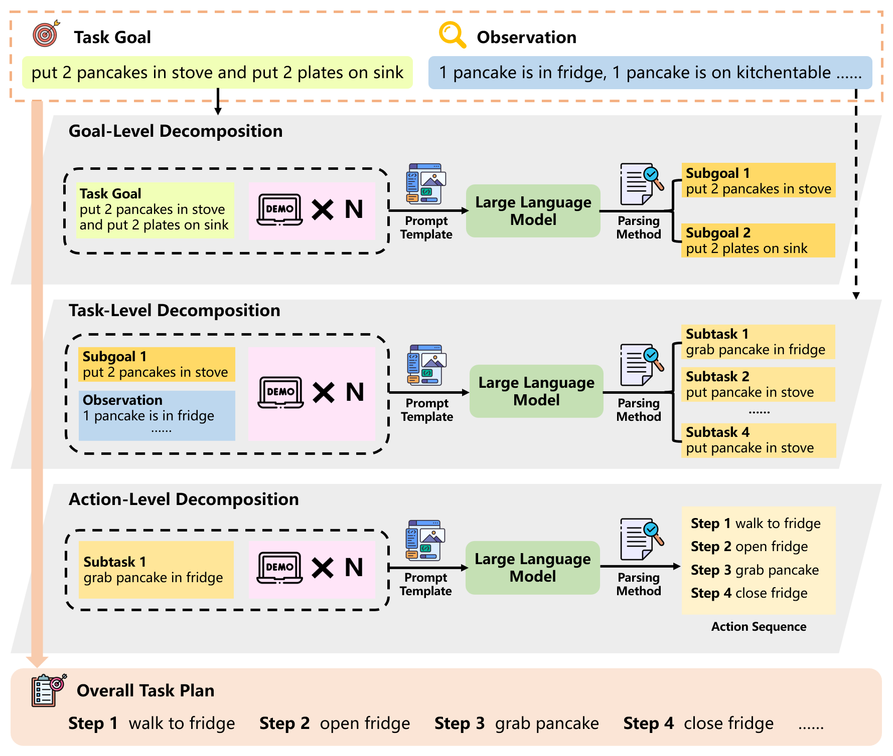
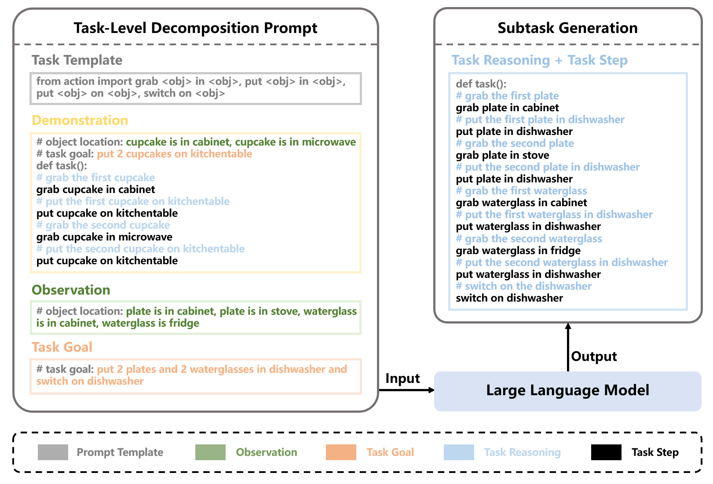
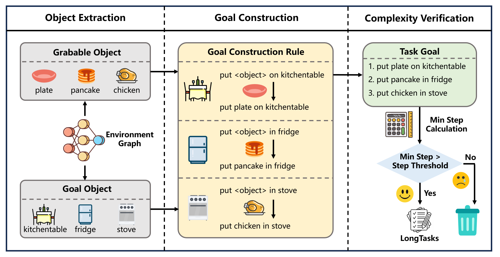
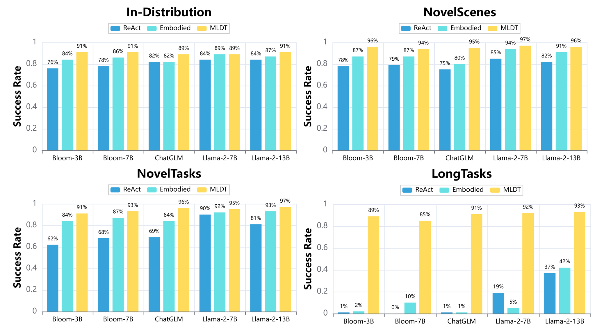
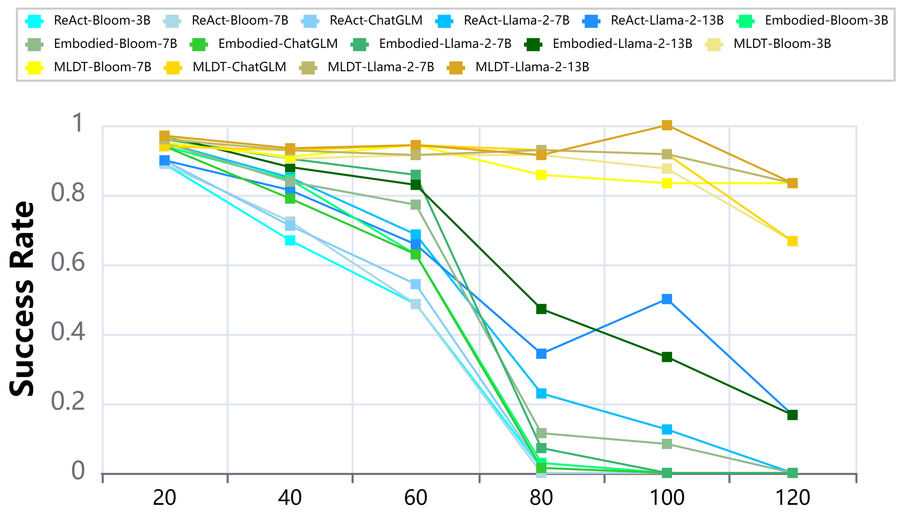
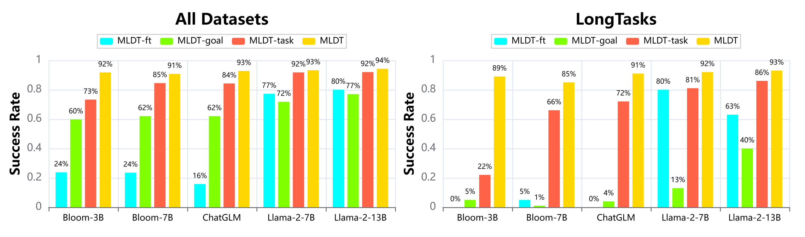
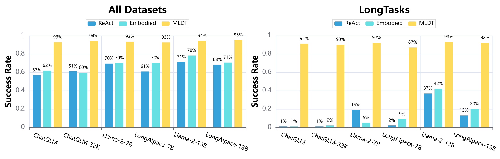
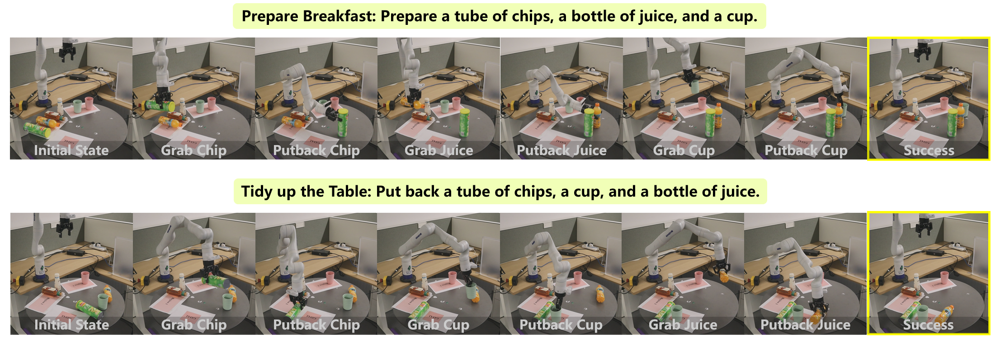

# MLDT 采用多层次分解策略，结合开源大型语言模型，旨在解决复杂长期机器人任务规划的挑战。

发布时间：2024年03月27日

`LLM应用` `机器人` `任务规划`

> MLDT: Multi-Level Decomposition for Complex Long-Horizon Robotic Task Planning with Open-Source Large Language Model

# 摘要

> 在数据驱动AI技术的世界里，将开源大型语言模型（LLMs）应用于机器人任务规划，标志着一个重大的进步。最新的基于开源LLMs的机器人任务规划方法，通过利用庞大的任务规划数据集来提升模型的规划实力。然而，面对复杂的长期任务，这些方法仍显不足，因为它们需要更深入地理解上下文并生成更长的行动序列。为了应对这一挑战，本文提出了一种创新的多级分解任务规划法（MLDT）。该方法通过在目标层、任务层和行动层对任务进行分解，有效降低了复杂长期任务的难度。我们还引入了一种针对目标敏感的语料库生成技术，以打造高质量的训练数据，并对这些数据进行精准的指令调优。鉴于现有数据集的复杂性尚不足以满足需求，我们特别构建了一个更具挑战性的数据集LongTasks，用以评估在复杂长期任务上的规划能力。通过在VirtualHome环境中的四个数据集上对不同LLMs进行测试，我们的成果显著提升了机器人任务规划的性能，证明了MLDT在解决开源LLMs现有方法的局限以及在现实世界复杂场景中应用的实用性方面，都具有显著的效果。

> In the realm of data-driven AI technology, the application of open-source large language models (LLMs) in robotic task planning represents a significant milestone. Recent robotic task planning methods based on open-source LLMs typically leverage vast task planning datasets to enhance models' planning abilities. While these methods show promise, they struggle with complex long-horizon tasks, which require comprehending more context and generating longer action sequences. This paper addresses this limitation by proposing MLDT, theMulti-Level Decomposition Task planning method. This method innovatively decomposes tasks at the goal-level, task-level, and action-level to mitigate the challenge of complex long-horizon tasks. In order to enhance open-source LLMs' planning abilities, we introduce a goal-sensitive corpus generation method to create high-quality training data and conduct instruction tuning on the generated corpus. Since the complexity of the existing datasets is not high enough, we construct a more challenging dataset, LongTasks, to specifically evaluate planning ability on complex long-horizon tasks. We evaluate our method using various LLMs on four datasets in VirtualHome. Our results demonstrate a significant performance enhancement in robotic task planning, showcasing MLDT's effectiveness in overcoming the limitations of existing methods based on open-source LLMs as well as its practicality in complex, real-world scenarios.

[Arxiv](https://arxiv.org/abs/2403.18760)