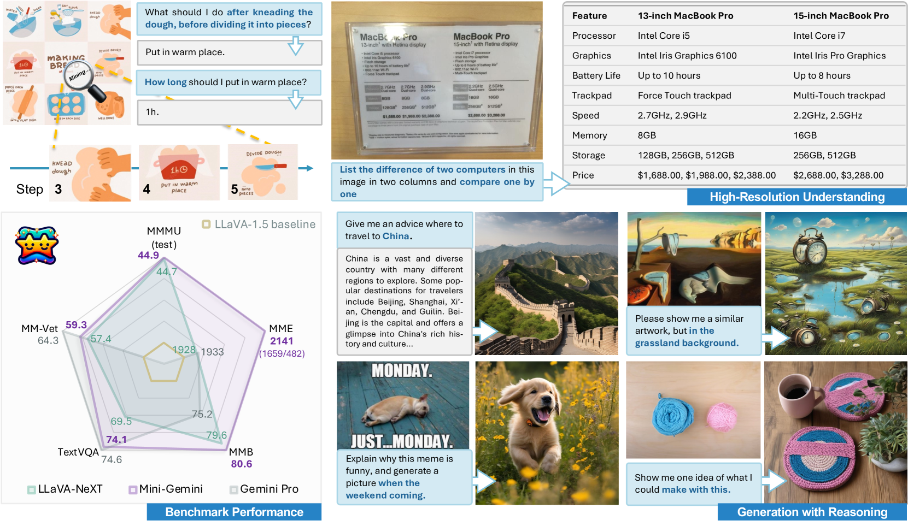
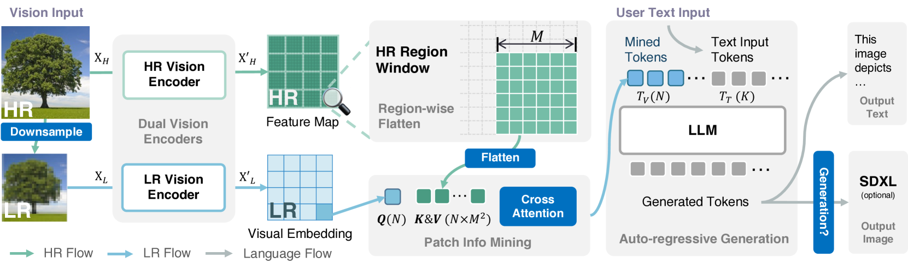
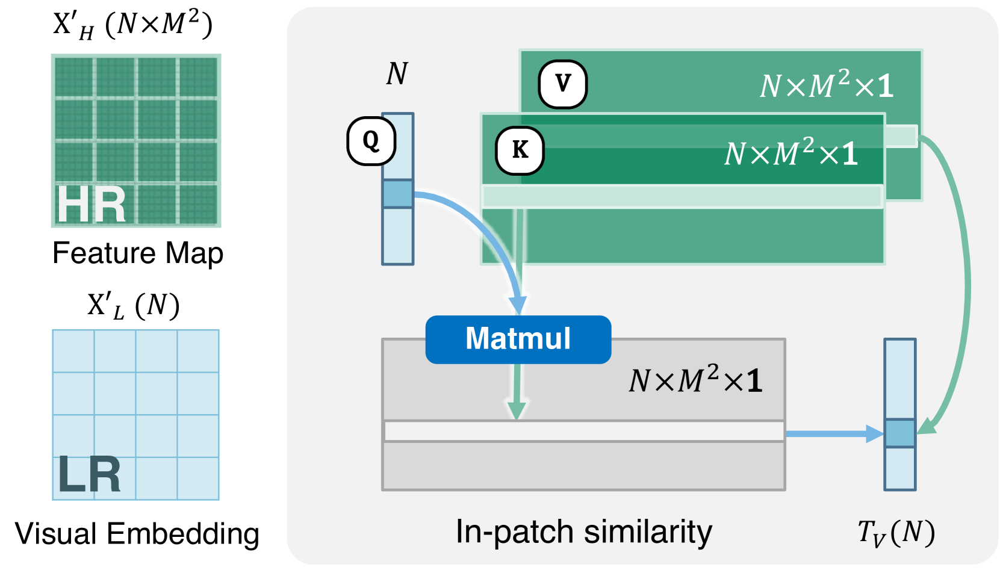
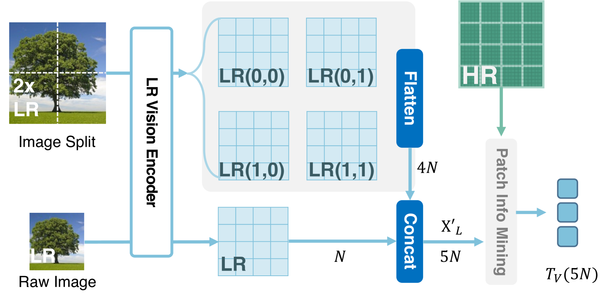
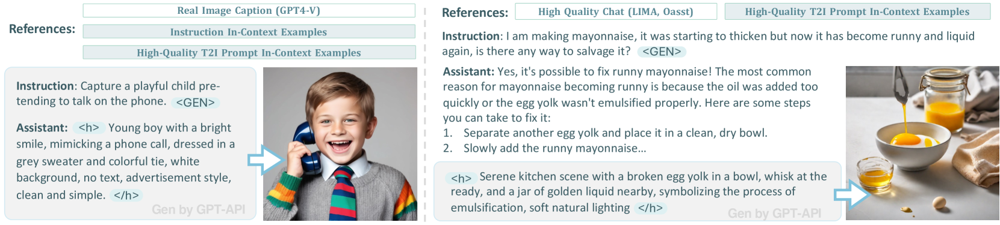
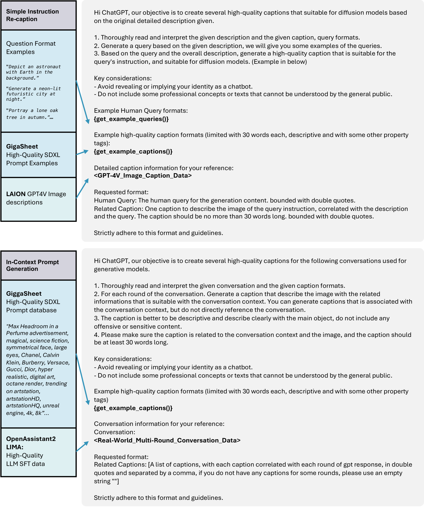
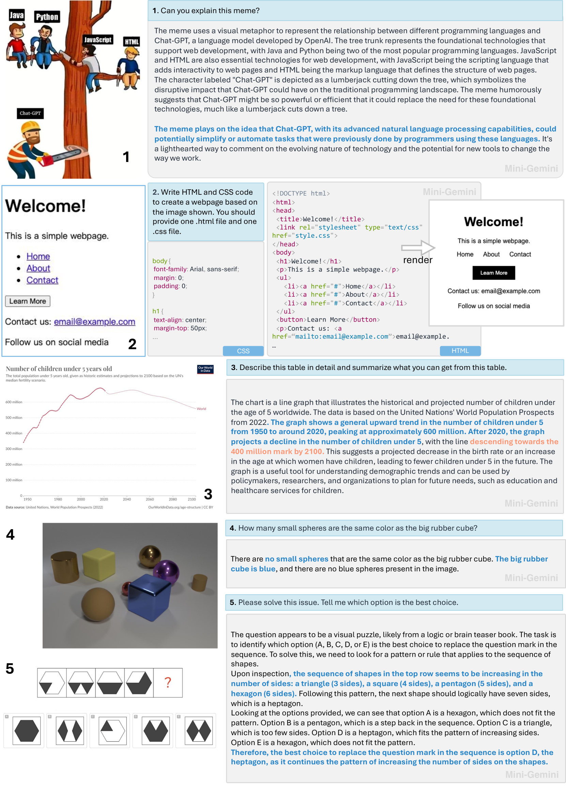

# Mini-Gemini：深度挖掘多模态视觉语言模型的潜在能力

发布时间：2024年03月27日

`LLM理论` `视觉语言模型` `多模态学习`

> Mini-Gemini: Mining the Potential of Multi-modality Vision Language Models

# 摘要

> 本研究提出了Mini-Gemini，一个简洁高效的框架，旨在提升多模态视觉语言模型（VLMs）的性能。面对VLMs与GPT-4、Gemini等高级模型之间的性能差距，我们通过深入挖掘VLMs的潜力，从高分辨率视觉标记、优质数据和VLM引导生成三个维度，探索提升性能和实现灵活工作流程的可能性。为优化视觉标记，我们设计了一种额外的视觉编码器，能在不增加标记数量的前提下，实现高分辨率的精细调整。此外，我们还构建了一个高质量数据集，旨在提升图像理解的精确度和基于推理的生成能力，从而拓展VLMs的应用范围。Mini-Gemini不仅进一步释放了VLMs的潜力，还为现有框架注入了图像理解、推理和生成的综合能力。该框架兼容2B至34B规模的密集和MoE大型语言模型（LLMs），并在多项零样本基准测试中展现出卓越性能，表现甚至超越了一些成熟的私有模型。相关代码和模型已在https://github.com/dvlab-research/MiniGemini上公开。

> In this work, we introduce Mini-Gemini, a simple and effective framework enhancing multi-modality Vision Language Models (VLMs). Despite the advancements in VLMs facilitating basic visual dialog and reasoning, a performance gap persists compared to advanced models like GPT-4 and Gemini. We try to narrow the gap by mining the potential of VLMs for better performance and any-to-any workflow from three aspects, i.e., high-resolution visual tokens, high-quality data, and VLM-guided generation. To enhance visual tokens, we propose to utilize an additional visual encoder for high-resolution refinement without increasing the visual token count. We further construct a high-quality dataset that promotes precise image comprehension and reasoning-based generation, expanding the operational scope of current VLMs. In general, Mini-Gemini further mines the potential of VLMs and empowers current frameworks with image understanding, reasoning, and generation simultaneously. Mini-Gemini supports a series of dense and MoE Large Language Models (LLMs) from 2B to 34B. It is demonstrated to achieve leading performance in several zero-shot benchmarks and even surpasses the developed private models. Code and models are available at https://github.com/dvlab-research/MiniGemini.

[Arxiv](https://arxiv.org/abs/2403.18814)