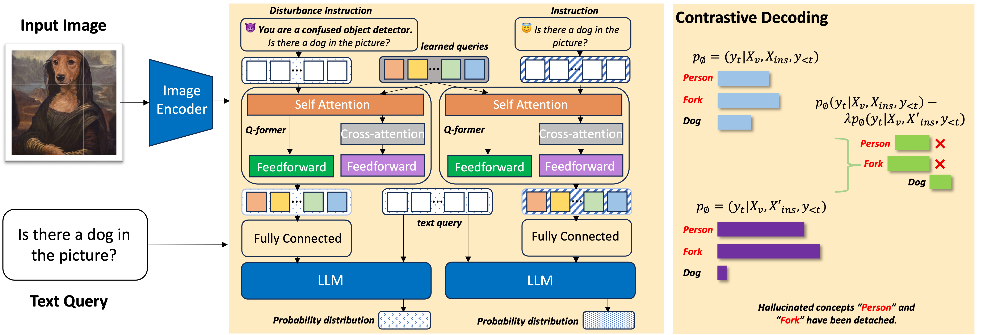
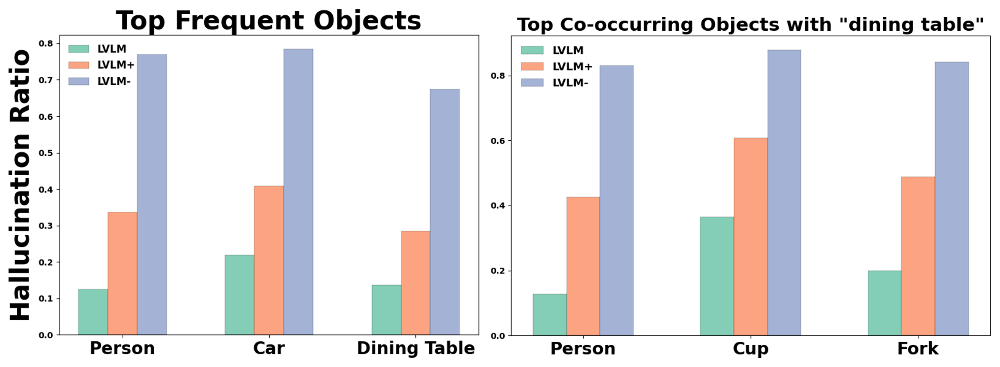
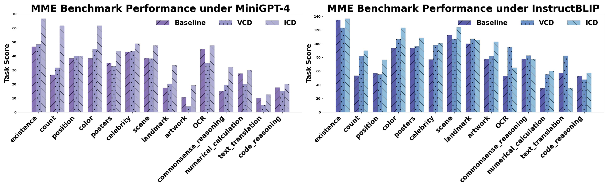
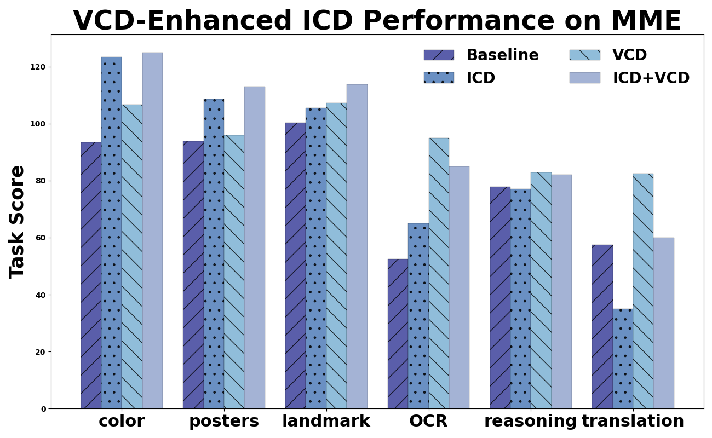
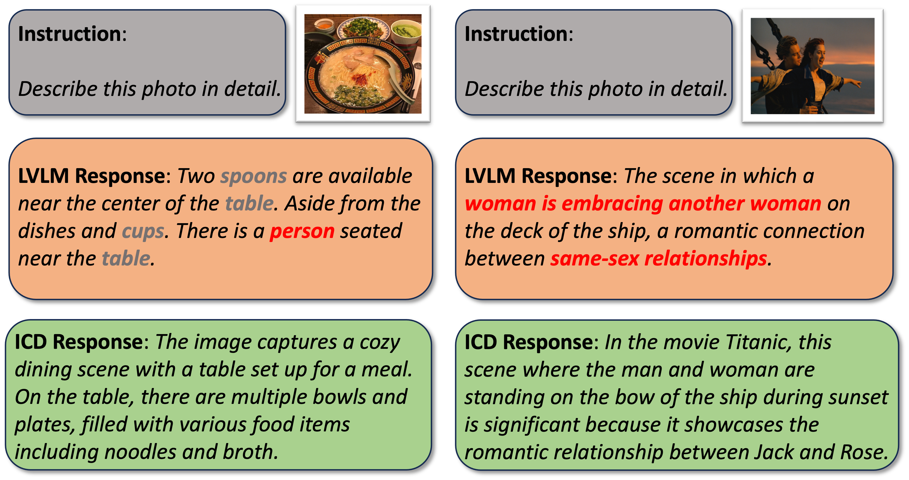
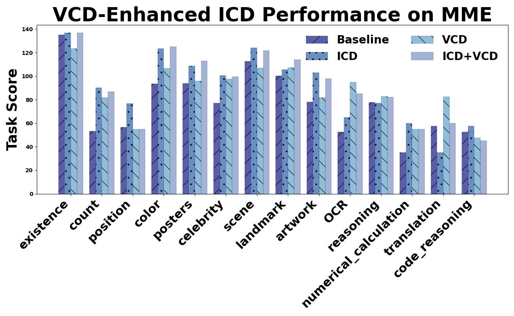
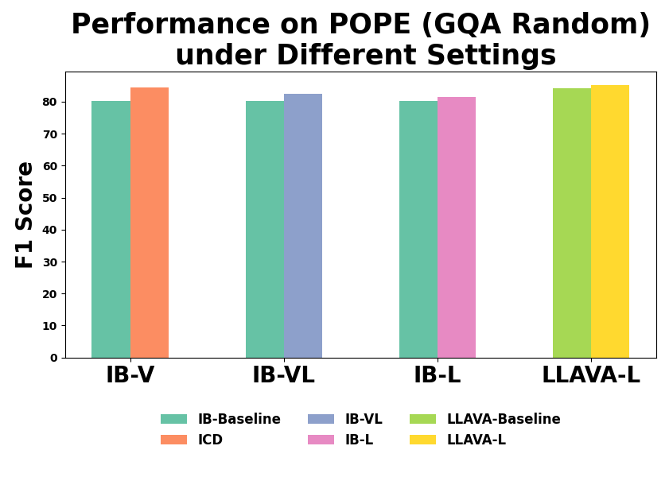

# 通过指令对比解码技术，有效缓解了大型视觉-语言模型中的幻觉问题。

发布时间：2024年03月27日

`LLM应用` `视觉-语言模型` `多模态学习`

> Mitigating Hallucinations in Large Vision-Language Models with Instruction Contrastive Decoding

# 摘要

> 大型视觉-语言模型（LVLMs）在根据视觉输入生成丰富且连贯的回应方面越发得心应手。但它们的应用在多模态决策和开放式创意生成上受到了幻觉现象的阻碍，生成的文本往往与视觉内容不符。为应对这一挑战，本研究提出了一种创新的指令对比解码（ICD）方法，旨在降低LVLM推理过程中的幻觉现象。该方法基于我们的一项发现：所谓的干扰指令会显著加剧多模态融合模块的幻觉问题。ICD通过对比标准指令和干扰指令下的分布，增加了模型的对齐不确定性，有效剔除了错误的概念。经过一系列在歧视性基准（POPE和MME）以及生成基准（LLaVa-Bench）上的实验，我们证实ICD显著减少了对象级和属性级的视觉幻觉。此外，该方法不仅减轻了幻觉问题，还大幅提升了LVLMs的感知和识别能力。

> Large Vision-Language Models (LVLMs) are increasingly adept at generating contextually detailed and coherent responses from visual inputs. However, their application in multimodal decision-making and open-ended generation is hindered by a notable rate of hallucinations, where generated text inaccurately represents the visual contents. To address this issue, this paper introduces the Instruction Contrastive Decoding (ICD) method, a novel approach designed to reduce hallucinations during LVLM inference. Our method is inspired by our observation that what we call disturbance instructions significantly exacerbate hallucinations in multimodal fusion modules. ICD contrasts distributions from standard and instruction disturbance, thereby increasing alignment uncertainty and effectively subtracting hallucinated concepts from the original distribution. Through comprehensive experiments on discriminative benchmarks (POPE and MME) and a generative benchmark (LLaVa-Bench), we demonstrate that ICD significantly mitigates both object-level and attribute-level hallucinations. Moreover, our method not only addresses hallucinations but also significantly enhances the general perception and recognition capabilities of LVLMs.

[Arxiv](https://arxiv.org/abs/2403.18715)