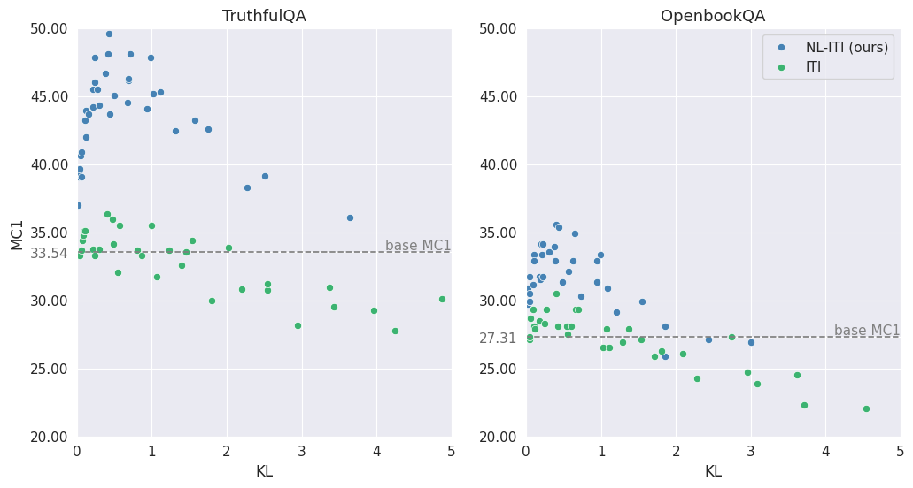
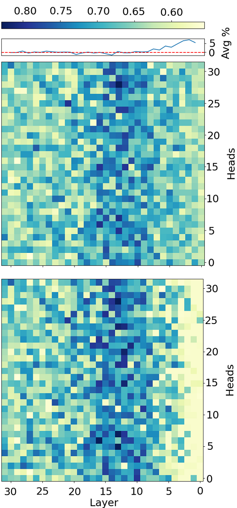
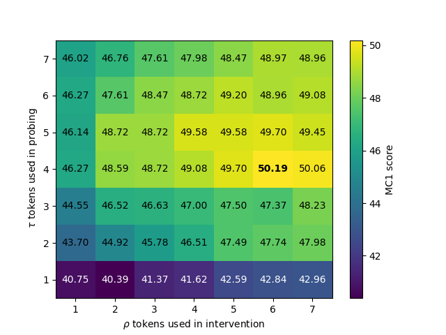

# NL-ITI：通过优化探测和干预手段，提升ITI方法的性能

发布时间：2024年03月27日

`LLM理论` `人工智能` `信息检索`

> NL-ITI: Optimizing Probing and Intervention for Improvement of ITI Method

# 摘要

> 大型语言模型（LLM）容易出现误导性信息，成为AI领域的一个重大难题。我们研究了推理时干预（ITI）提出的新方法。首先，该方法识别出含有丰富所需知识（如真实信息）的注意力头。推理阶段，选定的注意力头激活被调整。我们对ITI框架进行了创新，引入了非线性探测和多标记干预技术，形成了非线性ITI（NL-ITI）。NL-ITI在多个选择题基准测试中表现优异，例如在TruthfulQA测试中，相比ITI基线，MC1指标提升了约14%。在MMLU的商业道德子域测试中，NL-ITI也实现了约18%的MC1提升，超越了基线LLaMA2-7B。此外，NL-ITI在减少对LLM行为干预的同时，也保持了良好的性能（以Kullback-Leibler散度为标准）。

> Large Language Models (LLM) are prone to returning false information. It constitutes one of major challenges in the AI field. In our work, we explore paradigm introduced by Inference-Time-Intervention (ITI). In first stage, it identifies attention heads, which contain the highest amount of desired type of knowledge (e.g., truthful). Afterwards, during inference, LLM activations are shifted for chosen subset of attention heads. We further improved the ITI framework by introducing a nonlinear probing and multi-token intervention - Non-Linear ITI (NL-ITI). NL-ITI is tested on diverse multiple-choice benchmarks, including TruthfulQA, on which we report around 14% MC1 metric improvement with respect to the baseline ITI results. NL-ITI achieves also encouraging results on other testsets - on Business Ethics subdomain of MMLU, around 18% MC1 improvement over baseline LLaMA2-7B. Additionally, NL-ITI performs better while being less invasive in the behavior of LLM at the same time (as measured by Kullback-Leibler divergence).

[Arxiv](https://arxiv.org/abs/2403.18680)