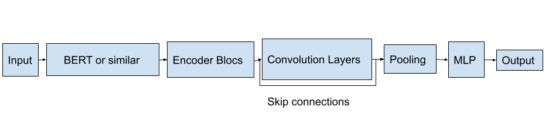

# BERT 助力句子分类的神经架构探索在自然语言处理的舞台上，BERT 已成为佼佼者。但如何借神经架构搜索（NAS）之力，为句子分类任务定制更高效的 BERT 架构，仍是一片待开垦的疆域。本研究将深入挖掘 BERT 在句子分类中的潜力，探索 NAS 在优化其性能方面的应用与影响。

发布时间：2024年03月27日

`LLM理论` `自动机器学习`

> Neural Architecture Search for Sentence Classification with BERT

# 摘要

> 在自然语言处理领域，通常我们会对大量文本数据进行语言模型的预训练。之后，通过微调这些模型来优化不同任务的表现。本文质疑了仅在网络顶端增加单一输出层作为分类器的常规做法。我们通过AutoML技术探索，发现了在计算成本略有增加的情况下，性能超越单层结构的新架构。这些新架构已在GLUE基准测试中的多个NLP任务上得到了验证。

> Pre training of language models on large text corpora is common practice in Natural Language Processing. Following, fine tuning of these models is performed to achieve the best results on a variety of tasks. In this paper we question the common practice of only adding a single output layer as a classification head on top of the network. We perform an AutoML search to find architectures that outperform the current single layer at only a small compute cost. We validate our classification architecture on a variety of NLP benchmarks from the GLUE dataset.

[Arxiv](https://arxiv.org/abs/2403.18547)