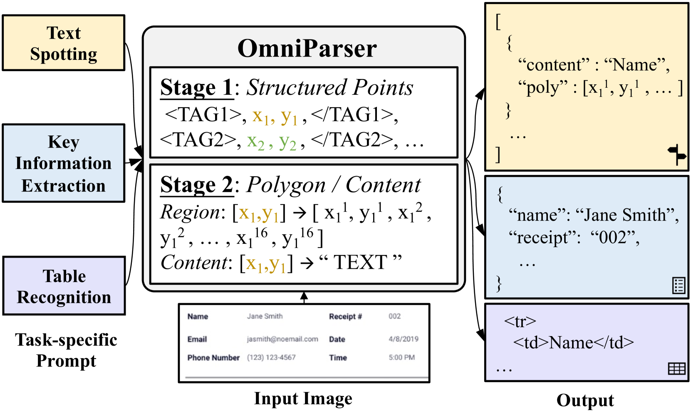
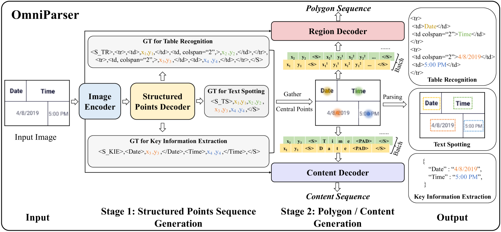

# OmniParser：统一框架实现文本发现、关键信息抽取与表格识别。

发布时间：2024年03月27日

`LLM应用` `文档自动化` `视觉定位文本解析`

> OmniParser: A Unified Framework for Text Spotting, Key Information Extraction and Table Recognition

# 摘要

> 近期，视觉定位文本解析（VsTP）领域因自动化文档理解需求的激增和生成性大型语言模型（LLMs）的兴起而快速发展。面对VsTP的挑战，众多方法应运而生。然而，先前研究往往针对特定任务定制架构和目标，导致模态隔离和流程复杂化。本文提出了一种全新的统一方法，用以解析不同场景下的视觉定位文本。我们创新性地构建了一个名为OmniParser的通用模型，能够同时应对文本发现、关键信息提取和表格识别三项常见任务。该模型采用统一的编码器-解码器架构、点条件文本生成目标，以及提示和结构化序列的统一输入输出表示。大量实验验证，OmniParser在三个视觉定位文本解析任务的七个数据集上，达到了业界领先或极具竞争力的水平，展现了其简洁而高效的设计优势。相关代码已在https://github.com/AlibabaResearch/AdvancedLiterateMachinery发布。

> Recently, visually-situated text parsing (VsTP) has experienced notable advancements, driven by the increasing demand for automated document understanding and the emergence of Generative Large Language Models (LLMs) capable of processing document-based questions. Various methods have been proposed to address the challenging problem of VsTP. However, due to the diversified targets and heterogeneous schemas, previous works usually design task-specific architectures and objectives for individual tasks, which inadvertently leads to modal isolation and complex workflow. In this paper, we propose a unified paradigm for parsing visually-situated text across diverse scenarios. Specifically, we devise a universal model, called OmniParser, which can simultaneously handle three typical visually-situated text parsing tasks: text spotting, key information extraction, and table recognition. In OmniParser, all tasks share the unified encoder-decoder architecture, the unified objective: point-conditioned text generation, and the unified input & output representation: prompt & structured sequences. Extensive experiments demonstrate that the proposed OmniParser achieves state-of-the-art (SOTA) or highly competitive performances on 7 datasets for the three visually-situated text parsing tasks, despite its unified, concise design. The code is available at https://github.com/AlibabaResearch/AdvancedLiterateMachinery.

[Arxiv](https://arxiv.org/abs/2403.19128)