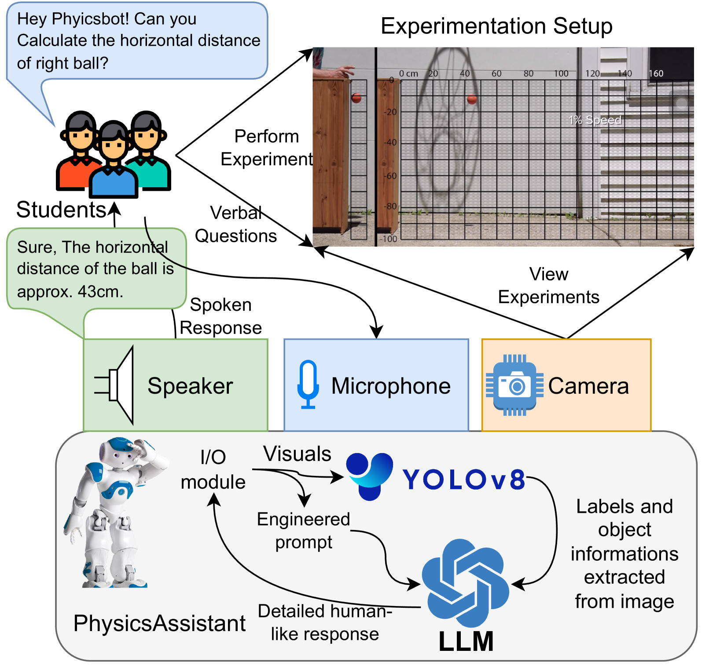
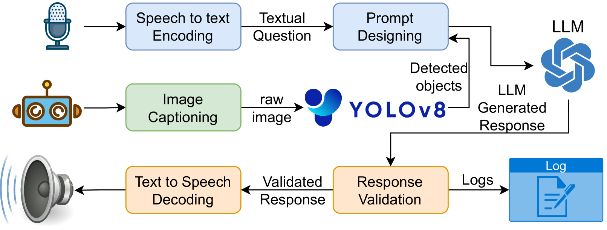

# PhysicsAssistant：一款由大型语言模型（LLM）提供动力的物理实验探索互动学习机器人。

发布时间：2024年03月27日

`LLM应用` `机器人技术`

> PhysicsAssistant: An LLM-Powered Interactive Learning Robot for Physics Lab Investigations

# 摘要

> 教育机器人系统借助大型语言模型的自然语义处理能力，为学习提供支持和便利。本文介绍了一款基于YOLOv8目标检测、摄像头、语音识别和聊天机器人技术的多模态交互机器人PhysicsAssistant，旨在辅助学生进行物理实验。通过与人类专家的对比研究，我们对十名八年级学生使用PhysicsAssistant的表现进行了实证评估。专家依据布鲁姆教育目标分类，对助手对学生问题的回答进行0到4分的评分。研究发现，PhysicsAssistant与GPT-4在事实理解方面的评分持平，但在概念和程序性知识方面，GPT-4的评分显著高于PhysicsAssistant。尽管如此，PhysicsAssistant的响应速度优于GPT-4，显示出其作为实时实验室助手的潜力，能够减轻教师的负担，处理一些重复性工作。这是首次尝试为K-12阶段的科学教育打造如此互动性强的多模态机器人助手。

> Robot systems in education can leverage Large language models' (LLMs) natural language understanding capabilities to provide assistance and facilitate learning. This paper proposes a multimodal interactive robot (PhysicsAssistant) built on YOLOv8 object detection, cameras, speech recognition, and chatbot using LLM to provide assistance to students' physics labs. We conduct a user study on ten 8th-grade students to empirically evaluate the performance of PhysicsAssistant with a human expert. The Expert rates the assistants' responses to student queries on a 0-4 scale based on Bloom's taxonomy to provide educational support. We have compared the performance of PhysicsAssistant (YOLOv8+GPT-3.5-turbo) with GPT-4 and found that the human expert rating of both systems for factual understanding is the same. However, the rating of GPT-4 for conceptual and procedural knowledge (3 and 3.2 vs 2.2 and 2.6, respectively) is significantly higher than PhysicsAssistant (p < 0.05). However, the response time of GPT-4 is significantly higher than PhysicsAssistant (3.54 vs 1.64 sec, p < 0.05). Hence, despite the relatively lower response quality of PhysicsAssistant than GPT-4, it has shown potential for being used as a real-time lab assistant to provide timely responses and can offload teachers' labor to assist with repetitive tasks. To the best of our knowledge, this is the first attempt to build such an interactive multimodal robotic assistant for K-12 science (physics) education.

[Arxiv](https://arxiv.org/abs/2403.18721)