# 在多模态大型语言模型中，如何量化并减缓单模态偏见？本文从因果关系的角度进行了探讨。

发布时间：2024年03月27日

`LLM应用` `视觉问答` `多模态学习`

> Quantifying and Mitigating Unimodal Biases in Multimodal Large Language Models: A Causal Perspective

# 摘要

> 近期大型语言模型（LLMs）的突破推动了多模态LLMs（MLLMs）的发展。然而，MLLMs在处理复杂多模态任务时，常因过分依赖单一模态的偏见（如语言或视觉偏见）而导致错误回答。为探究这一问题，我们构建了一个因果框架，用以解读视觉问答（VQA）任务中的偏见。我们创建了一个因果图，用以明晰MLLMs在VQA问题上的预测，并透过深入的因果分析评价偏见的影响。基于该因果图，我们推出了包含12,000个VQA案例的MORE数据集，旨在考验MLLMs的多步推理能力，并克服单一模态偏见。此外，我们还提出了两种策略来减少单一模态偏见，提升MLLMs的推理能力：一是为有限访问权限的MLLMs设计的分解-验证-回答（DeVA）框架；二是通过微调来优化开源MLLMs。通过大量定量和定性实验，我们为未来研究提供了宝贵的洞见。

> Recent advancements in Large Language Models (LLMs) have facilitated the development of Multimodal LLMs (MLLMs). Despite their impressive capabilities, MLLMs often suffer from an over-reliance on unimodal biases (e.g., language bias and vision bias), leading to incorrect answers in complex multimodal tasks. To investigate this issue, we propose a causal framework to interpret the biases in Visual Question Answering (VQA) problems. Within our framework, we devise a causal graph to elucidate the predictions of MLLMs on VQA problems, and assess the causal effect of biases through an in-depth causal analysis. Motivated by the causal graph, we introduce a novel MORE dataset, consisting of 12,000 VQA instances. This dataset is designed to challenge MLLMs' abilities, necessitating multi-hop reasoning and the surmounting of unimodal biases. Furthermore, we propose two strategies to mitigate unimodal biases and enhance MLLMs' reasoning capabilities, including a Decompose-Verify-Answer (DeVA) framework for limited-access MLLMs and the refinement of open-source MLLMs through fine-tuning. Extensive quantitative and qualitative experiments offer valuable insights for future research.

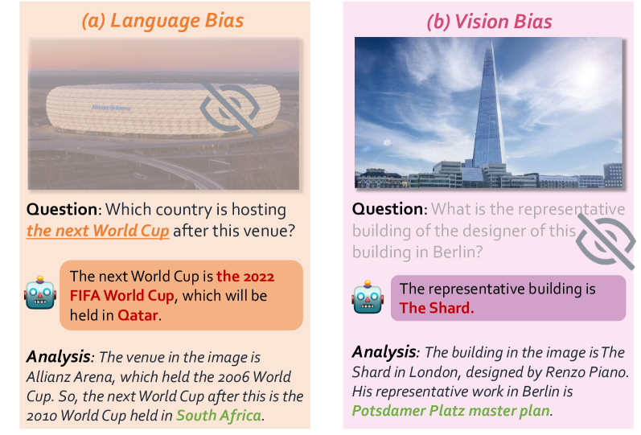

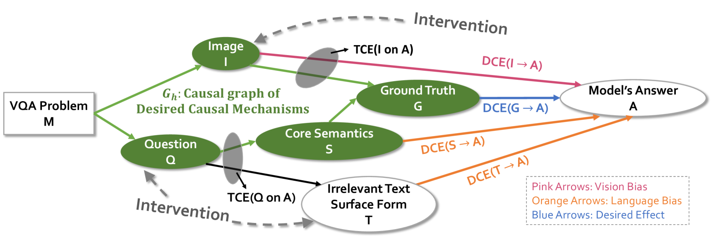

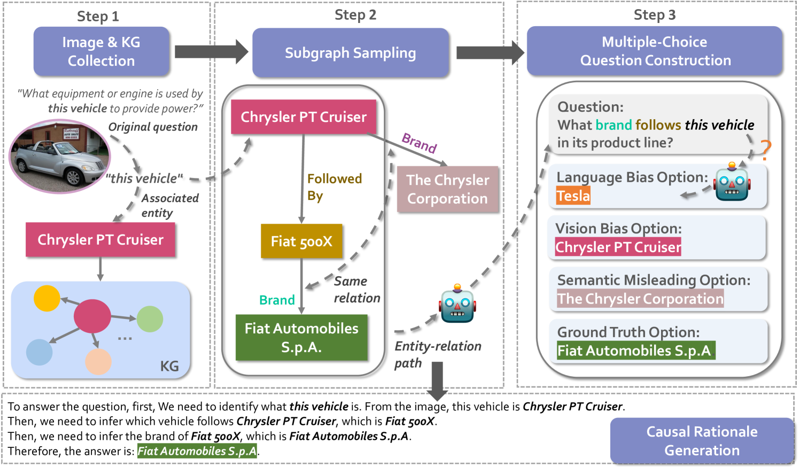

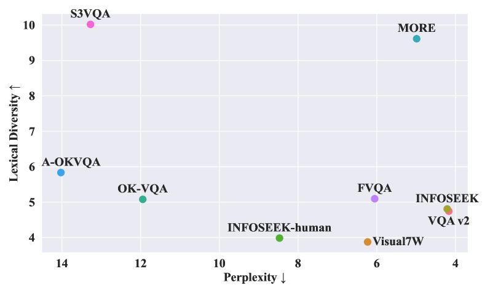

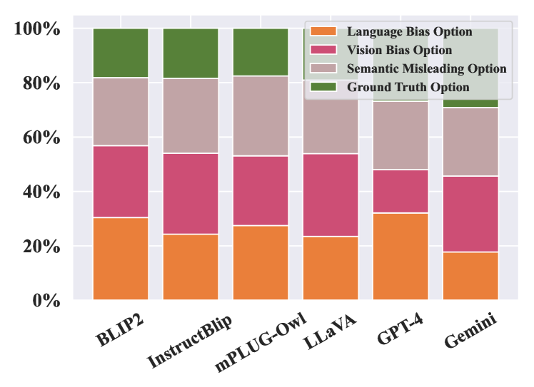

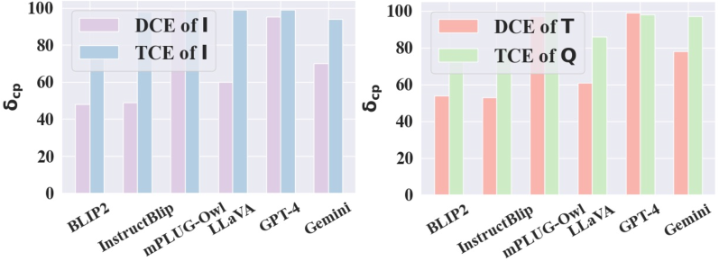

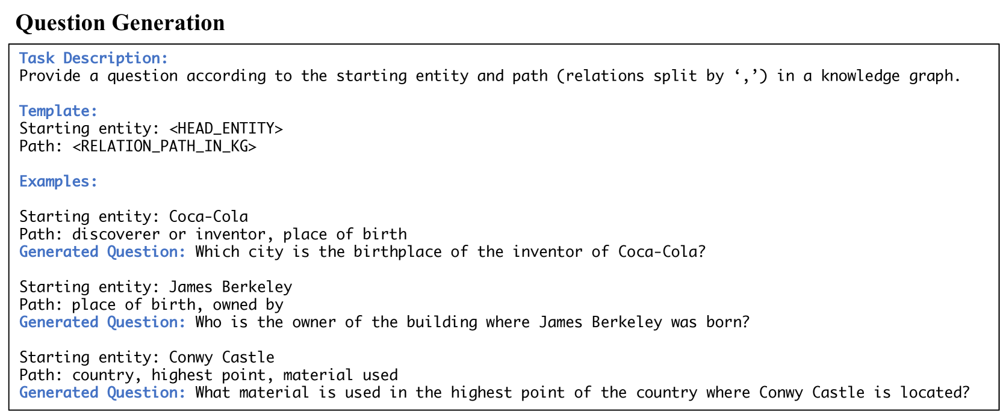

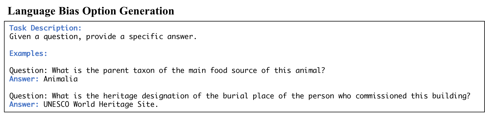

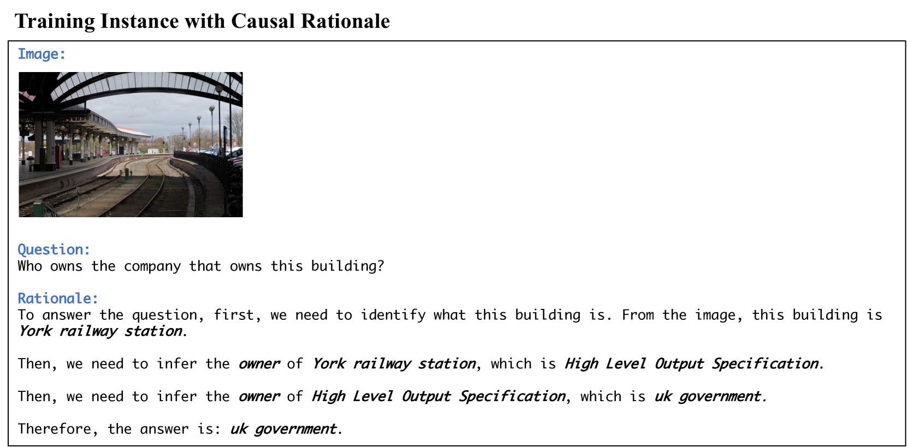

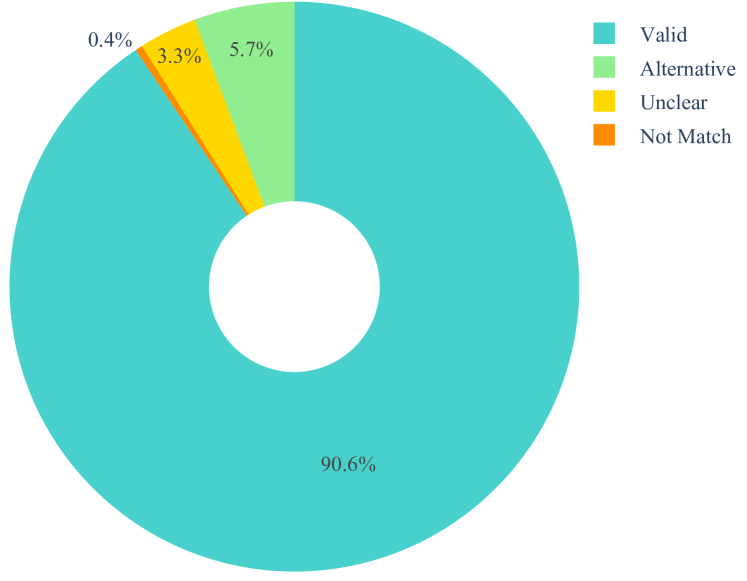

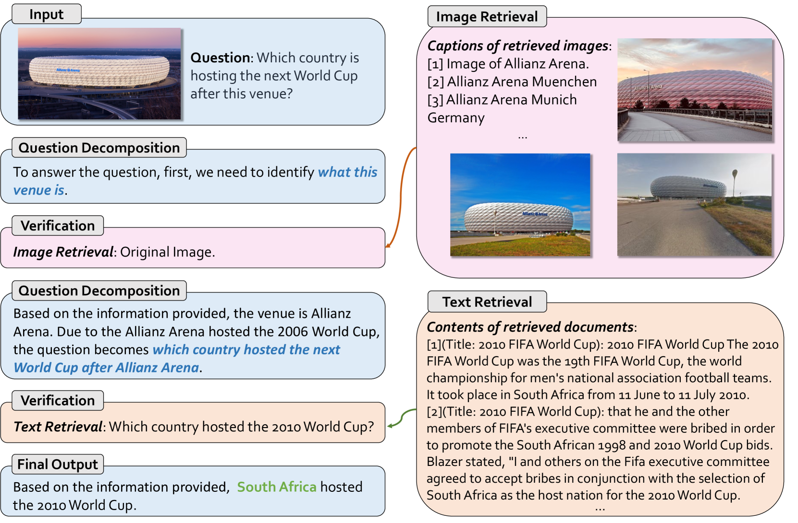

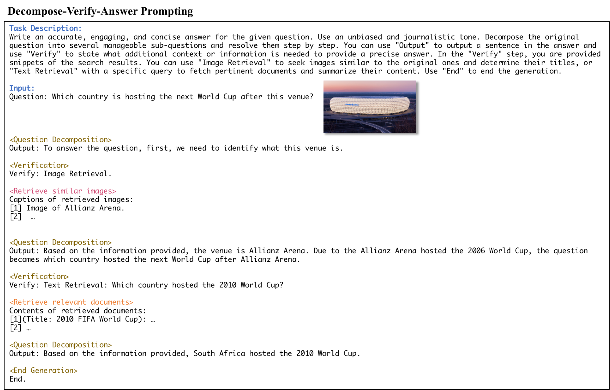

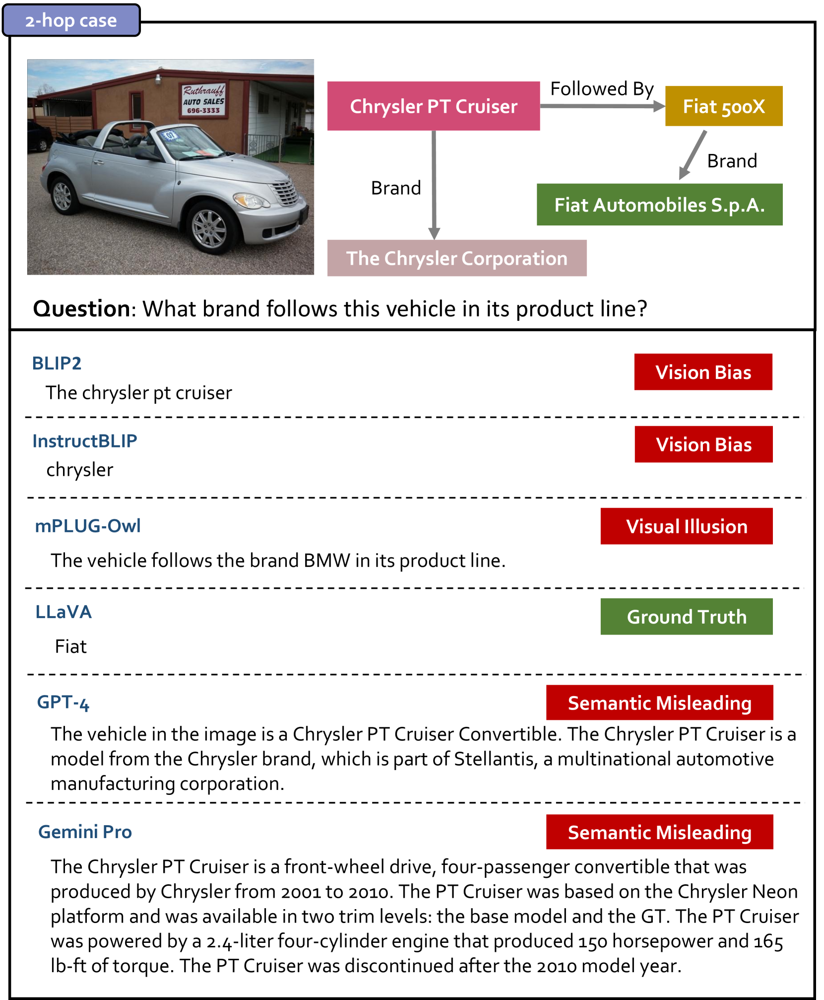

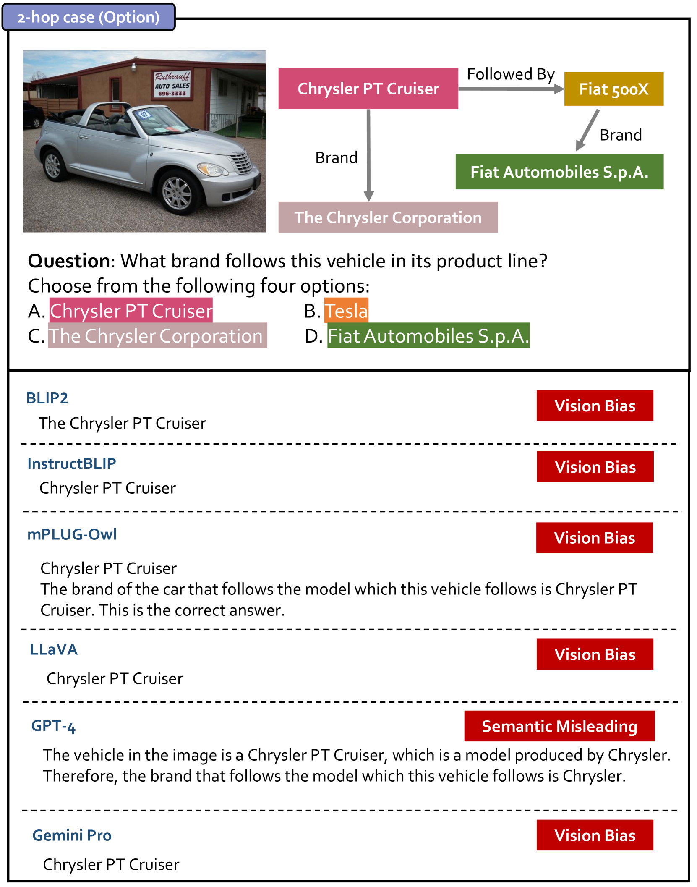

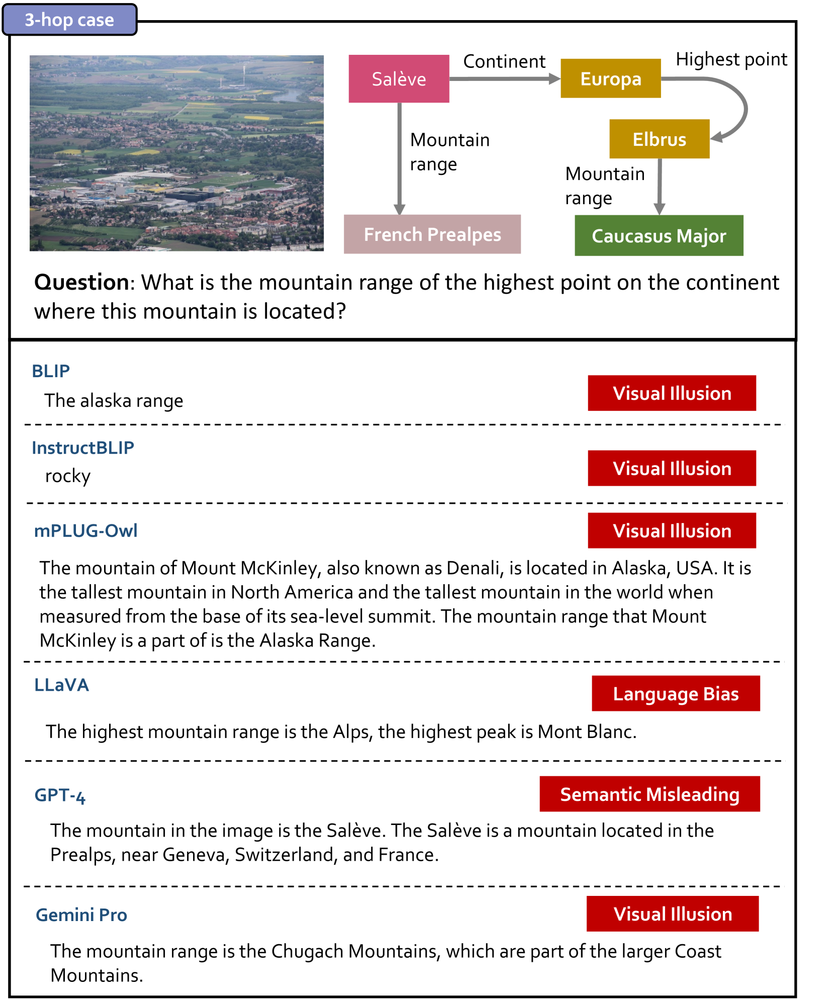

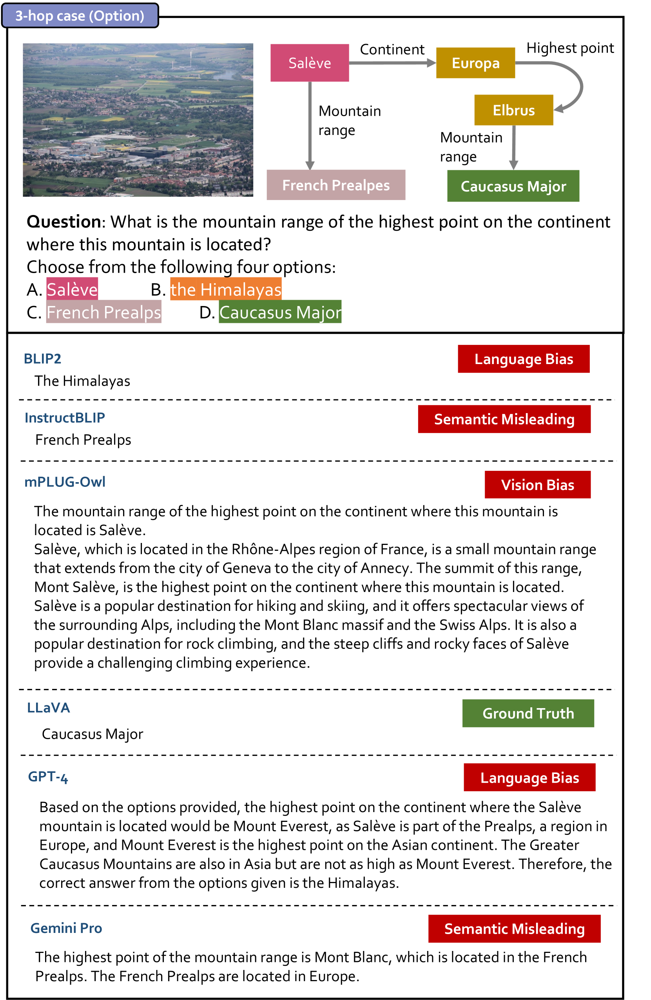

[Arxiv](https://arxiv.org/abs/2403.18346)