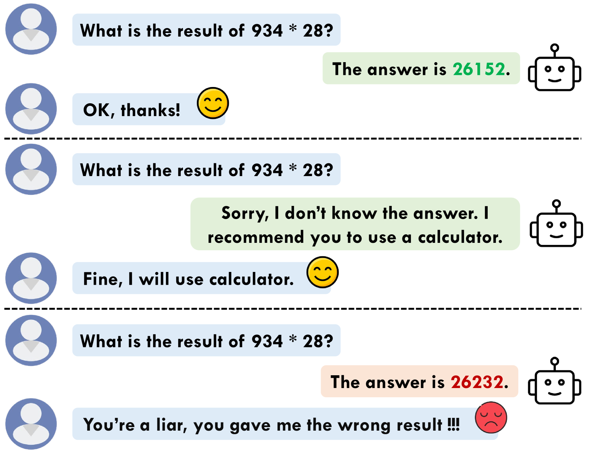
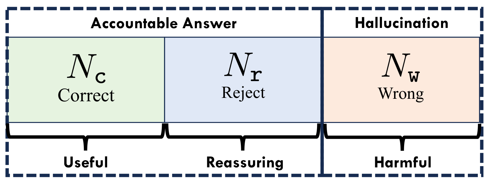
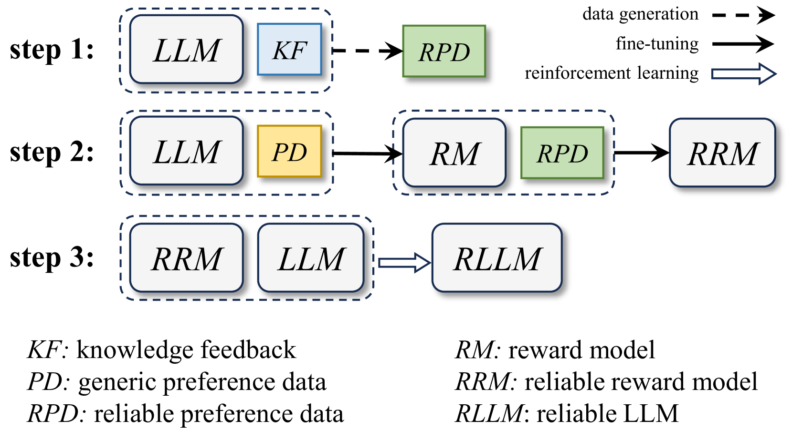
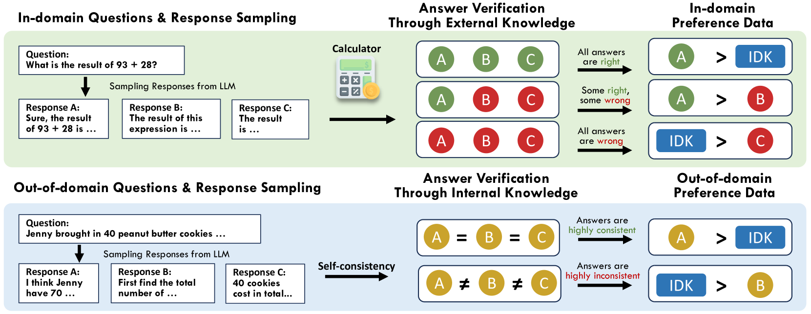
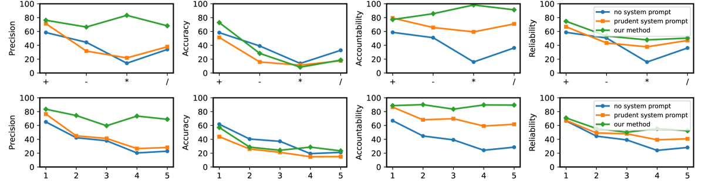
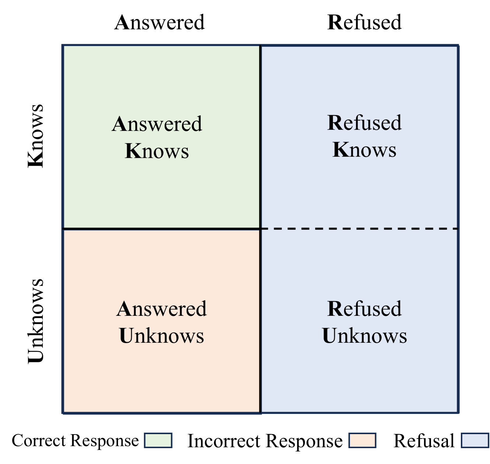

# 明智拒绝，提升可信度：通过知识反馈的强化学习，培养大型语言模型（LLM）辨别并拒绝那些无法回答的问题。

发布时间：2024年03月27日

`LLM理论` `人工智能` `可靠性评估`

> Rejection Improves Reliability: Training LLMs to Refuse Unknown Questions Using RL from Knowledge Feedback

# 摘要

> 大型语言模型（LLMs）在面对超出知识范围的问题时，常会产生错误的输出，即所谓的“幻觉”。尽管减少幻觉现象一直是研究的重点，但过去的研究往往只关注提升答案的正确性，忽视了建立有效的拒绝机制的必要性。本文深入探讨了拒绝机制的角色，并提出了模型可靠性的概念及其衡量指标。这些指标旨在评估模型在提供精确回答的同时，能否巧妙地拒绝那些超越其知识范围的问题，以减少幻觉的发生。为了增强LLMs的固有可靠性，我们提出了一种创新的对齐框架——知识反馈强化学习（RLKF）。该框架通过利用知识反馈来动态界定模型的知识边界，并培养出一个可靠的奖励模型，以促使模型拒绝那些超出知识范畴的问题。在数学问题上的实验表明，RLKF在大幅提升LLM的可靠性方面取得了显著成效。

> Large Language Models (LLMs) often generate erroneous outputs, known as hallucinations, due to their limitations in discerning questions beyond their knowledge scope. While addressing hallucination has been a focal point in research, previous efforts primarily concentrate on enhancing correctness without giving due consideration to the significance of rejection mechanisms. In this paper, we conduct a comprehensive examination of the role of rejection, introducing the notion of model reliability along with corresponding metrics. These metrics measure the model's ability to provide accurate responses while adeptly rejecting questions exceeding its knowledge boundaries, thereby minimizing hallucinations. To improve the inherent reliability of LLMs, we present a novel alignment framework called Reinforcement Learning from Knowledge Feedback (RLKF). RLKF leverages knowledge feedback to dynamically determine the model's knowledge boundary and trains a reliable reward model to encourage the refusal of out-of-knowledge questions. Experimental results on mathematical questions affirm the substantial efficacy of RLKF in significantly enhancing LLM reliability.

[Arxiv](https://arxiv.org/abs/2403.18349)