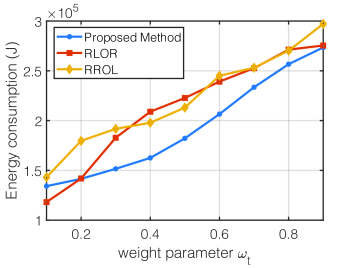

# 在融合了大型语言模型的6G车联网中，探究资源配置策略。

发布时间：2024年03月27日

`LLM应用` `车辆网络` `边缘计算`

> Resource Allocation in Large Language Model Integrated 6G Vehicular Networks

# 摘要

> 随着6G时代的来临，车辆网络正从基础的车对车通信迈向复杂的车对一切互联。引领这一变革的是大型语言模型（LLMs）的车载化。LLMs凭借其卓越的自然语言处理能力，彻底改变了人车互动模式，使得语音指令和交互成为可能，摆脱了手动控制的束缚。然而，将LLMs融入车载系统面临诸多挑战，尤其是在计算和能源需求方面，车辆的有限环境加剧了这一问题。同时，车辆网络任务的时间敏感性也带来了额外的复杂度。本文提出了一种边缘计算系统，车辆在本地处理LLM的初步计算层，剩余计算任务则交由路边单元（RSUs）完成，构建了一个与6G网络超低延迟和高带宽特性完美融合的车辆生态系统。为了在完成时间和能耗之间取得平衡，我们提出了一个多目标优化问题，旨在最小化车辆和RSUs的总成本。通过顺序二次规划（SQP）和分数规划技术解决这一问题，模拟结果显示我们的算法在降低系统完成时间和能耗方面表现出色。

> In the upcoming 6G era, vehicular networks are shifting from simple Vehicle-to-Vehicle (V2V) communication to the more complex Vehicle-to-Everything (V2X) connectivity. At the forefront of this shift is the incorporation of Large Language Models (LLMs) into vehicles. Known for their sophisticated natural language processing abilities, LLMs change how users interact with their vehicles. This integration facilitates voice-driven commands and interactions, departing from the conventional manual control systems. However, integrating LLMs into vehicular systems presents notable challenges. The substantial computational demands and energy requirements of LLMs pose significant challenges, especially in the constrained environment of a vehicle. Additionally, the time-sensitive nature of tasks in vehicular networks adds another layer of complexity. In this paper, we consider an edge computing system where vehicles process the initial layers of LLM computations locally, and offload the remaining LLM computation tasks to the Roadside Units (RSUs), envisioning a vehicular ecosystem where LLM computations seamlessly interact with the ultra-low latency and high-bandwidth capabilities of 6G networks. To balance the trade-off between completion time and energy consumption, we formulate a multi-objective optimization problem to minimize the total cost of the vehicles and RSUs. The problem is then decomposed into two sub-problems, which are solved by sequential quadratic programming (SQP) method and fractional programming technique. The simulation results clearly indicate that the algorithm we have proposed is highly effective in reducing both the completion time and energy consumption of the system.

[Arxiv](https://arxiv.org/abs/2403.19016)