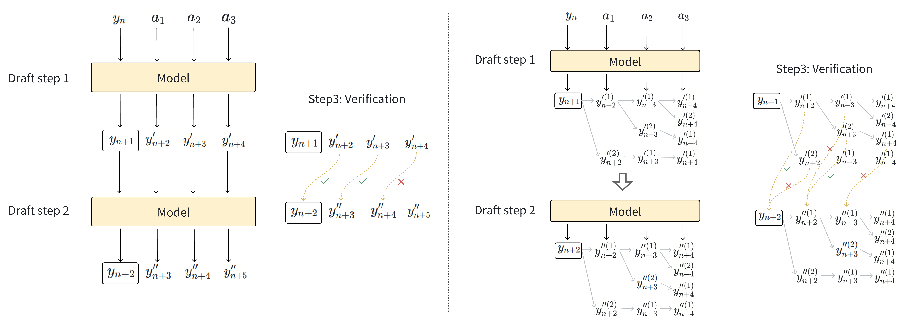
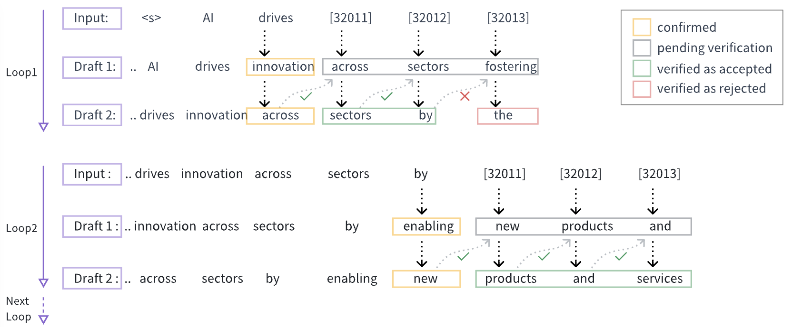
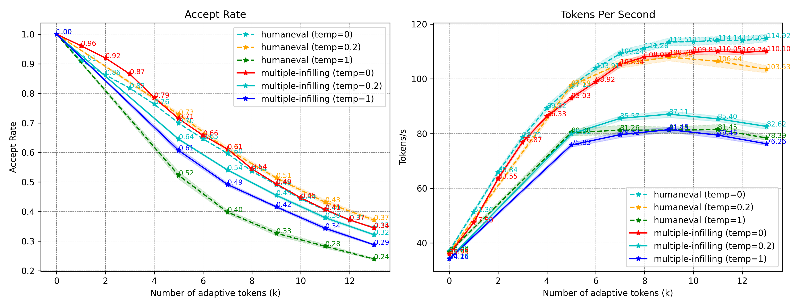
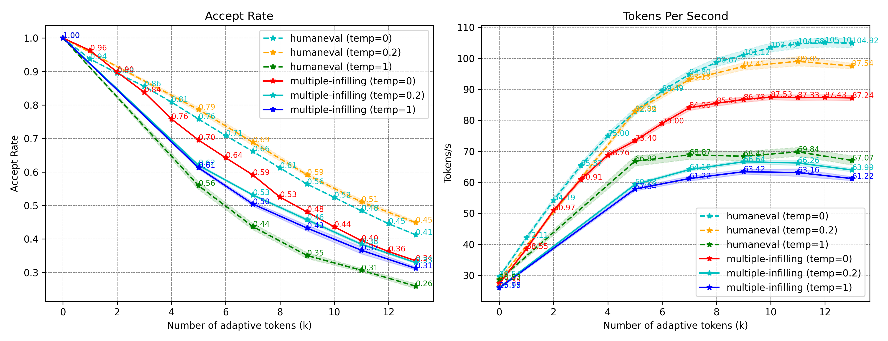
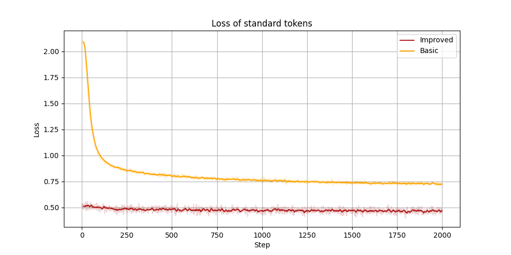
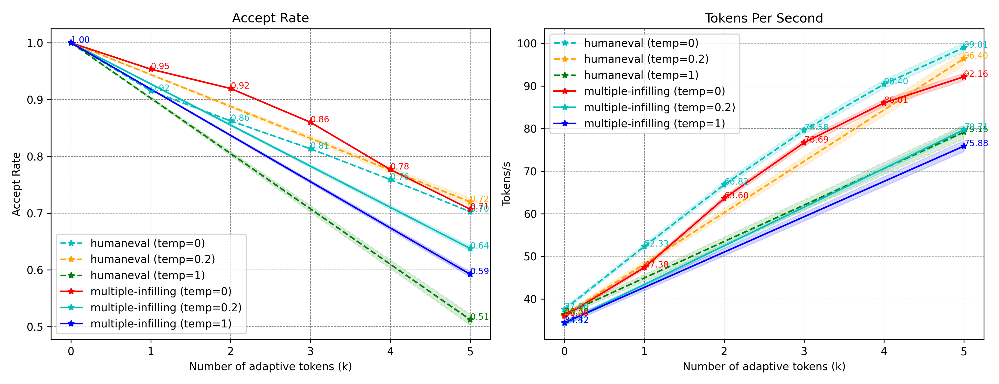
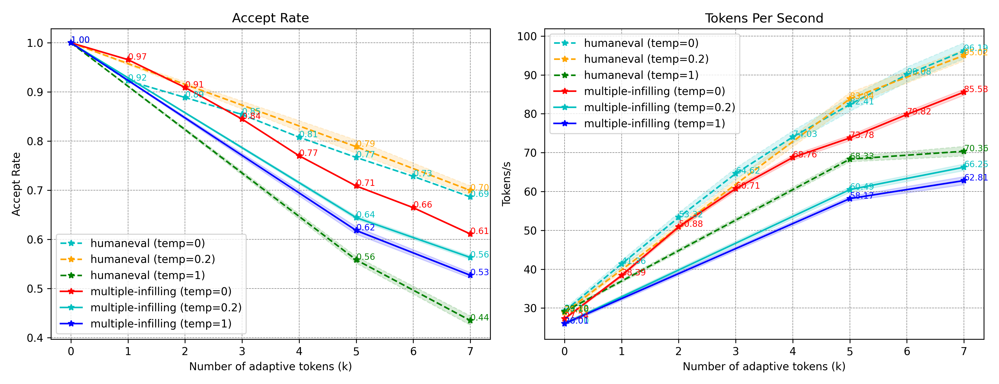

# SDSAT：利用语义自适应标记进行推测性解码，加速大型语言模型（LLM）的推理过程。

发布时间：2024年03月27日

`LLM理论` `计算机科学` `大型语言模型`

> SDSAT: Accelerating LLM Inference through Speculative Decoding with Semantic Adaptive Tokens

# 摘要

> 我们为大型语言模型（LLMs）设计了一种加速方案，即通过语义自适应令牌的推测解码（SDSAT）。这一设计旨在提升LLM生成草稿令牌的精确度，同时保持模型的准确性。核心策略包括：1）加入能灵活解码的语义自适应令牌进行模型微调，以生成更优质的草稿令牌，而不改变模型结构。2）采用不影响标准令牌的训练方法，让模型在原有基础上获得额外的并行解码能力，且训练成本极低。3）我们采用了结合贪婪搜索和核心采样的“先草稿后验证两步法”生成策略。在CodeLlama-13B和7B模型上的实验显示，速度分别提升了3.5倍以上和3.0倍以上。更多信息，请访问 https://github.com/hasuoshenyun/SDSAT。

> We propose an acceleration scheme for large language models (LLMs) through Speculative Decoding with Semantic Adaptive Tokens (SDSAT). The primary objective of this design is to enhance the LLM model's ability to generate draft tokens more accurately without compromising the model's accuracy. The core strategies involve: 1) Fine-tune the model by incorporating semantic adaptive tokens that possess flexible decoding capabilities without changing its structure, allowing them to generate high-quality draft tokens. 2) By employing a training method that does not affect the standard tokens, the model can acquire parallel decoding abilities atop its original framework with minimal training overhead. 3) We have designed the "two-step-draft-then-verify" generation strategies using both greedy search and nucleus sampling. Experiments conducted on the CodeLlama-13B and 7B models have yielded speed increases of over 3.5X and 3.0X, respectively. Please refer to https://github.com/hasuoshenyun/SDSAT.

[Arxiv](https://arxiv.org/abs/2403.18647)