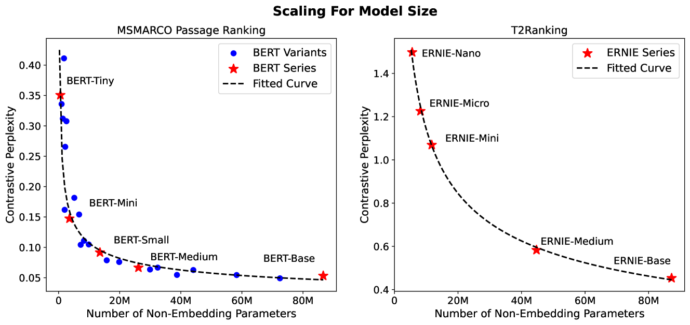
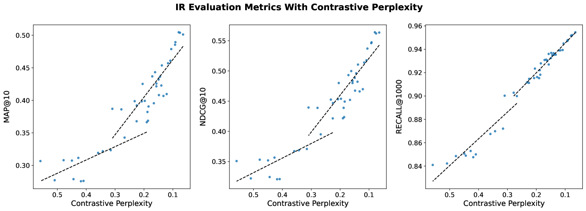
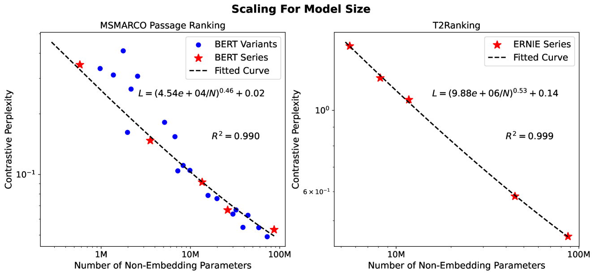
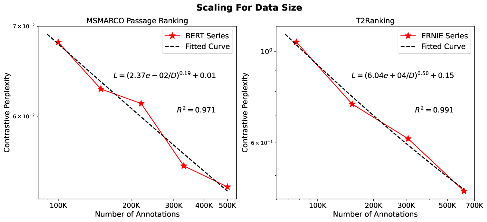
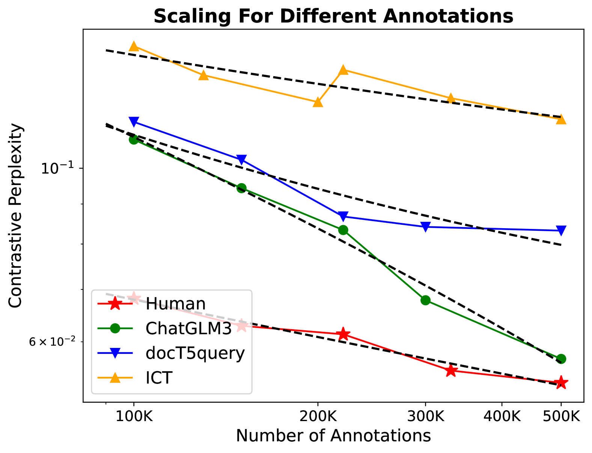
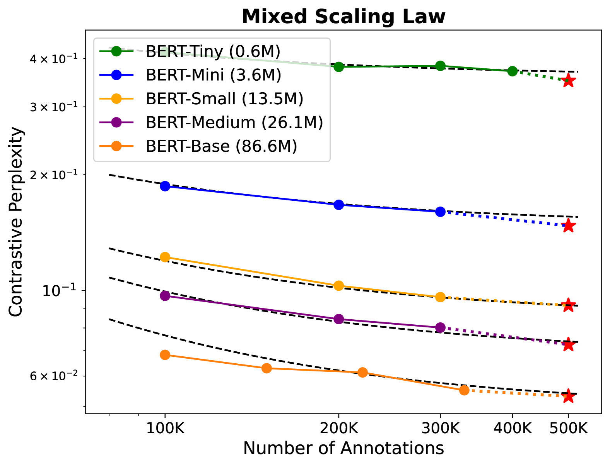
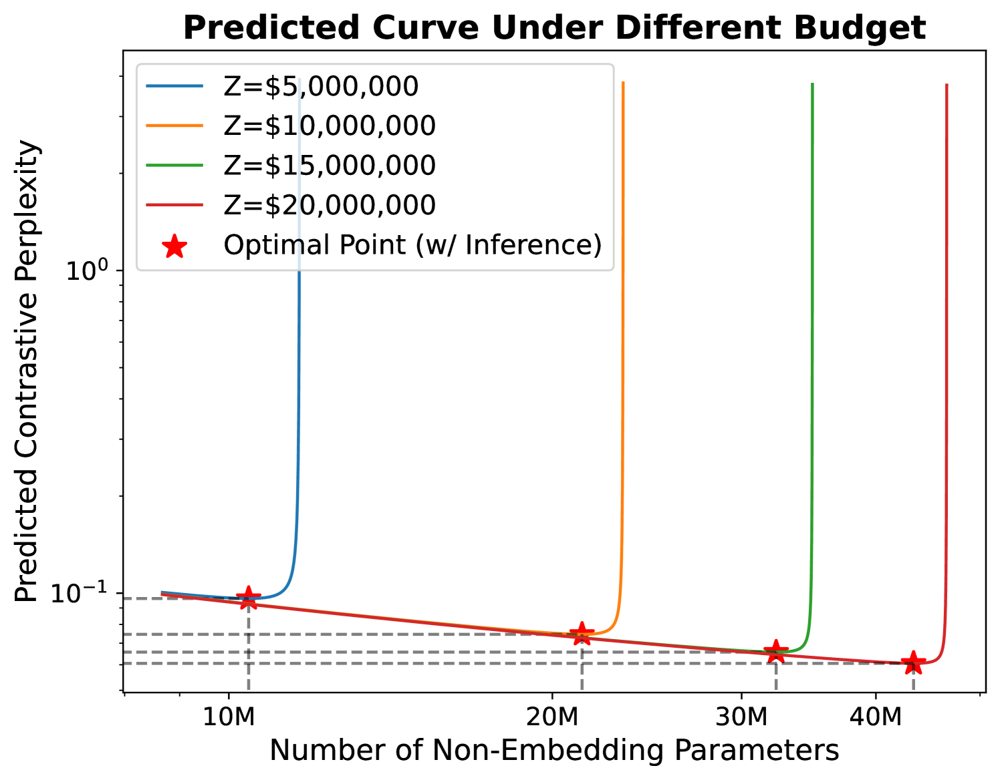

# 密集检索的规模法则已被验证。

发布时间：2024年03月27日

`LLM理论` `密集检索` `大规模数据处理`

> Scaling Laws For Dense Retrieval

# 摘要

> 神经模型规模的扩大在众多任务上取得了显著进步，特别是在语言生成领域。先前研究显示，模型性能往往与训练集规模、模型大小等因素成正比，这一发现对于资源日益紧张的大规模实验尤为重要。然而，由于检索任务中训练数据与模型大小之间关系的复杂性，密集检索领域的规模法则尚未得到充分研究。本研究旨在探究密集检索模型是否也遵循类似的规模法则。我们采用对比对数似然作为评价指标，对不同参数规模的密集检索模型进行了大量实验，并探讨了不同量级标注数据对模型性能的影响。研究结果显示，在特定条件下，模型性能与模型规模和标注数量呈现出明确的幂律关系。我们还考察了结合常用数据增强方法的规模效应，评估了标注质量的影响，并在预算限制下，利用规模法则确定了最优的资源配置策略。我们认为这些发现将极大促进对密集检索模型规模效应的理解，并为未来研究提供宝贵的指导。

> Scaling up neural models has yielded significant advancements in a wide array of tasks, particularly in language generation. Previous studies have found that the performance of neural models frequently adheres to predictable scaling laws, correlated with factors such as training set size and model size. This insight is invaluable, especially as large-scale experiments grow increasingly resource-intensive. Yet, such scaling law has not been fully explored in dense retrieval due to the discrete nature of retrieval metrics and complex relationships between training data and model sizes in retrieval tasks. In this study, we investigate whether the performance of dense retrieval models follows the scaling law as other neural models. We propose to use contrastive log-likelihood as the evaluation metric and conduct extensive experiments with dense retrieval models implemented with different numbers of parameters and trained with different amounts of annotated data. Results indicate that, under our settings, the performance of dense retrieval models follows a precise power-law scaling related to the model size and the number of annotations. Additionally, we examine scaling with prevalent data augmentation methods to assess the impact of annotation quality, and apply the scaling law to find the best resource allocation strategy under a budget constraint. We believe that these insights will significantly contribute to understanding the scaling effect of dense retrieval models and offer meaningful guidance for future research endeavors.

[Arxiv](https://arxiv.org/abs/2403.18684)