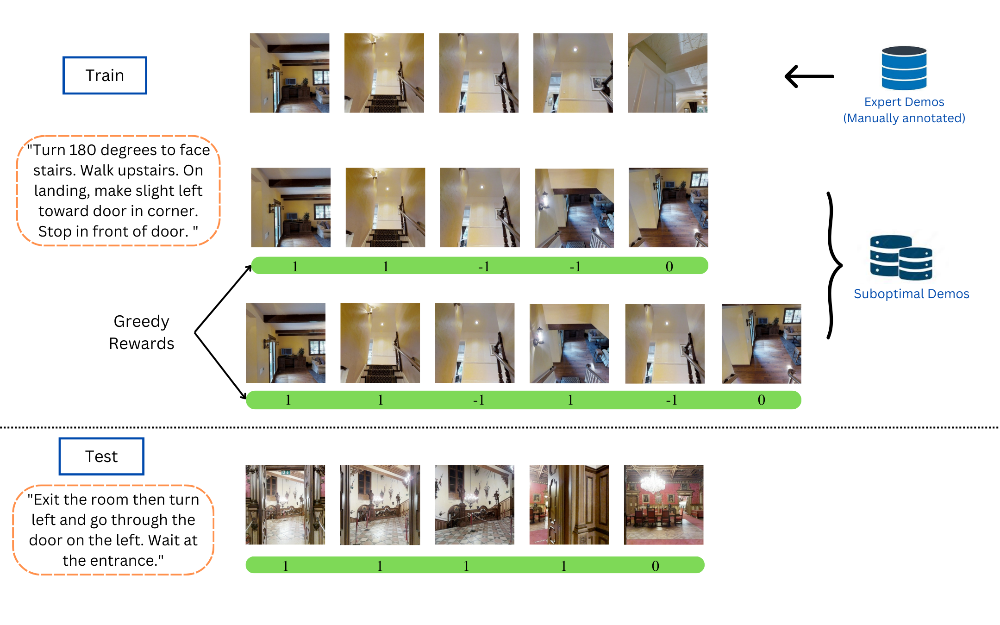
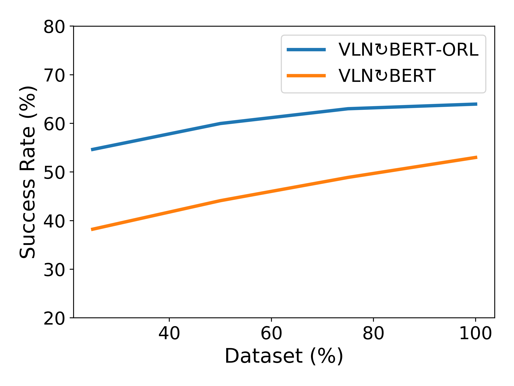
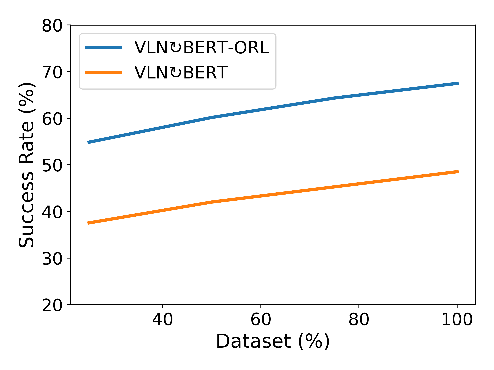
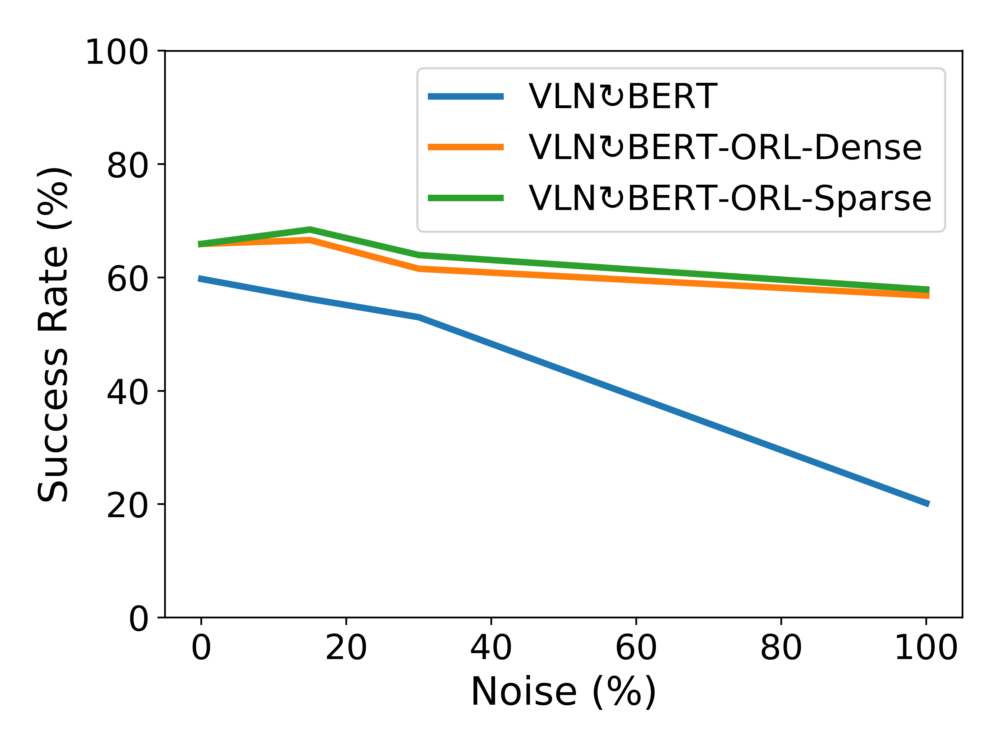
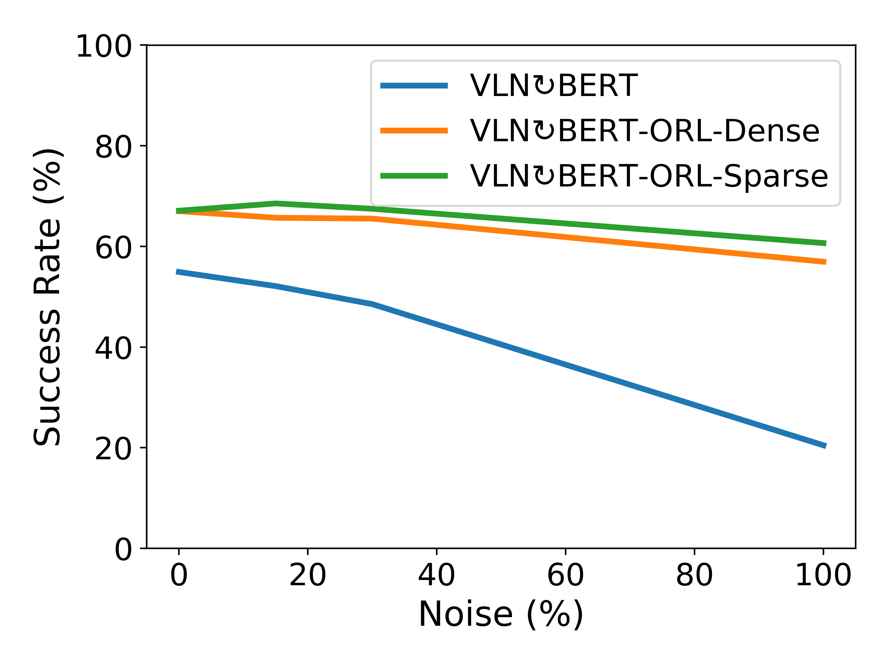
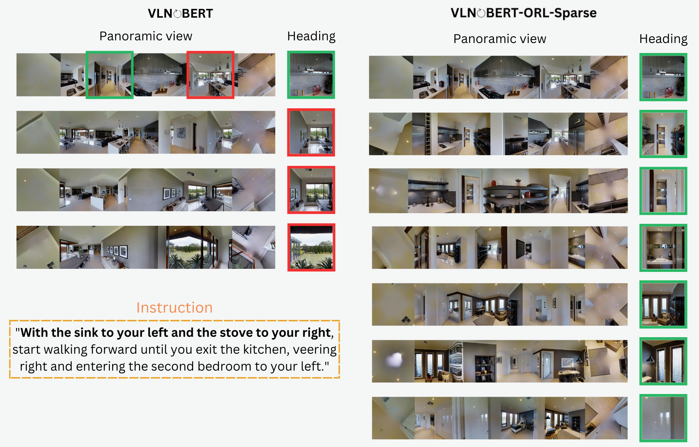
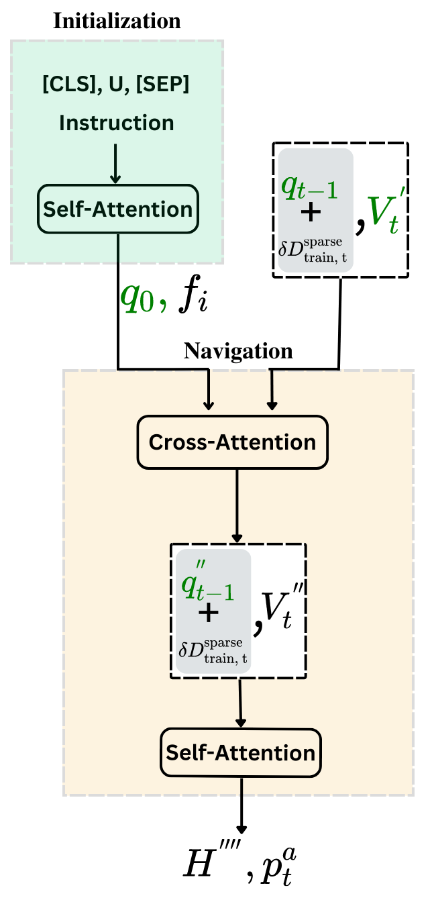
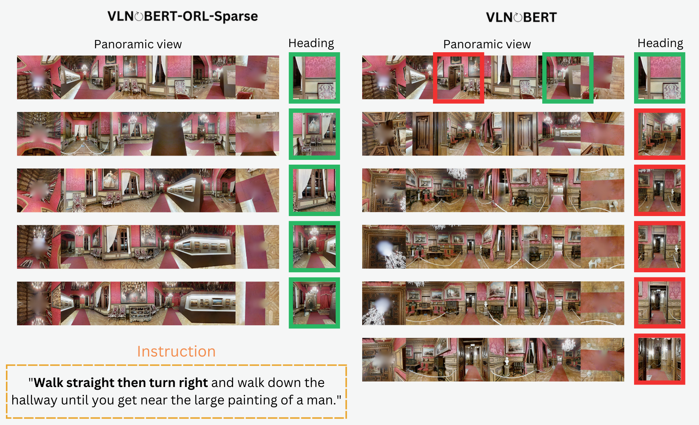
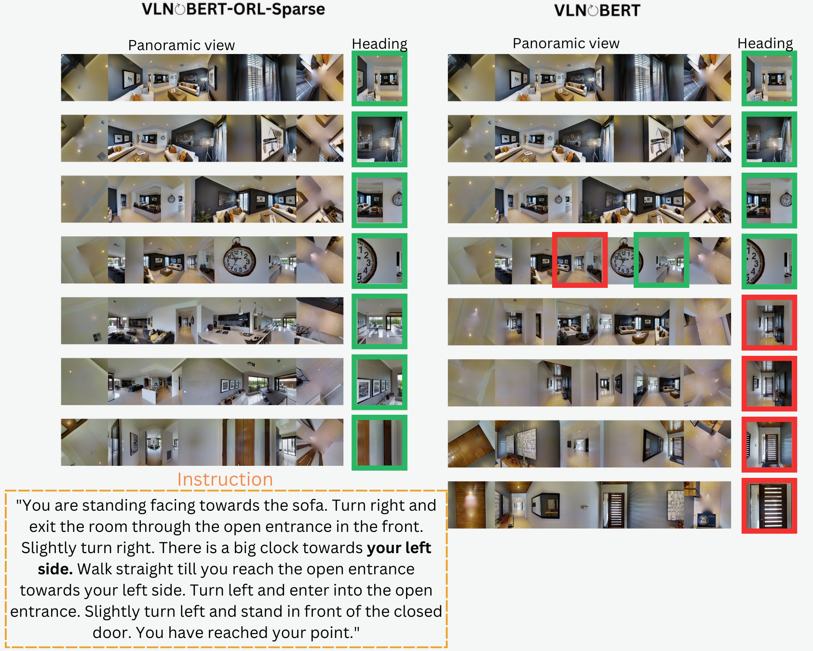
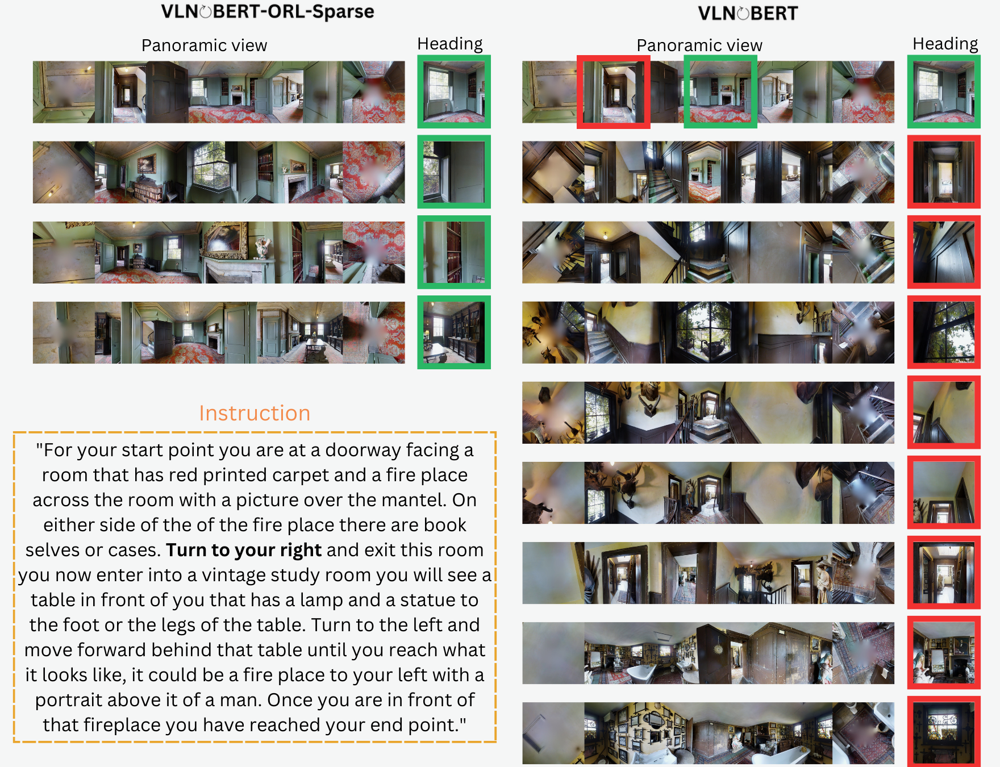

# 通过离线RL技术，我们能够有效地扩展视觉与语言导航系统的应用范围。

发布时间：2024年03月27日

`Agent` `视觉与语言导航`

> Scaling Vision-and-Language Navigation With Offline RL

# 摘要

> 通常，视觉与语言导航（VLN）研究依赖专家级轨迹，但在现实场景中，这些轨迹因收集难度大而难以获得。而现有方法在扩展VLN代理训练时，往往采用数据增强或在线探索，这些方法既耗时又有风险。与之相对，获取大量次优的离线轨迹资源则相对容易。本研究借鉴离线强化学习（ORL）的理念，提出了VLN-ORL新框架，利用次优演示数据进行VLN研究。我们提出了一种基于奖励调整的方法，能有效应对训练数据的不足，并建立了评估标准，推动该领域的研究进展。我们针对VLN-ORL中数据次优性等独特问题，进行了多种噪声模型的实证分析，并在R2R和RxR环境下，将该方法应用于VLN$\circlearrowright$BERT和MTVM架构。实验证明，即便在复杂多变的环境中，这种基于奖励的方法也能显著提升性能。

> The study of vision-and-language navigation (VLN) has typically relied on expert trajectories, which may not always be available in real-world situations due to the significant effort required to collect them. On the other hand, existing approaches to training VLN agents that go beyond available expert data involve data augmentations or online exploration which can be tedious and risky. In contrast, it is easy to access large repositories of suboptimal offline trajectories. Inspired by research in offline reinforcement learning (ORL), we introduce a new problem setup of VLN-ORL which studies VLN using suboptimal demonstration data. We introduce a simple and effective reward-conditioned approach that can account for dataset suboptimality for training VLN agents, as well as benchmarks to evaluate progress and promote research in this area. We empirically study various noise models for characterizing dataset suboptimality among other unique challenges in VLN-ORL and instantiate it for the VLN$\circlearrowright$BERT and MTVM architectures in the R2R and RxR environments. Our experiments demonstrate that the proposed reward-conditioned approach leads to significant performance improvements, even in complex and intricate environments.

[Arxiv](https://arxiv.org/abs/2403.18454)