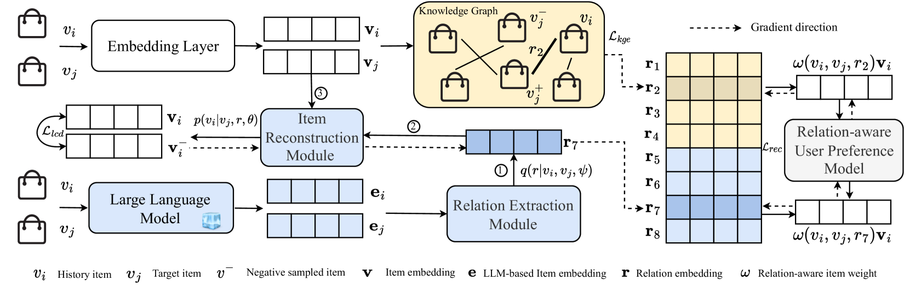
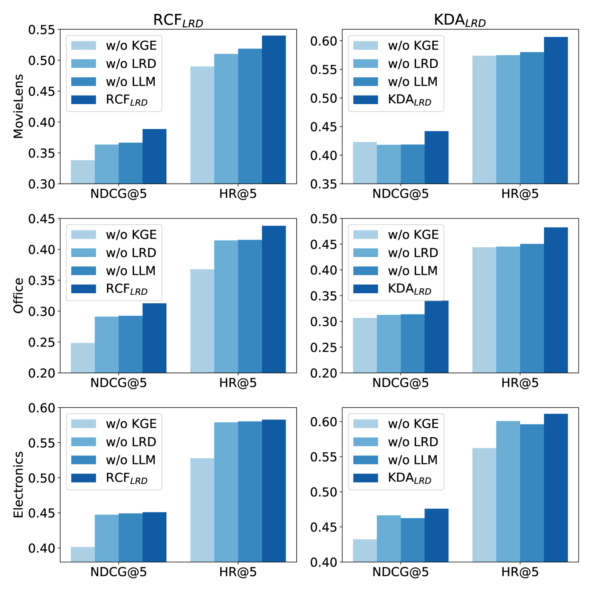
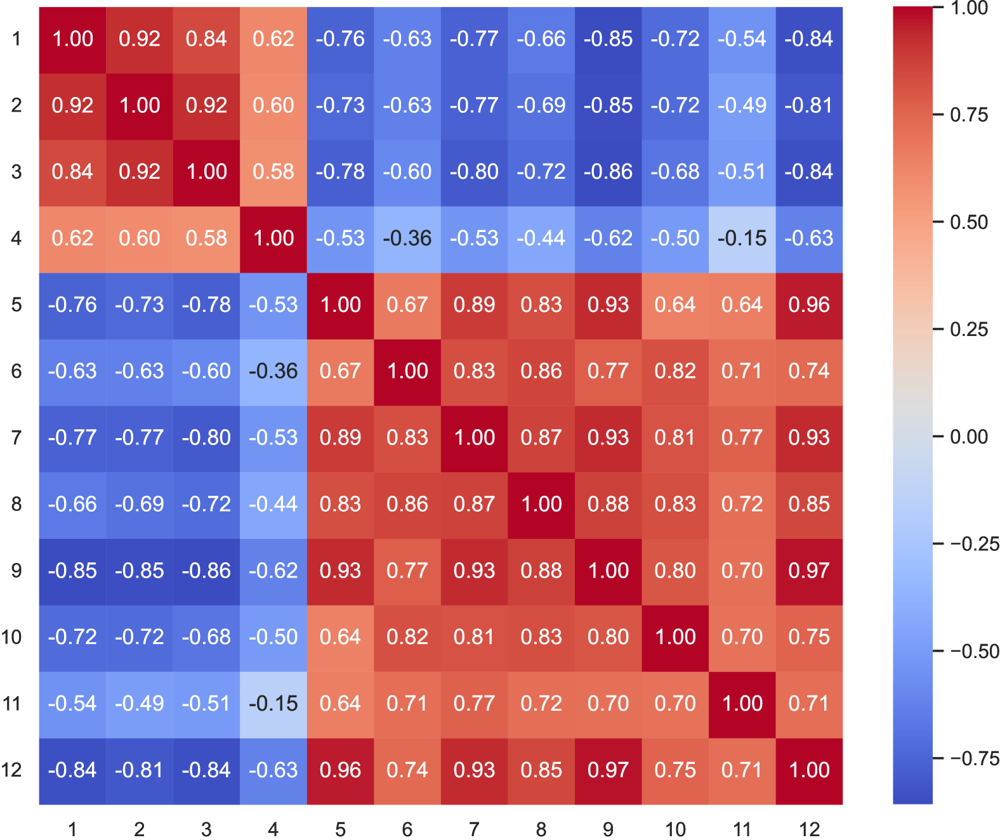
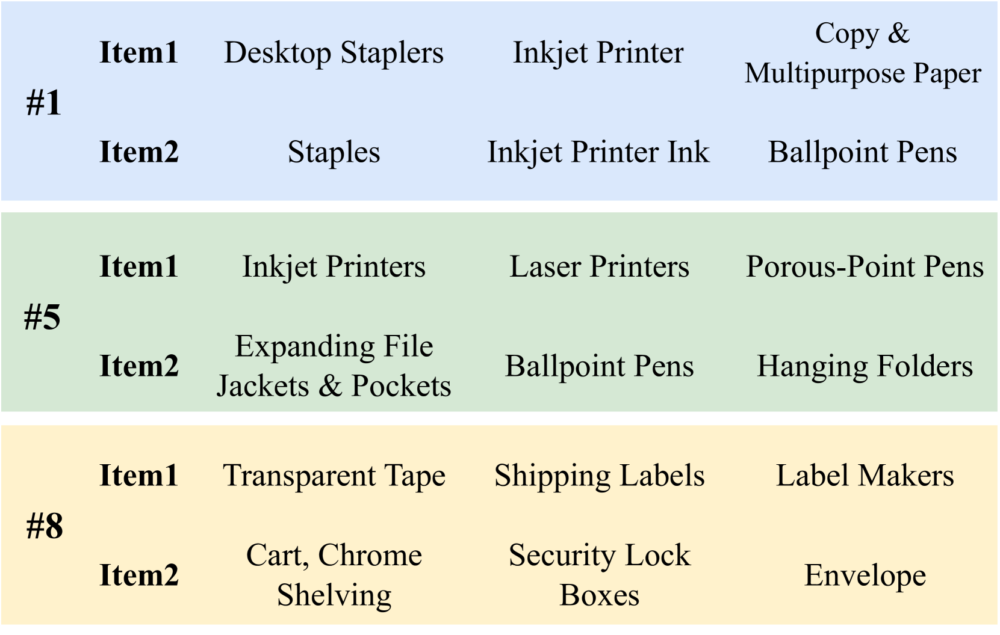
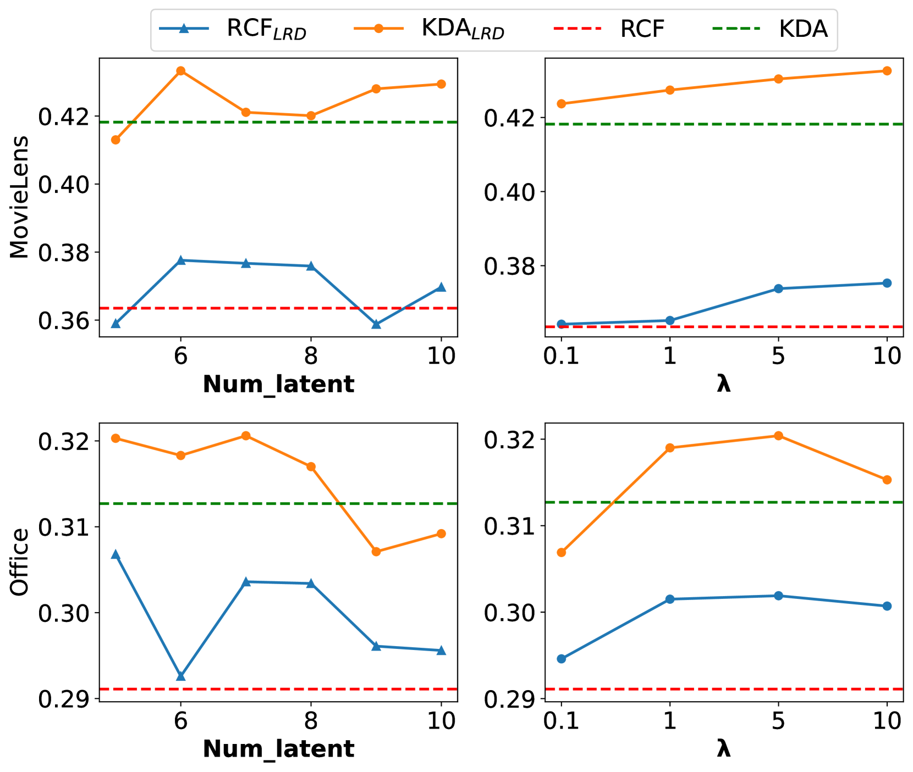

# 利用大型语言模型挖掘潜在关系，优化序列推荐策略。

发布时间：2024年03月27日

`LLM应用` `推荐系统` `知识图谱`

> Sequential Recommendation with Latent Relations based on Large Language Model

# 摘要

> 序列推荐系统通过分析用户过往的互动历史来预测他们可能感兴趣的商品。传统方法主要捕捉商品间的隐式协同过滤信号。而新兴的关联感知模型通过明确整合商品关系，已在用户历史序列建模中展现出优异表现，尽管这些关系大多来源于知识图谱。然而，现有方法过度依赖预设的关系，受限于稀疏性问题，影响了在多样化商品关系场景下的泛化能力。本文提出了一个创新的关联感知推荐框架——潜在关系发现（LRD）。区别于以往依赖固定规则的模型，我们创新性地运用大型语言模型（LLM）来探索商品间新的关系和联系。这一灵感源自人类使用自然语言描述商品关系的天赋，LRD借鉴了LLM类似人类的知识理解能力，获取商品的语言知识表示。这些表示随后被送入基于离散状态变分自编码器（DVAE）的潜在关系发现模块。接着，我们对关系发现任务和推荐任务进行联合优化。多个公共数据集的实验结果显示，我们提出的潜在关系发现方法能显著提升现有关联感知推荐模型的性能。更深入的分析实验验证了这些发现的潜在关系的有效性和可靠性。

> Sequential recommender systems predict items that may interest users by modeling their preferences based on historical interactions. Traditional sequential recommendation methods rely on capturing implicit collaborative filtering signals among items. Recent relation-aware sequential recommendation models have achieved promising performance by explicitly incorporating item relations into the modeling of user historical sequences, where most relations are extracted from knowledge graphs. However, existing methods rely on manually predefined relations and suffer the sparsity issue, limiting the generalization ability in diverse scenarios with varied item relations. In this paper, we propose a novel relation-aware sequential recommendation framework with Latent Relation Discovery (LRD). Different from previous relation-aware models that rely on predefined rules, we propose to leverage the Large Language Model (LLM) to provide new types of relations and connections between items. The motivation is that LLM contains abundant world knowledge, which can be adopted to mine latent relations of items for recommendation. Specifically, inspired by that humans can describe relations between items using natural language, LRD harnesses the LLM that has demonstrated human-like knowledge to obtain language knowledge representations of items. These representations are fed into a latent relation discovery module based on the discrete state variational autoencoder (DVAE). Then the self-supervised relation discovery tasks and recommendation tasks are jointly optimized. Experimental results on multiple public datasets demonstrate our proposed latent relations discovery method can be incorporated with existing relation-aware sequential recommendation models and significantly improve the performance. Further analysis experiments indicate the effectiveness and reliability of the discovered latent relations.

[Arxiv](https://arxiv.org/abs/2403.18348)