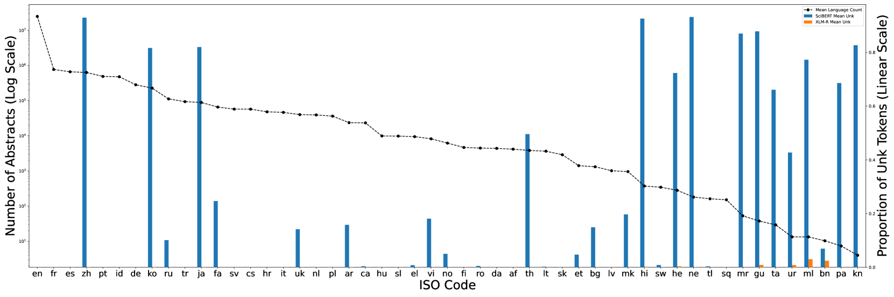
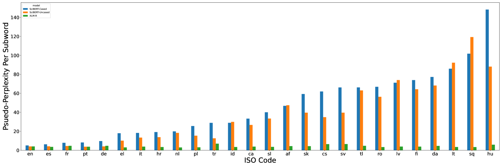
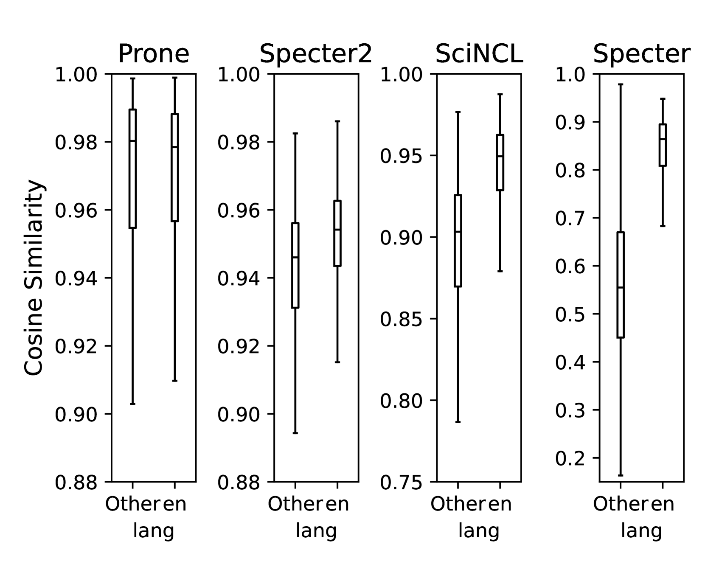

# 既然科学文献涵盖多种语言，那么我们的模型理应具备多语言能力。

发布时间：2024年03月27日

`LLM理论` `多语言处理
</example>`

> Since the Scientific Literature Is Multilingual, Our Models Should Be Too

# 摘要

> 长久以来，英语被视为科学研究的“通用语”，自然语言处理领域的科学文献研究也印证了这一点。本文通过定量分析揭示了学术文献的多语言本质，并主张现行的NLP模型与评估标准应体现这种多元性。我们发现，文本模型在处理非英语文献时往往无法构建出有效的信息表示，同时指出了不加选择地在多语言环境中使用英语模型可能带来的负面用户体验。文章最后，我们向NLP研究者提出了提升对非英语文献处理能力的若干建议。

> English has long been assumed the $\textit{lingua franca}$ of scientific research, and this notion is reflected in the natural language processing (NLP) research involving scientific document representation. In this position piece, we quantitatively show that the literature is largely multilingual and argue that current models and benchmarks should reflect this linguistic diversity. We provide evidence that text-based models fail to create meaningful representations for non-English papers and highlight the negative user-facing impacts of using English-only models non-discriminately across a multilingual domain. We end with suggestions for the NLP community on how to improve performance on non-English documents.

[Arxiv](https://arxiv.org/abs/2403.18251)