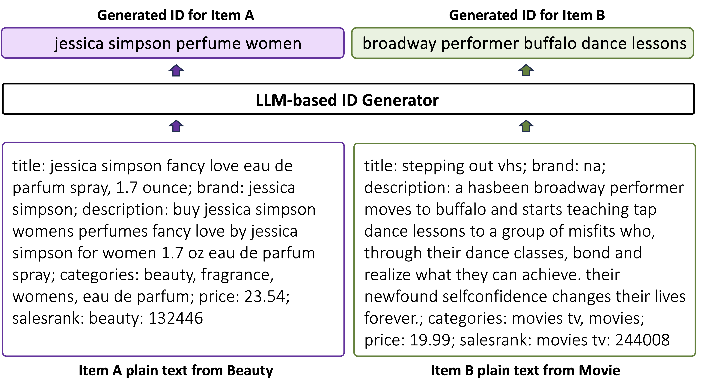

# 探索文本ID学习以实现大型语言模型与推荐系统的融合

发布时间：2024年03月27日

`LLM应用` `推荐系统`

> Towards LLM-RecSys Alignment with Textual ID Learning

# 摘要

> 大型语言模型（LLMs）驱动的生成式推荐，将传统的排名推荐转变为文本生成的新范式。但面对NLP任务的固有挑战，如何将推荐内容以简洁而富有意义的方式来编码，仍是研究的难点。为此，我们设计了IDGen，它通过人类语言标记，为每个推荐项创建一个独特、精练、语义丰富的文本ID，不受平台限制。通过与LLM推荐系统同步训练文本ID生成器，实现了个性化推荐与自然语言生成的完美融合。尤其值得注意的是，用户历史以自然语言形式表达，与原始数据集解耦，这为构建基础生成式推荐模型提供了可能。实验显示，我们的框架在序列推荐任务中持续超越现有模型。进一步，我们在19个不同数据集上采用此方法训练基础推荐模型，并在六个未见数据集上进行了零-shot测试，结果显示，预训练的基础模型在零-shot环境下的表现与传统监督训练的推荐模型相当甚至更优，证明了IDGen范式在生成式推荐中作为基础模型的潜力。相关代码和数据已在https://github.com/agiresearch/IDGenRec开源。

> Generative recommendation based on Large Language Models (LLMs) have transformed the traditional ranking-based recommendation style into a text-to-text generation paradigm. However, in contrast to standard NLP tasks that inherently operate on human vocabulary, current research in generative recommendations struggles to effectively encode recommendation items within the text-to-text framework using concise yet meaningful ID representations. To better align LLMs with recommendation needs, we propose IDGen, representing each item as a unique, concise, semantically rich, platform-agnostic textual ID using human language tokens. This is achieved by training a textual ID generator alongside the LLM-based recommender, enabling seamless integration of personalized recommendations into natural language generation. Notably, as user history is expressed in natural language and decoupled from the original dataset, our approach suggests the potential for a foundational generative recommendation model. Experiments show that our framework consistently surpasses existing models in sequential recommendation under standard experimental setting. Then, we explore the possibility of training a foundation recommendation model with the proposed method on data collected from 19 different datasets and tested its recommendation performance on 6 unseen datasets across different platforms under a completely zero-shot setting. The results show that the zero-shot performance of the pre-trained foundation model is comparable to or even better than some traditional recommendation models based on supervised training, showing the potential of the IDGen paradigm serving as the foundation model for generative recommendation. Code and data are open-sourced at https://github.com/agiresearch/IDGenRec.

[Arxiv](https://arxiv.org/abs/2403.19021)