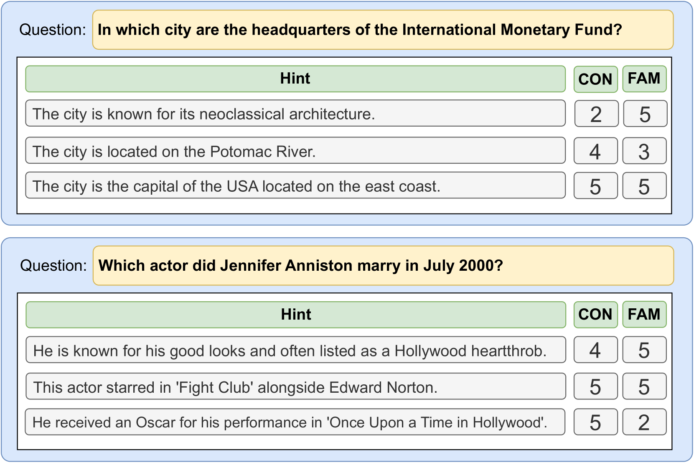
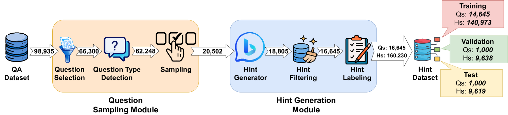
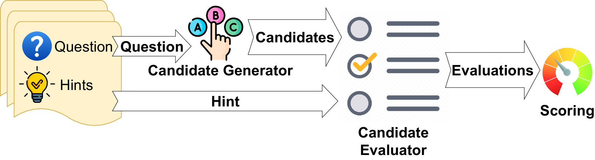
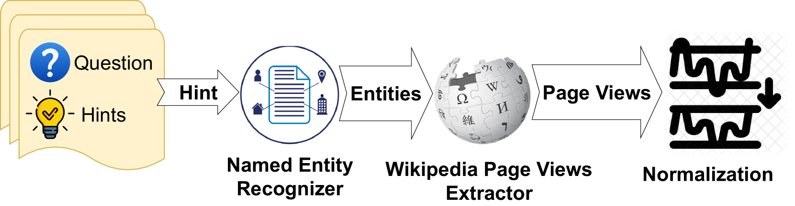
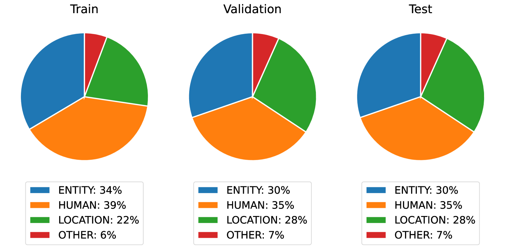
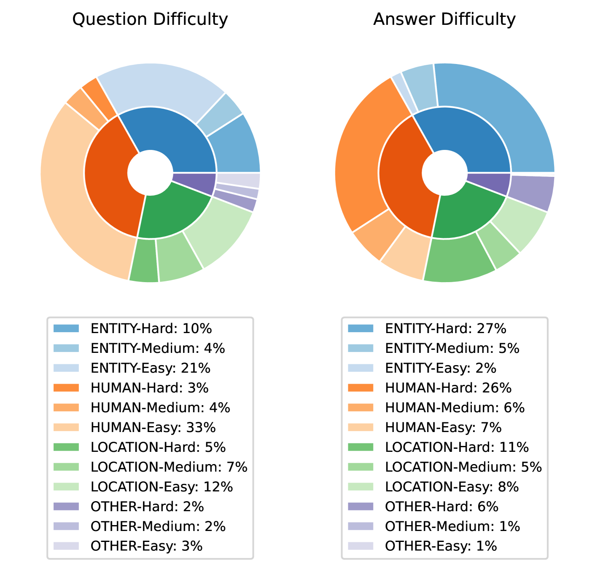
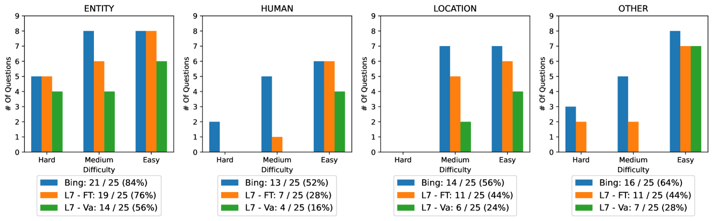
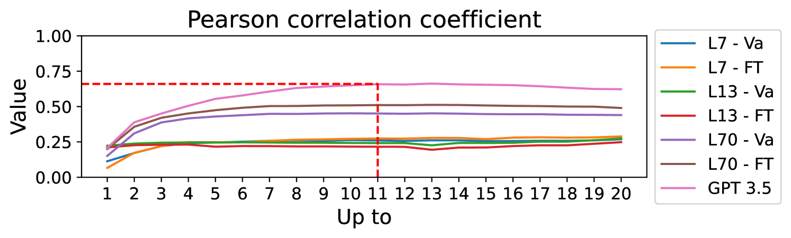

# TriviaHG：面向事实性问题，打造自动生成提示信息的数据集

发布时间：2024年03月27日

`LLM应用` `认知科学` `问答系统`

> TriviaHG: A Dataset for Automatic Hint Generation from Factoid Questions

# 摘要

> 如今，人们喜欢与大型语言模型对话，以获取问题的答案。在这个答案触手可得的时代，激发和维护人类的认知能力，确保我们保持出色的推理能力变得尤为重要。本研究提出了一种新方法，通过提供提示而非直接答案，来满足这一需求。我们开发了一个自动生成提示的框架，并据此创建了TriviaHG数据集，该数据集包含了针对TriviaQA数据集中16,645个问题的160,230条提示。我们还设计了一种评估提示质量的自动方法，关注其收敛性和熟悉度。通过让10名参与者标注2,791条提示，并让6名参与者利用这些提示回答问题，我们对TriviaHG数据集和评估方法进行了测试。结果表明，提示的有效性因问题难度而异，简单、中等和困难问题的正确率分别为96%、78%和36%。自动评估方法也与人工标注结果高度一致。这项研究揭示了三个重要发现：提示在帮助解决未知问题中的作用，提示质量与答案难度的关系，以及自动评估方法在评估提示方面的有效性。

> Nowadays, individuals tend to engage in dialogues with Large Language Models, seeking answers to their questions. In times when such answers are readily accessible to anyone, the stimulation and preservation of human's cognitive abilities, as well as the assurance of maintaining good reasoning skills by humans becomes crucial. This study addresses such needs by proposing hints (instead of final answers or before giving answers) as a viable solution. We introduce a framework for the automatic hint generation for factoid questions, employing it to construct TriviaHG, a novel large-scale dataset featuring 160,230 hints corresponding to 16,645 questions from the TriviaQA dataset. Additionally, we present an automatic evaluation method that measures the Convergence and Familiarity quality attributes of hints. To evaluate the TriviaHG dataset and the proposed evaluation method, we enlisted 10 individuals to annotate 2,791 hints and tasked 6 humans with answering questions using the provided hints. The effectiveness of hints varied, with success rates of 96%, 78%, and 36% for questions with easy, medium, and hard answers, respectively. Moreover, the proposed automatic evaluation methods showed a robust correlation with annotators' results. Conclusively, the findings highlight three key insights: the facilitative role of hints in resolving unknown questions, the dependence of hint quality on answer difficulty, and the feasibility of employing automatic evaluation methods for hint assessment.

[Arxiv](https://arxiv.org/abs/2403.18426)