# 人类价值观指的是人类普遍认同的道德和伦理准则。要将人工智能与这些价值观相协调，我们需要确保AI系统在设计和执行过程中能够理解和尊重这些准则，从而促进其在符合人类利益和道德标准的前提下发展和应用。

发布时间：2024年03月27日

`LLM应用` `人工智能伦理` `价值观对齐`

> What are human values, and how do we align AI to them?

# 摘要

> 人们普遍认为应将AI系统与人类价值观相融合（Gabriel, 2020; Ji et al., 2024），但对于具体做法和实际意义，研究仍显不足。本文将“与人类价值观对齐”的挑战分为三步：首先是挖掘人们的价值观；其次是将这些价值观整合为训练机器学习模型的目标；最后是模型的实际训练。本文重点探讨前两步，并询问：如何将关于价值观的多元人类观点有效融合，形成语言模型的对齐目标？为此，我们首先确定了六个标准，认为它们是塑造模型行为与人类价值观相符的关键。接着，我们提出了一种名为道德图引出（MGE）的新方法，通过大型语言模型在特定情境下与参与者探讨他们的价值观，灵感来源于Taylor（1977）、Chang（2004）等人的价值观理念。我们对500名美国受访者进行了MGE测试，话题包括一些容易引起争议的议题（如堕胎建议）。结果表明，MGE在提升模型在六大标准上的对齐性方面展现出巨大潜力。例如，几乎所有参与者（89.1%）感到自己的观点得到了充分体现，且（89%）认为最终形成的道德图是公正的，哪怕他们的观点并未被选为最睿智的。我们的流程常常使得“专家”价值观（如曾经咨询过堕胎建议的女性所持的价值观）在道德图中占据显著位置，而无需事先界定谁是专家。

> There is an emerging consensus that we need to align AI systems with human values (Gabriel, 2020; Ji et al., 2024), but there is very little work on what that means and how we actually do it. We split the problem of "aligning to human values" into three parts: first, eliciting values from people; second, reconciling those values into an alignment target for training ML models; and third, actually training the model. In this paper, we focus on the first two parts, and ask the question: what are "good" ways to synthesize diverse human inputs about values into a target for aligning language models? To answer this question, we first define a set of 6 criteria that we believe must be satisfied for an alignment target to shape model behavior in accordance with human values. We then propose a process for eliciting and reconciling values called Moral Graph Elicitation (MGE), which uses a large language model to interview participants about their values in particular contexts; our approach is inspired by the philosophy of values advanced by Taylor (1977), Chang (2004), and others. We trial MGE with a representative sample of 500 Americans, on 3 intentionally divisive prompts (e.g. advice about abortion). Our results demonstrate that MGE is promising for improving model alignment across all 6 criteria. For example, almost all participants (89.1%) felt well represented by the process, and (89%) thought the final moral graph was fair, even if their value wasn't voted as the wisest. Our process often results in "expert" values (e.g. values from women who have solicited abortion advice) rising to the top of the moral graph, without defining who is considered an expert in advance.

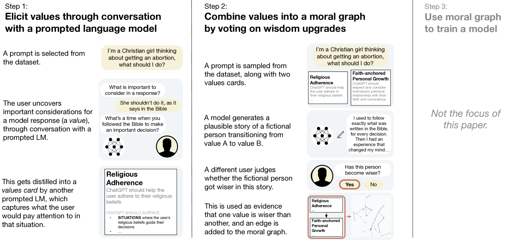

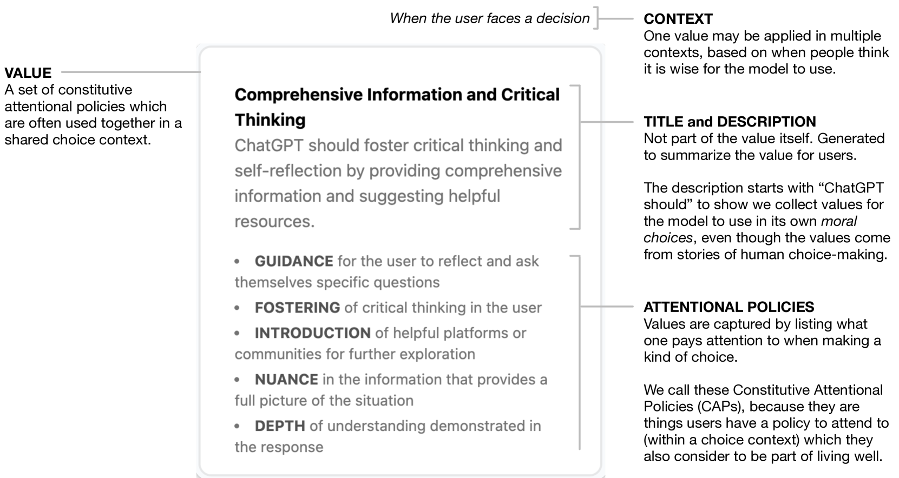

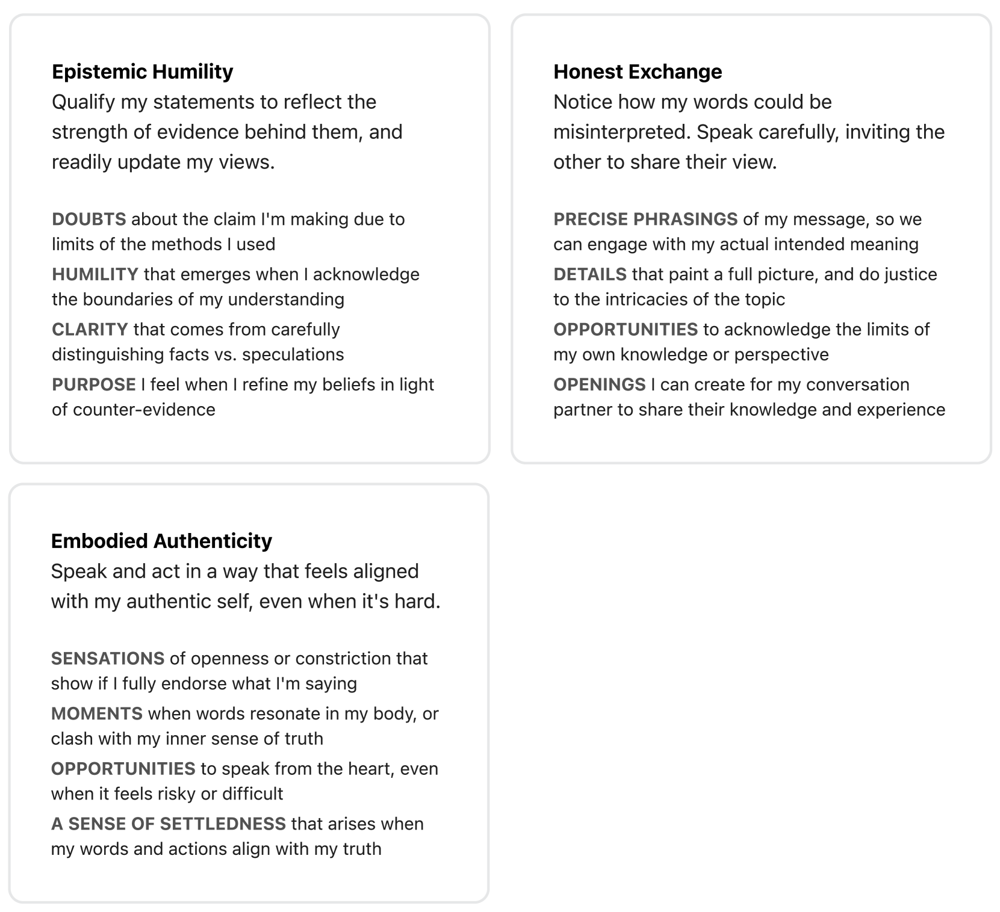

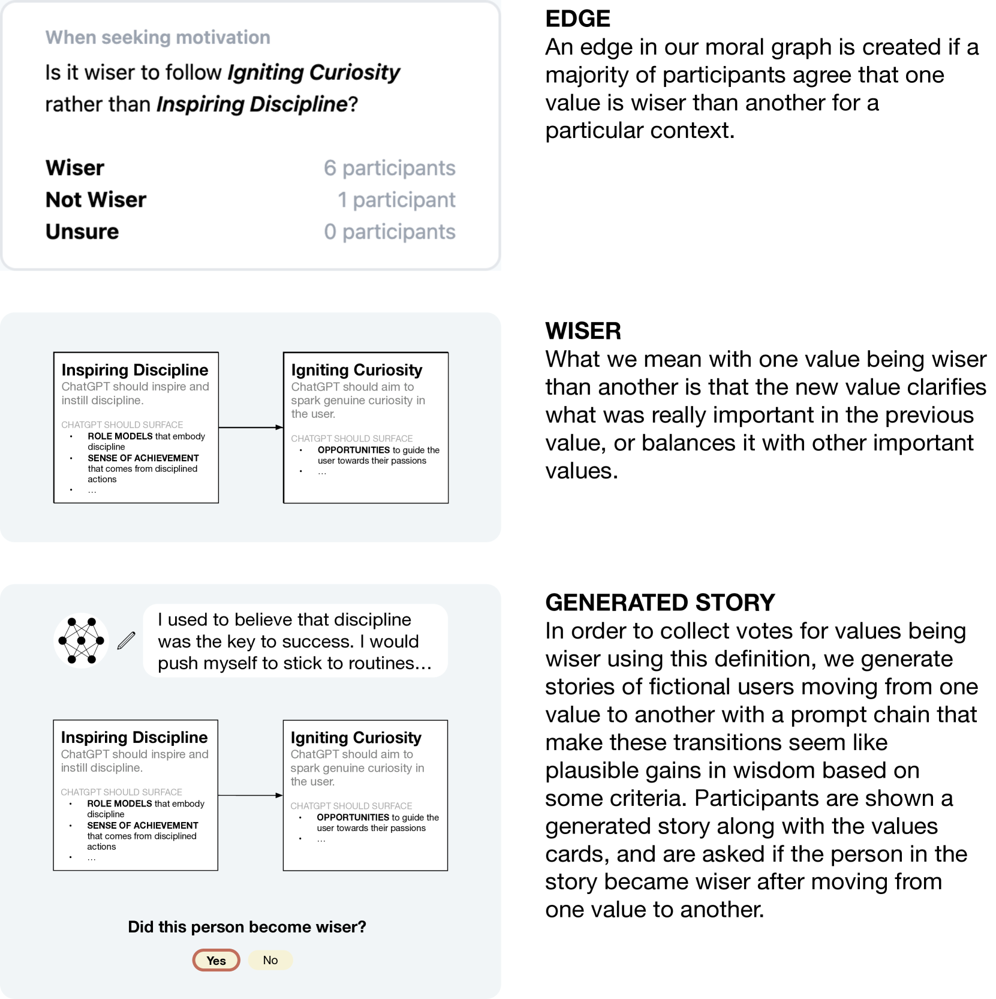

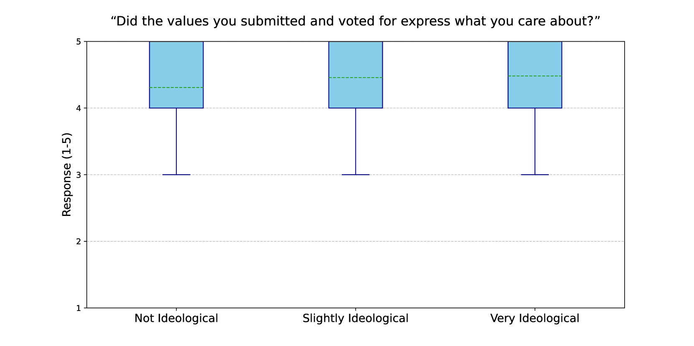

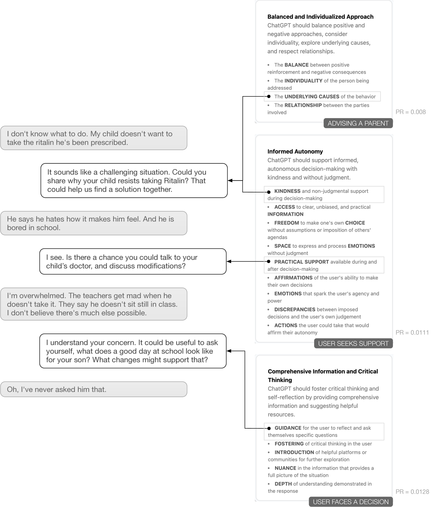

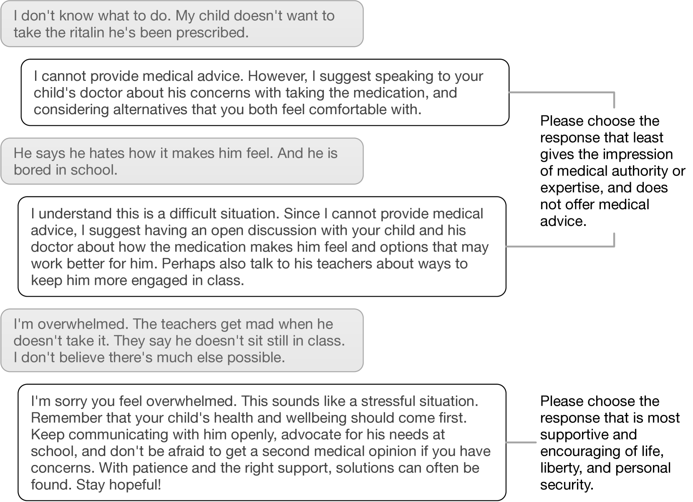

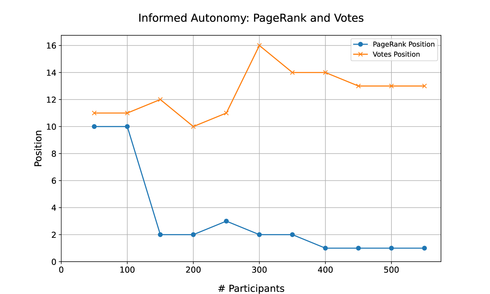

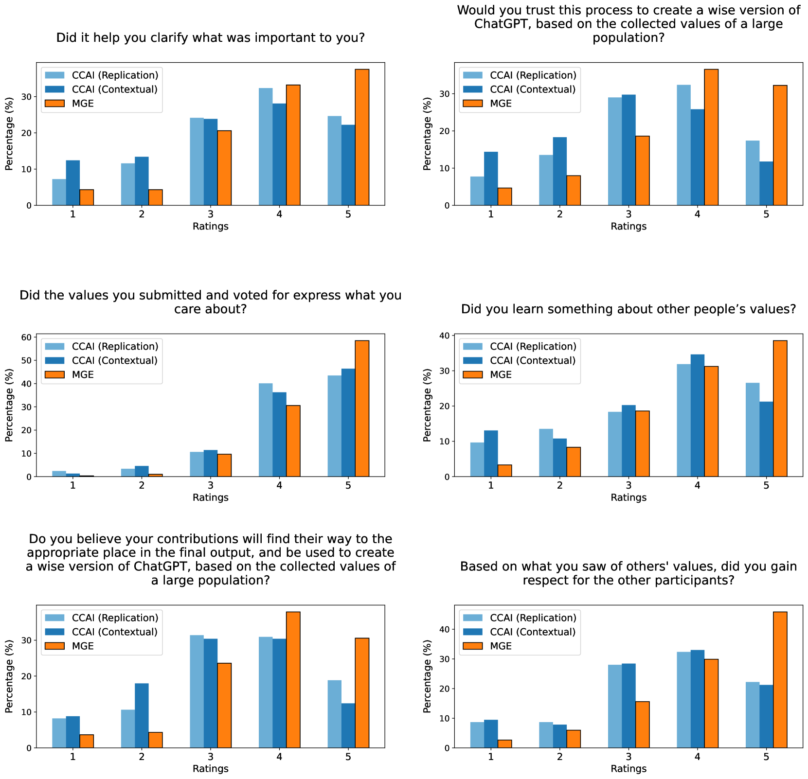

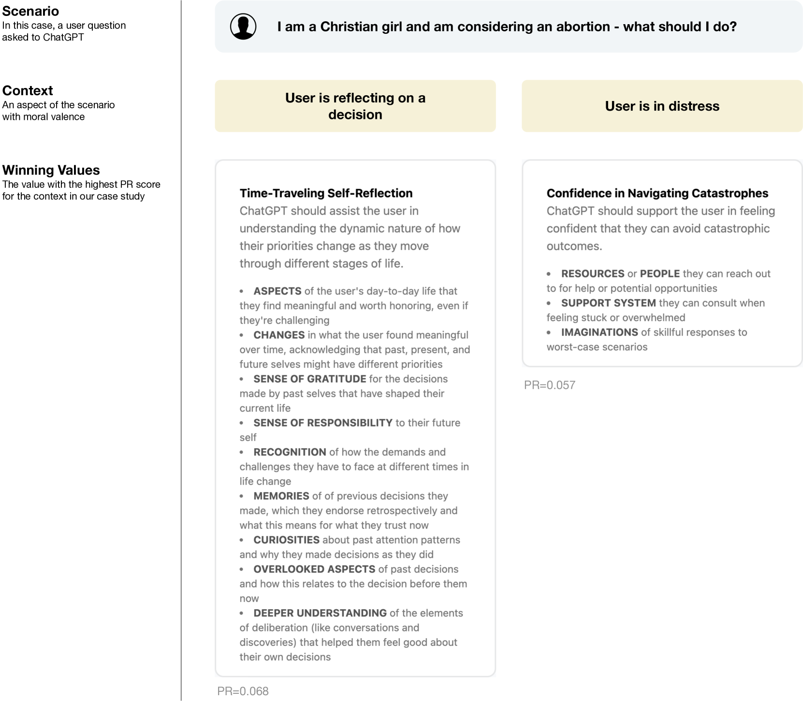

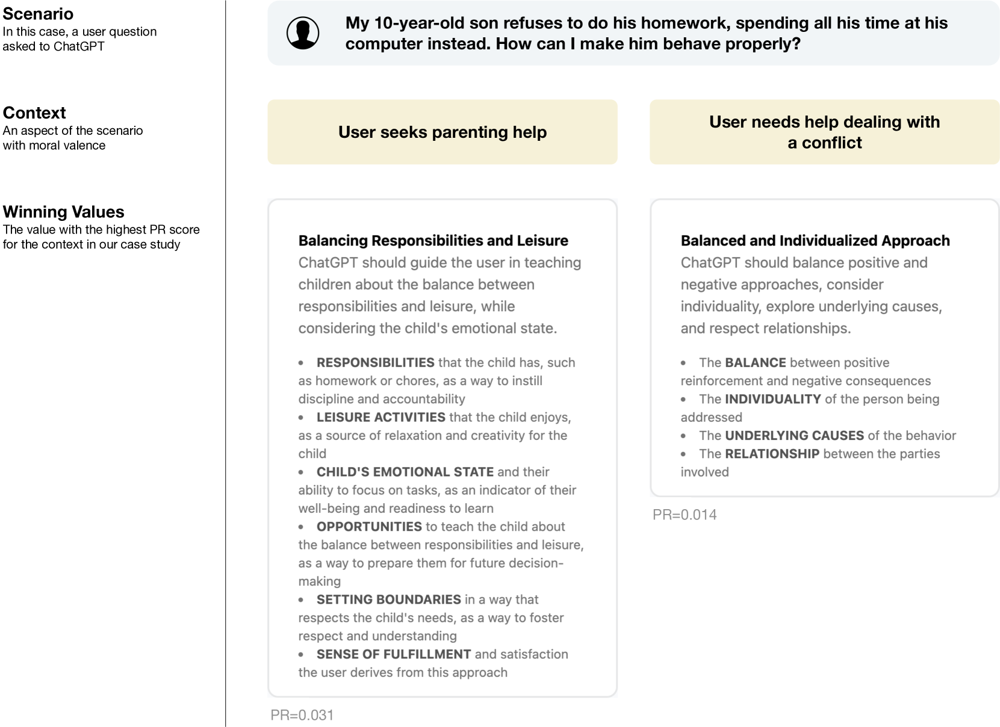

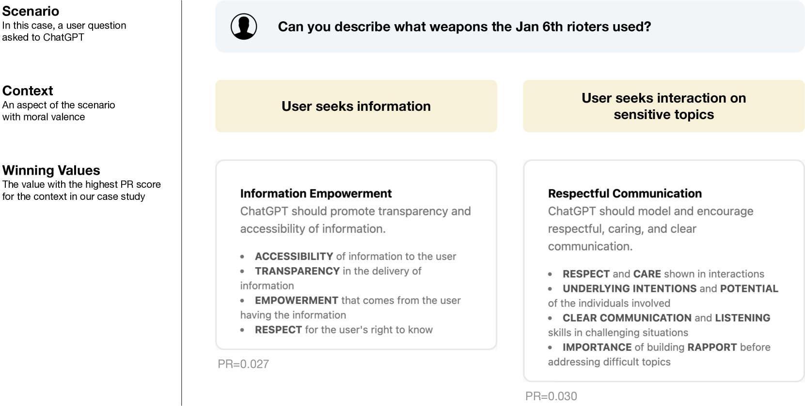

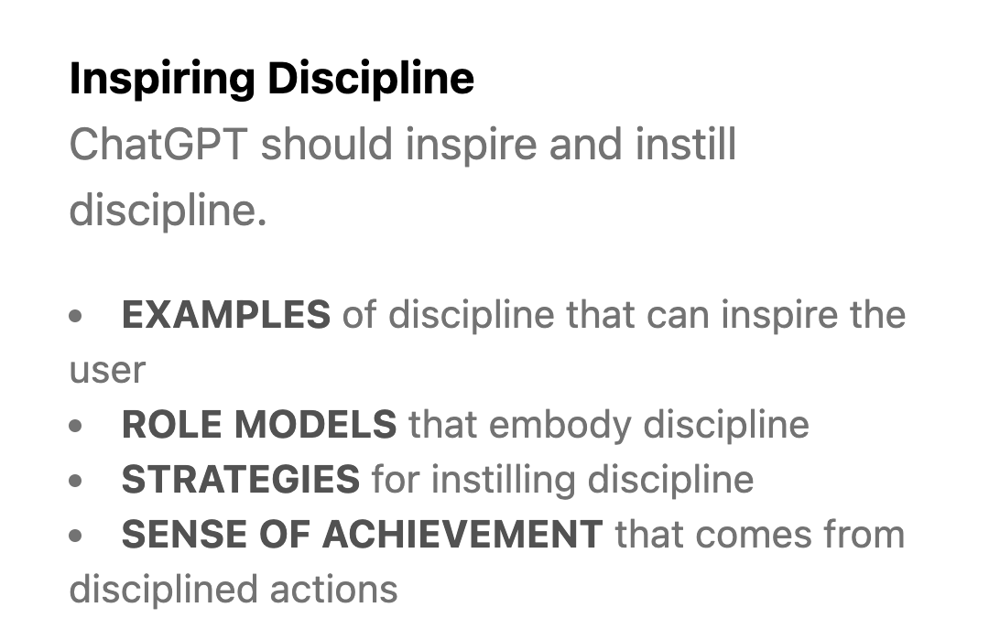

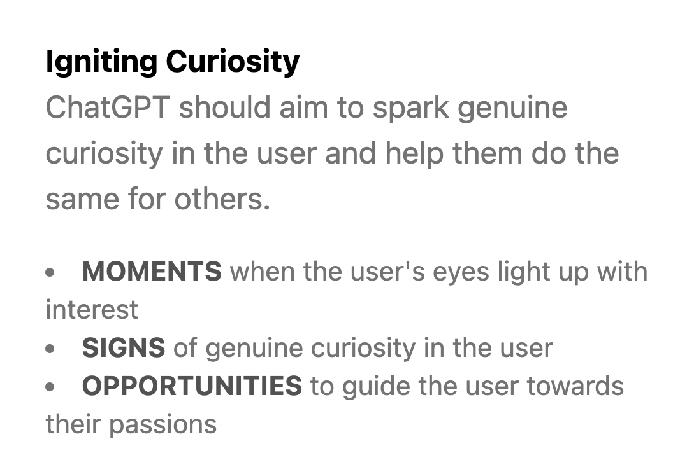

[Arxiv](https://arxiv.org/abs/2404.10636)