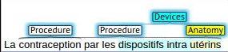

# 本文通过基准测试，对法语临床命名实体识别进行了深入评估。

发布时间：2024年03月28日

`LLM应用` `生物医学`

> A Benchmark Evaluation of Clinical Named Entity Recognition in French

# 摘要

> 背景：基于变换器的语言模型在众多自然语言处理任务中展现出强大实力。掩码语言模型（MLMs）因其能够灵活适应不同语言和子领域而备受瞩目，且相较于现代大型语言模型（LLMs），它们更为轻便。近期，针对法语生物医学领域的多个MLMs相继问世，实验结果显示其性能超越了标准的法语模型。然而，尚缺乏对这些模型在同一数据集上的系统性比较。目标：本文旨在对生物医学领域的法语掩码语言模型在临床命名实体识别任务上的性能进行评估。材料与方法：我们对CamemBERT-bio和DrBERT两款生物医学模型进行了评估，并将其与CamemBERT、FlauBERT和FrALBERT等标准法语模型以及多语言mBERT进行了对比，评估所用的三个语料库均为公开可用的法语临床命名实体识别数据集。评估过程严格依据语料库开发者发布的权威数据进行。结果：研究发现，CamemBERT-bio在各项测试中均稳定超越DrBERT，FlauBERT展现出可匹敌的性能，而FrAlBERT在碳足迹方面表现最佳。结论：本研究首次为生物医学领域的法语掩码语言模型在临床实体识别上设立了基准，通过一系列涵盖性能与环境影响的指标，对模型性能进行了公正的比较。

> Background: Transformer-based language models have shown strong performance on many Natural LanguageProcessing (NLP) tasks. Masked Language Models (MLMs) attract sustained interest because they can be adaptedto different languages and sub-domains through training or fine-tuning on specific corpora while remaining lighterthan modern Large Language Models (LLMs). Recently, several MLMs have been released for the biomedicaldomain in French, and experiments suggest that they outperform standard French counterparts. However, nosystematic evaluation comparing all models on the same corpora is available. Objective: This paper presentsan evaluation of masked language models for biomedical French on the task of clinical named entity recognition.Material and methods: We evaluate biomedical models CamemBERT-bio and DrBERT and compare them tostandard French models CamemBERT, FlauBERT and FrALBERT as well as multilingual mBERT using three publicallyavailable corpora for clinical named entity recognition in French. The evaluation set-up relies on gold-standardcorpora as released by the corpus developers. Results: Results suggest that CamemBERT-bio outperformsDrBERT consistently while FlauBERT offers competitive performance and FrAlBERT achieves the lowest carbonfootprint. Conclusion: This is the first benchmark evaluation of biomedical masked language models for Frenchclinical entity recognition that compares model performance consistently on nested entity recognition using metricscovering performance and environmental impact.

[Arxiv](https://arxiv.org/abs/2403.19726)