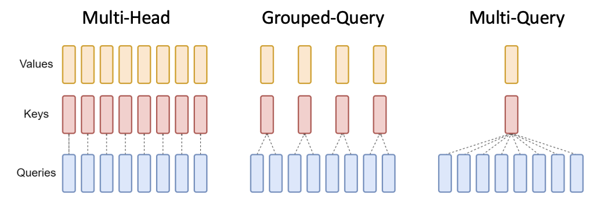
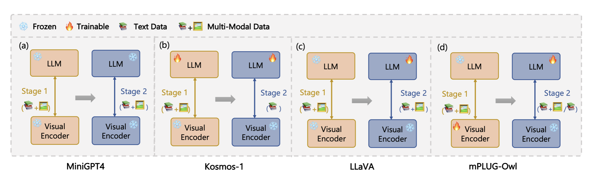

# 本文综述了多模态大型语言和视觉模型，探讨了它们在理解和处理多种信息类型方面的能力和应用。

发布时间：2024年03月28日

`LLM理论` `多模态` `人工智能`

> A Review of Multi-Modal Large Language and Vision Models

# 摘要

> 大型语言模型（LLMs）凭借其卓越的文本理解和生成能力，已成为研究和实践的新热点。而多模态大型语言模型（MM-LLMs）的问世，更是将它们的应用范围扩展到了图像、视频和音频领域。这些进步不仅催生了诸如视频文本生成、图像描述、语音合成等新应用，还可通过对现有LLM进行技术升级或全新构建MM-LLM来实现。本文深入回顾了具备多模态能力的LLMs和新兴的MM-LLMs的发展现状，探讨了变换器架构如OpenAI的GPT系列和Google的BERT所带来的技术飞跃，以及注意力机制如何提升模型表现。文中还细致梳理了主要的LLMs和MM-LLMs，并讨论了模型调优技术，如微调和提示工程，使预训练模型能更好地适应特定任务。同时，针对数据偏见和模型滥用等伦理挑战进行了分析，强调了AI发展中责任感的重要性。文末，我们还探讨了开源与专有模型在AI研究中的不同影响。通过这篇综述，我们揭示了MM-LLMs在未来应用中的变革力量。

> Large Language Models (LLMs) have recently emerged as a focal point of research and application, driven by their unprecedented ability to understand and generate text with human-like quality. Even more recently, LLMs have been extended into multi-modal large language models (MM-LLMs) which extends their capabilities to deal with image, video and audio information, in addition to text. This opens up applications like text-to-video generation, image captioning, text-to-speech, and more and is achieved either by retro-fitting an LLM with multi-modal capabilities, or building a MM-LLM from scratch. This paper provides an extensive review of the current state of those LLMs with multi-modal capabilities as well as the very recent MM-LLMs. It covers the historical development of LLMs especially the advances enabled by transformer-based architectures like OpenAI's GPT series and Google's BERT, as well as the role of attention mechanisms in enhancing model performance. The paper includes coverage of the major and most important of the LLMs and MM-LLMs and also covers the techniques of model tuning, including fine-tuning and prompt engineering, which tailor pre-trained models to specific tasks or domains. Ethical considerations and challenges, such as data bias and model misuse, are also analysed to underscore the importance of responsible AI development and deployment. Finally, we discuss the implications of open-source versus proprietary models in AI research. Through this review, we provide insights into the transformative potential of MM-LLMs in various applications.

[Arxiv](https://arxiv.org/abs/2404.01322)