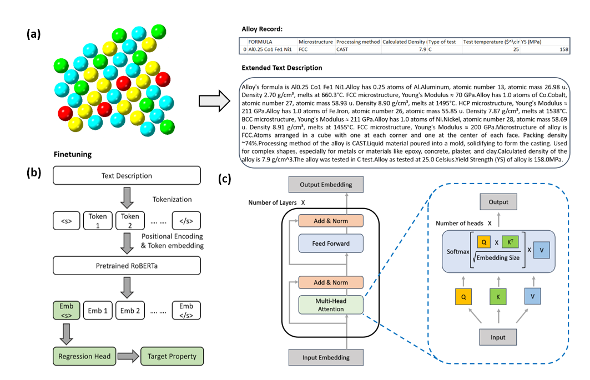
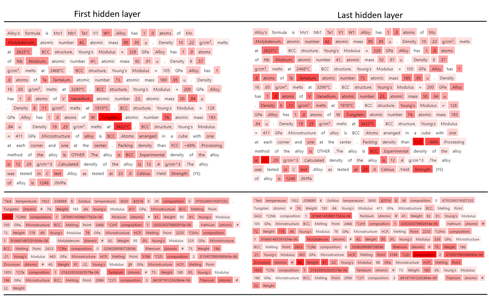
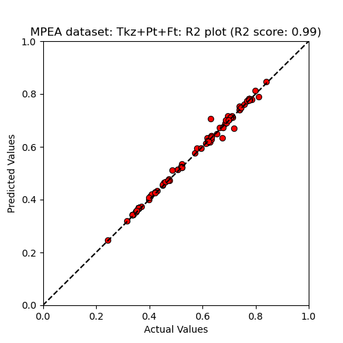
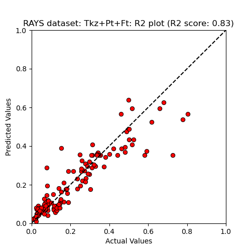

# AlloyBERT：借助大型语言模型预测合金特性

发布时间：2024年03月28日

`LLM应用` `材料科学` `人工智能`

> AlloyBERT: Alloy Property Prediction with Large Language Models

# 摘要

> 为满足特定需求而研发新型合金，对材料科学领域的研究者来说是一项巨大挑战。这凸显了开发一种基于合金化学成分和加工参数来预测其物理属性的预测技术的重要性。本研究推出了AlloyBERT，这是一个基于变压器编码器的模型，能够通过文本输入来预测合金的弹性模量和屈服强度等关键性质。AlloyBERT以预训练的RoBERTa编码器为基础，运用自注意力机制在词汇间建立联系，从而解读人类可读的文本并预测合金特性。我们结合了针对文本数据训练的分词器和为这项任务专门预训练及微调的RoBERTa编码器，在Multi Principal Elemental Alloys (MPEA)数据集上达到了平均平方误差仅为0.00015，在Refractory Alloy Yield Strength (RAYS)数据集上达到了0.00611，超越了浅层模型的最佳性能。这一成果不仅展示了语言模型在材料科学领域的应用潜力，还为基于文本的合金性质预测提供了一个不依赖复杂计算和模拟的基础框架。

> The pursuit of novel alloys tailored to specific requirements poses significant challenges for researchers in the field. This underscores the importance of developing predictive techniques for essential physical properties of alloys based on their chemical composition and processing parameters. This study introduces AlloyBERT, a transformer encoder-based model designed to predict properties such as elastic modulus and yield strength of alloys using textual inputs. Leveraging the pre-trained RoBERTa encoder model as its foundation, AlloyBERT employs self-attention mechanisms to establish meaningful relationships between words, enabling it to interpret human-readable input and predict target alloy properties. By combining a tokenizer trained on our textual data and a RoBERTa encoder pre-trained and fine-tuned for this specific task, we achieved a mean squared error (MSE) of 0.00015 on the Multi Principal Elemental Alloys (MPEA) data set and 0.00611 on the Refractory Alloy Yield Strength (RAYS) dataset. This surpasses the performance of shallow models, which achieved a best-case MSE of 0.00025 and 0.0076 on the MPEA and RAYS datasets respectively. Our results highlight the potential of language models in material science and establish a foundational framework for text-based prediction of alloy properties that does not rely on complex underlying representations, calculations, or simulations.

[Arxiv](https://arxiv.org/abs/2403.19783)