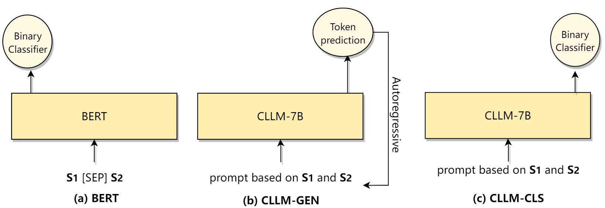
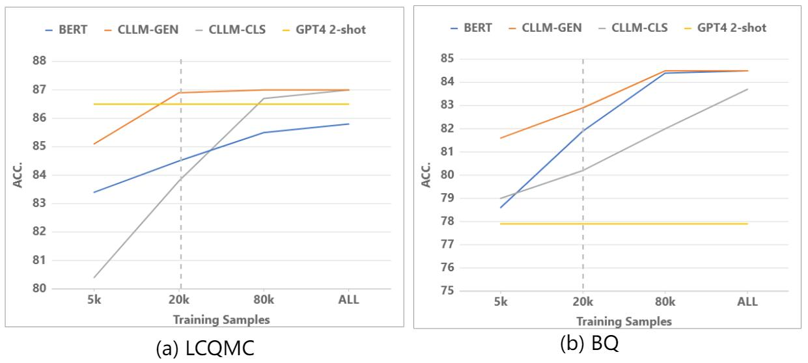
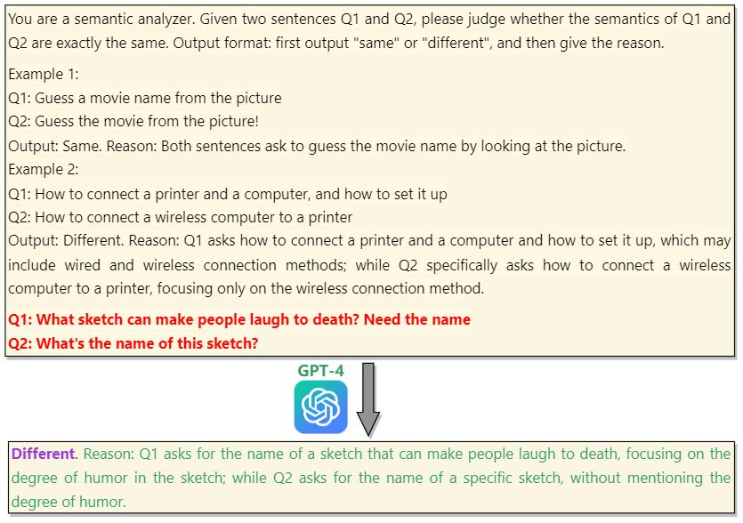
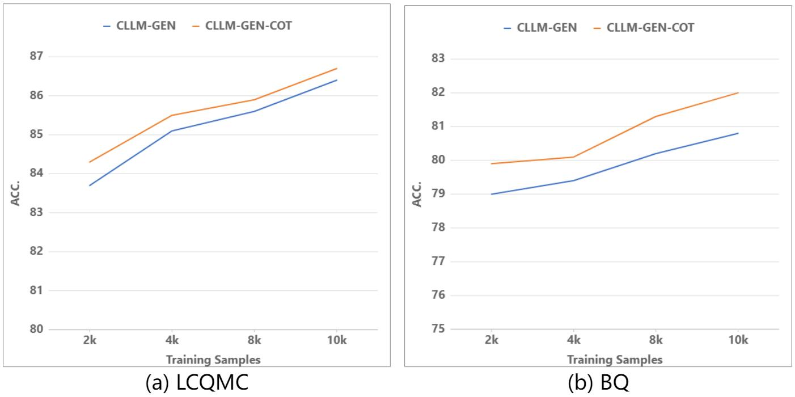
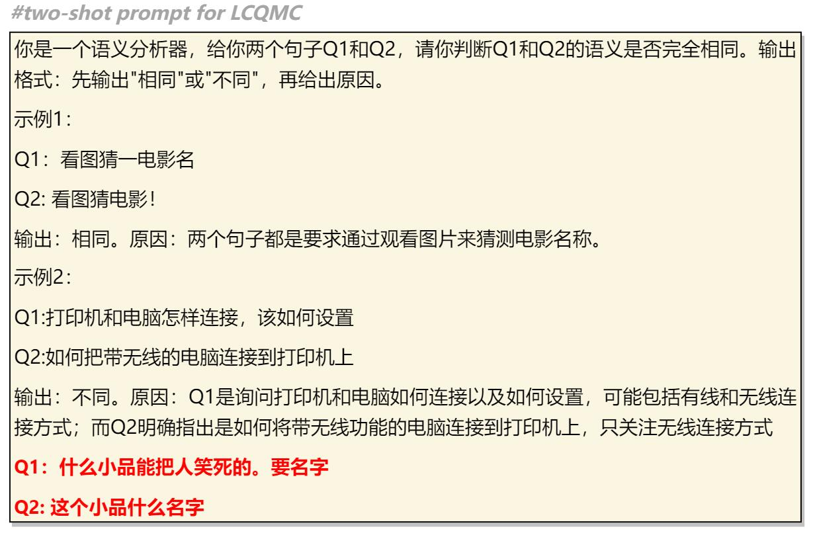
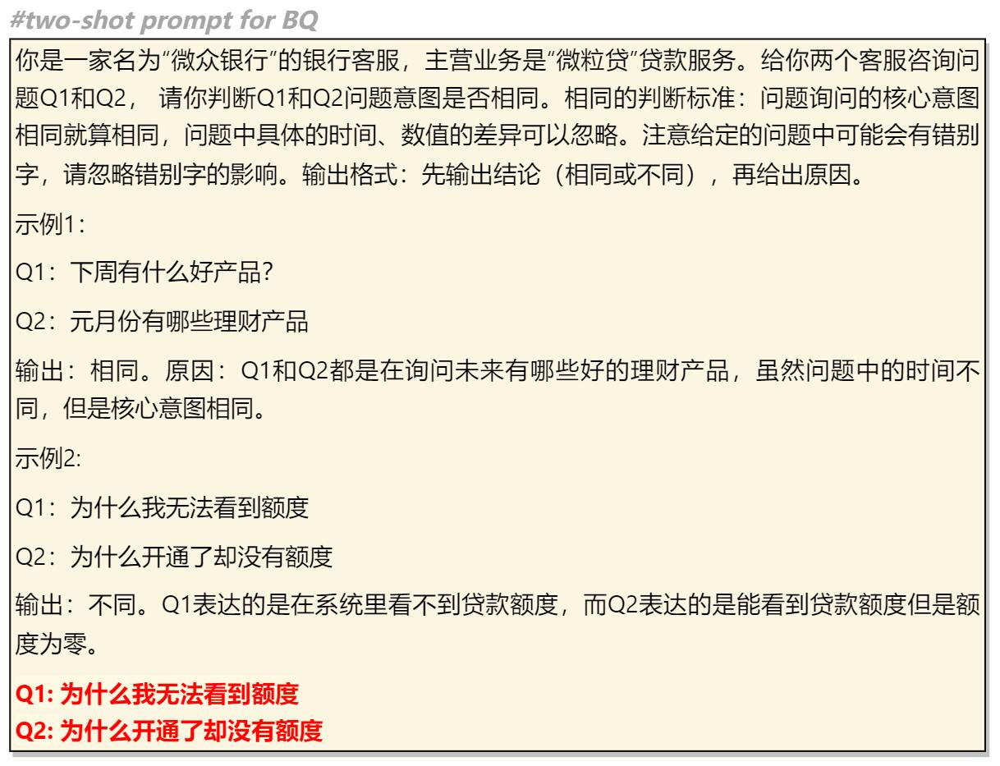
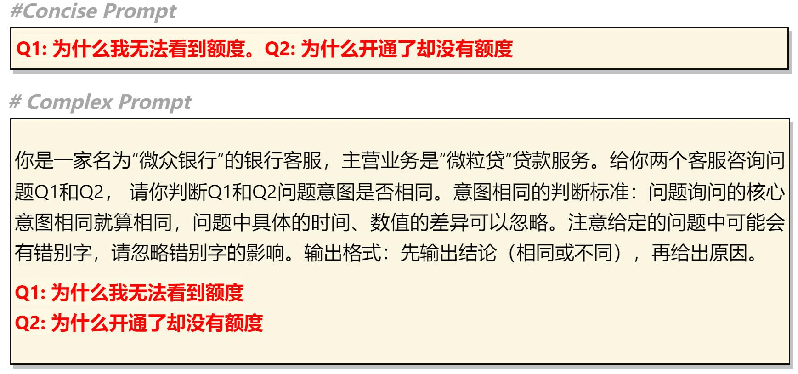
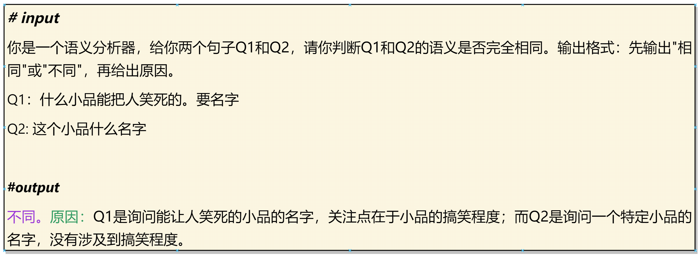

# 大型语言模型（LLM）能否成为精准调优的有效支撑？通过一项针对中文短文本匹配任务的监督LLM的实验探索，我们来一探究竟。

发布时间：2024年03月28日

`LLM应用` `机器学习`

> Are LLMs Effective Backbones for Fine-tuning? An Experimental Investigation of Supervised LLMs on Chinese Short Text Matching

# 摘要

> 大型语言模型（LLMs）的近期突破在学术和产业界引起了极大关注。先前的研究主要着眼于提升或利用LLMs在零样本和少样本情境下的泛化性能。然而，在监督学习环境中，针对特定自然语言理解任务对LLMs进行有效微调的研究还相当匮乏。本研究通过微调LLMs来处理中文短文本匹配任务，进行了一系列的实验分析。我们深入探讨了多个因素，这些因素在微调LLMs时对性能有着显著影响，包括任务建模方式、提示设计和输出展现形式。

> The recent success of Large Language Models (LLMs) has garnered significant attention in both academia and industry. Prior research on LLMs has primarily focused on enhancing or leveraging their generalization capabilities in zero- and few-shot settings. However, there has been limited investigation into effectively fine-tuning LLMs for a specific natural language understanding task in supervised settings. In this study, we conduct an experimental analysis by fine-tuning LLMs for the task of Chinese short text matching. We explore various factors that influence performance when fine-tuning LLMs, including task modeling methods, prompt formats, and output formats.

[Arxiv](https://arxiv.org/abs/2403.19930)