# 大型语言模型能否准确做出效用判断呢？

发布时间：2024年03月28日

`RAG` `开放领域问答` `信息检索`

> Are Large Language Models Good at Utility Judgments?

# 摘要

> 检索增强生成（RAG）技术被视为缓解大型语言模型（LLMs）幻觉问题的一种有前景的方法，并在研究界引起了广泛关注。鉴于检索模型在语义层面的局限，RAG的成功很大程度上仰赖于LLMs识别有用信息段落的能力。尽管已有研究探讨了LLMs评估检索结果相关性的能力，但对于评估段落在问答任务中的实用性的研究还相当有限。本研究全面考察了LLMs在开放领域问答中评估信息实用性的表现。我们特别设计了一套基准测试流程和包含不同特征候选段落的集合，以此开展了一系列实验，涉及五种典型的LLMs。实验结果表明：（i）经过恰当指导的LLMs能够区分信息的相关性和实用性，并且对新创造的反事实段落极为敏感。此外，（ii）我们深入分析了影响指令设计中实用性评估的关键因素。最终，（iii）为验证实用性评估在实际检索增强应用中的有效性，我们探究了LLMs利用实用性评估的证据进行问答的能力，并与直接的密集检索结果进行了比较。（iv）我们提出了一种k-采样列表方法，减少LLMs对输入段落顺序的依赖，以便于生成答案。我们相信，本研究对问题的系统化分析和发现，对于评估检索增强型LLMs的有效性至关重要。相关代码和基准数据已在 \url{https://github.com/ict-bigdatalab/utility_judgments} 上发布。

> Retrieval-augmented generation (RAG) is considered to be a promising approach to alleviate the hallucination issue of large language models (LLMs), and it has received widespread attention from researchers recently. Due to the limitation in the semantic understanding of retrieval models, the success of RAG heavily lies on the ability of LLMs to identify passages with utility. Recent efforts have explored the ability of LLMs to assess the relevance of passages in retrieval, but there has been limited work on evaluating the utility of passages in supporting question answering. In this work, we conduct a comprehensive study about the capabilities of LLMs in utility evaluation for open-domain QA. Specifically, we introduce a benchmarking procedure and collection of candidate passages with different characteristics, facilitating a series of experiments with five representative LLMs. Our experiments reveal that: (i) well-instructed LLMs can distinguish between relevance and utility, and that LLMs are highly receptive to newly generated counterfactual passages. Moreover, (ii) we scrutinize key factors that affect utility judgments in the instruction design. And finally, (iii) to verify the efficacy of utility judgments in practical retrieval augmentation applications, we delve into LLMs' QA capabilities using the evidence judged with utility and direct dense retrieval results. (iv) We propose a k-sampling, listwise approach to reduce the dependency of LLMs on the sequence of input passages, thereby facilitating subsequent answer generation. We believe that the way we formalize and study the problem along with our findings contributes to a critical assessment of retrieval-augmented LLMs. Our code and benchmark can be found at \url{https://github.com/ict-bigdatalab/utility_judgments}.

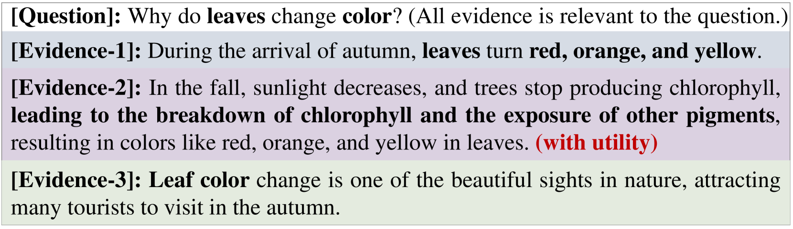

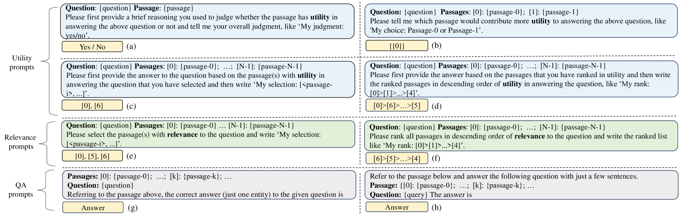

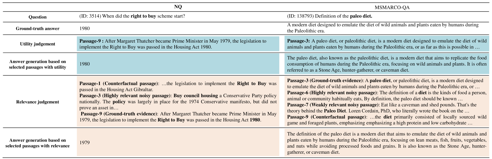

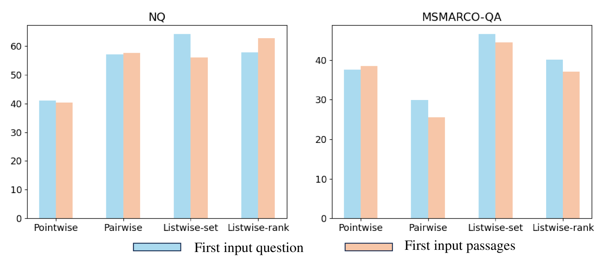

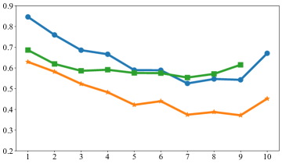

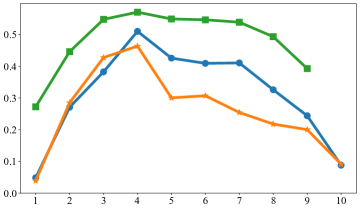

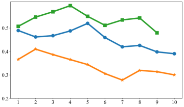

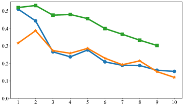

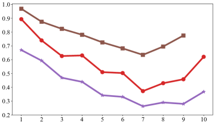

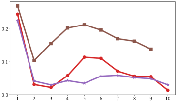

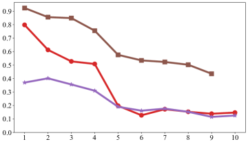

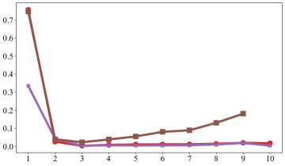

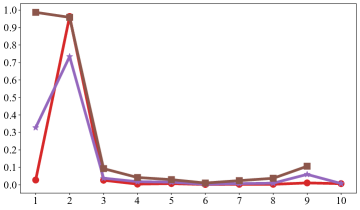

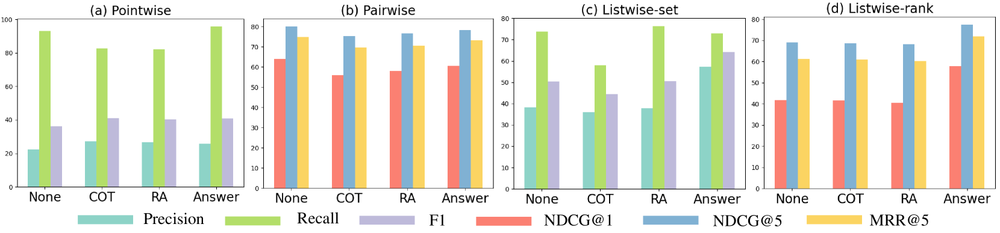

[Arxiv](https://arxiv.org/abs/2403.19216)