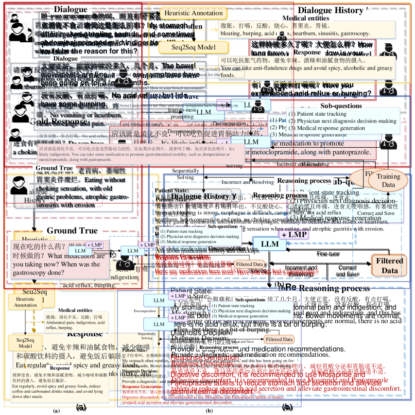
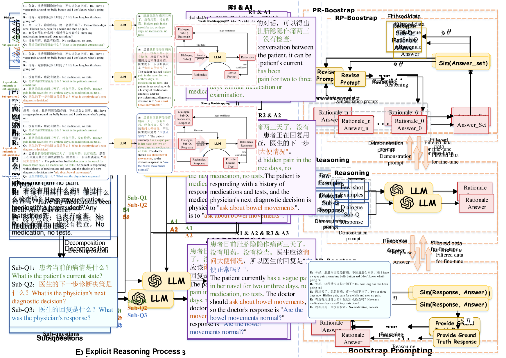
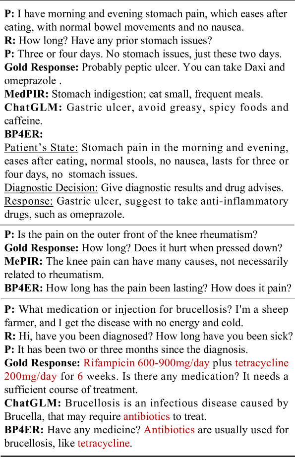

# BP4ER：一种针对医疗对话生成的自举式明确推理提示方法。

发布时间：2024年03月28日

`LLM应用` `对话生成`

> BP4ER: Bootstrap Prompting for Explicit Reasoning in Medical Dialogue Generation

# 摘要

> 医疗对话生成（MDG）因其显著的实际价值而日益受到重视。传统方法多采用序列到序列模型，通过模拟带有标注医疗信息的连续文本来生成医疗回复，虽能生成流畅的回应，却缺乏对推理过程的阐释，并依赖于繁琐的实体标注。为克服这些不足，我们提出了一种新方法——Bootstrap Prompting for Explicit Reasoning in MDG (BP4ER)，它直接模拟MDG的多步推理过程，并通过迭代增强这一推理链。我们运用由浅入深的提示策略，指导大型语言模型（LLM）进行逐步推理，将复杂问题拆解为易于处理的子问题，并以前一个问题的答案为基础构建下一个问题。同时，我们还引入了两种创新的自举技术，用以自动纠正错误并促进LLM的明确推理。这一方法摒弃了实体标注的需要，通过显式构建推理链条，提高了MDG过程的透明度。在两个公共数据集上的实验结果显示，BP4ER在客观和主观评价指标上均超越了现有顶尖技术。

> Medical dialogue generation (MDG) has gained increasing attention due to its substantial practical value. Previous works typically employ a sequence-to-sequence framework to generate medical responses by modeling dialogue context as sequential text with annotated medical entities. While these methods have been successful in generating fluent responses, they fail to provide process explanations of reasoning and require extensive entity annotation. To address these limitations, we propose the method Bootstrap Prompting for Explicit Reasoning in MDG (BP4ER), which explicitly model MDG's multi-step reasoning process and iteratively enhance this reasoning process. We employ a least-to-most prompting strategy to guide a large language model (LLM) in explicit reasoning, breaking down MDG into simpler sub-questions. These sub-questions build on answers from previous ones. Additionally, we also introduce two distinct bootstrapping techniques for prompting, which autonomously correct errors and facilitate the LLM's explicit reasoning. This approach eliminates the need for entity annotation and increases the transparency of the MDG process by explicitly generating the intermediate reasoning chain. The experimental findings on the two public datasets indicate that BP4ER outperforms state-of-the-art methods in terms of both objective and subjective evaluation metrics.

[Arxiv](https://arxiv.org/abs/2403.19414)