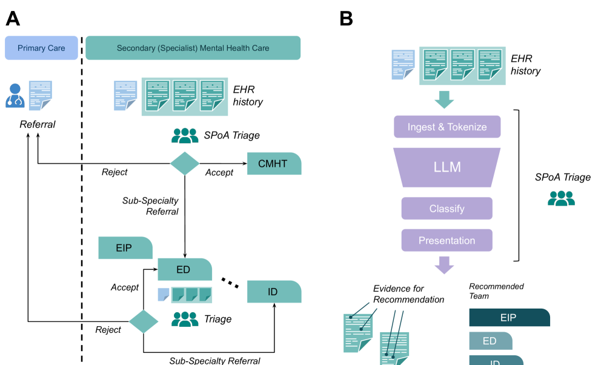
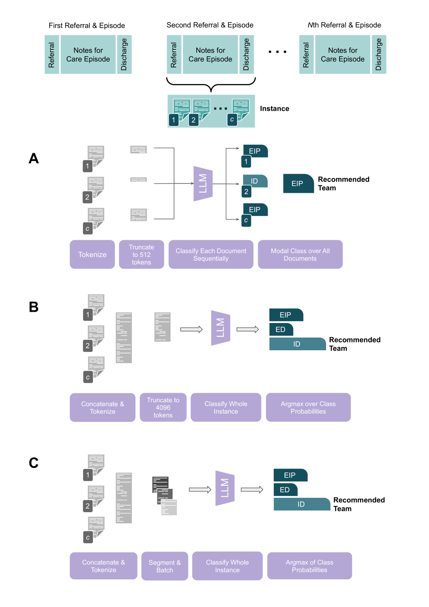
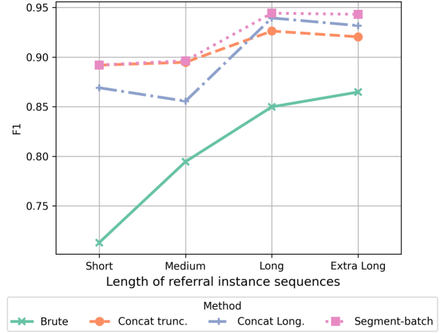
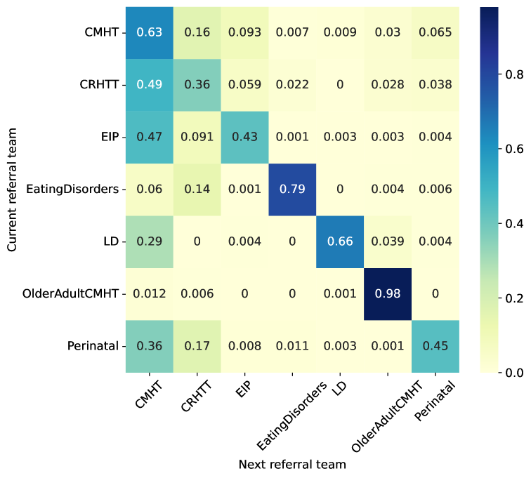
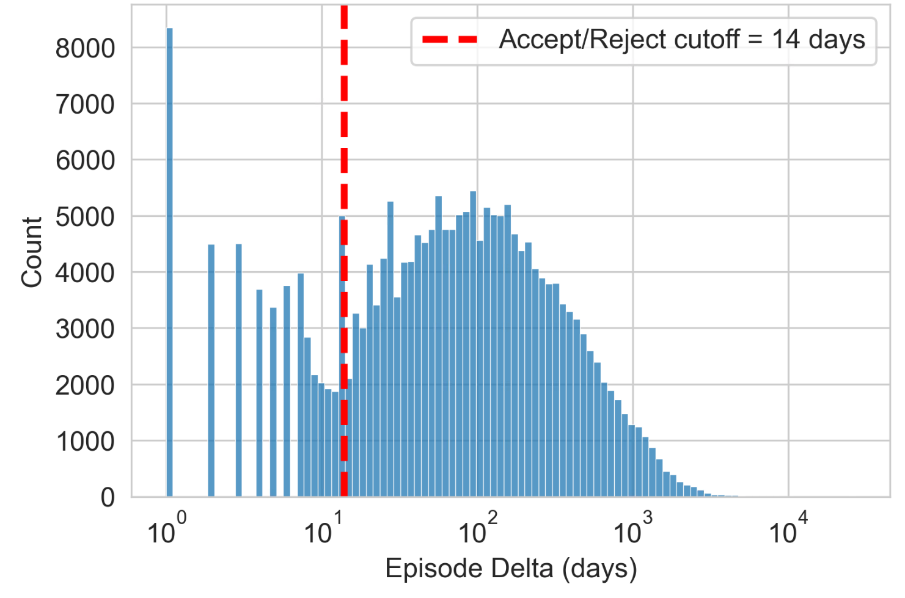
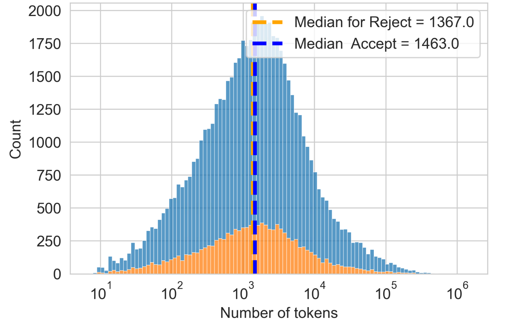
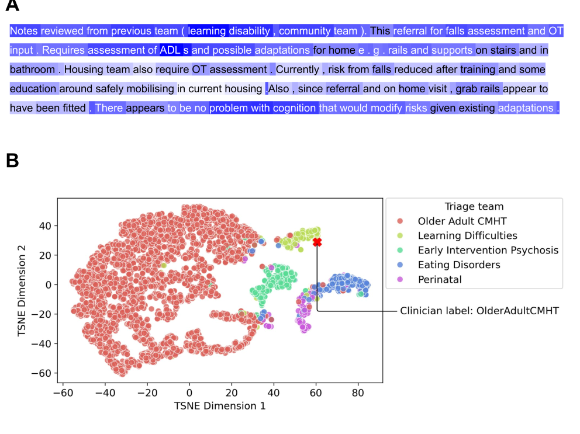

# 在心理健康护理领域，我们专门打造的大型语言模型，旨在为数字分流提供智能辅助。

发布时间：2024年03月28日

`LLM应用` `精神健康` `电子健康记录`

> Bespoke Large Language Models for Digital Triage Assistance in Mental Health Care

# 摘要

> 现代大型语言模型在解析电子健康记录中的非结构化叙述性文本数据方面大有裨益，尤其在精神健康领域，这里的患者数据大多缺乏机器可直接解析的结构化格式。英国国家卫生服务体系面临的一个重大挑战是专家精神卫生服务的漫长等待名单。数据显示，在2023年的每个月，新增的二级精神卫生服务转介个案多达37万至47万个。这些转介需由临床医生依据患者健康记录中的信息进行紧急排序，以确定最合适的医疗团队来评估和治疗患者。我们的模型能够通过分析大量的临床记录，高效地推荐合适的治疗团队，这不仅有助于缩短等待时间，还能借助先进技术，增强分诊决策的合理性。我们展示了并评估了三种不同的基于大型语言模型的方法，它们能够端到端地处理不同长度的临床健康记录数据，以便在临床医生进行转介排序时提供帮助。该模型能够提供与现行临床操作相符的转诊建议，并且其架构设计可在单GPU上运行，非常适合在资源受限的NHS环境中应用。在这里，为了确保机密的临床数据得到恰当的控制和管理，LLM技术的私密实施将显得尤为重要。

> Contemporary large language models (LLMs) may have utility for processing unstructured, narrative free-text clinical data contained in electronic health records (EHRs) -- a particularly important use-case for mental health where a majority of routinely-collected patient data lacks structured, machine-readable content.
  A significant problem for the the United Kingdom's National Health Service (NHS) are the long waiting lists for specialist mental healthcare. According to NHS data, in each month of 2023, there were between 370,000 and 470,000 individual new referrals into secondary mental healthcare services. Referrals must be triaged by clinicians, using clinical information contained in the patient's EHR to arrive at a decision about the most appropriate mental healthcare team to assess and potentially treat these patients.
  The ability to efficiently recommend a relevant team by ingesting potentially voluminous clinical notes could help services both reduce referral waiting times and with the right technology, improve the evidence available to justify triage decisions.
  We present and evaluate three different approaches for LLM-based, end-to-end ingestion of variable-length clinical EHR data to assist clinicians when triaging referrals. Our model is able to deliver triage recommendations consistent with existing clinical practices and it's architecture was implemented on a single GPU, making it practical for implementation in resource-limited NHS environments where private implementations of LLM technology will be necessary to ensure confidential clinical data is appropriately controlled and governed.

[Arxiv](https://arxiv.org/abs/2403.19790)