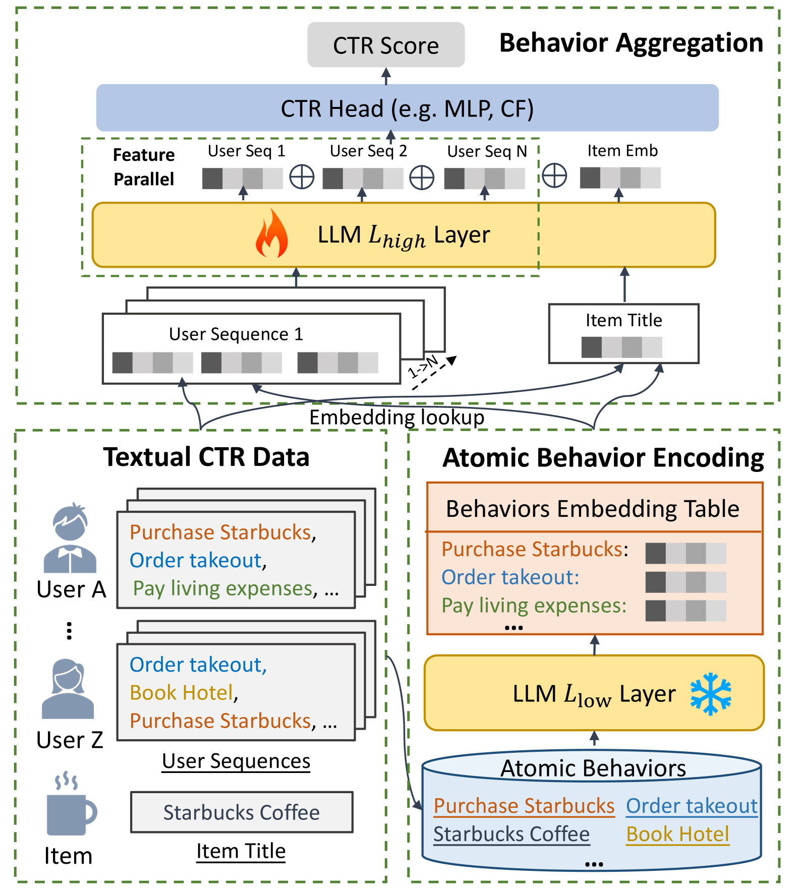
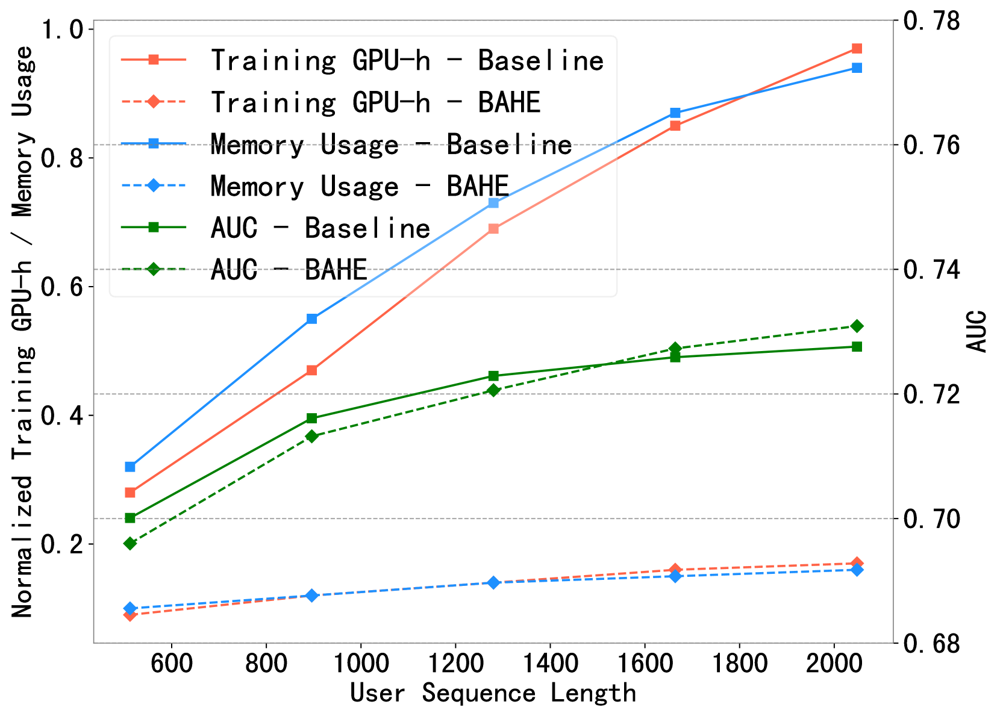
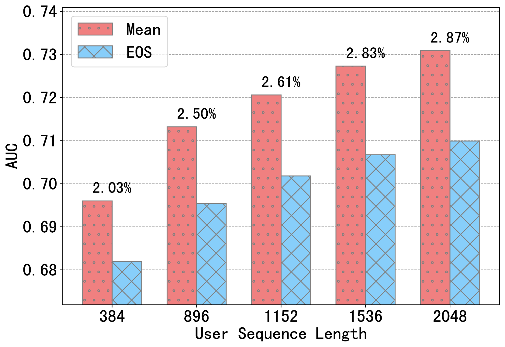

# 突破长度限制：利用大型语言模型提升长文本用户行为的点击率预测能力

发布时间：2024年03月28日

`LLM应用` `推荐系统`

> Breaking the Length Barrier: LLM-Enhanced CTR Prediction in Long Textual User Behaviors

# 摘要

> 随着大型语言模型（LLMs）的流行，研究者们开始借助LLMs来增强点击率（CTR）预测的效果。但我们发现，在实际运用LLMs时，处理长文本用户行为的效率问题仍是一个难以逾越的障碍。面对用户序列不断增长的挑战，现有LLMs的效率已不足以应对大规模用户和项目的培训需求。为此，我们提出了一种名为行为聚合层次编码（BAHE）的新方法，旨在提升基于LLM的CTR模型的效率。BAHE通过创新的层次架构，将用户行为编码与其交互作用解耦。首先，为了避免对重复用户行为的编码造成不必要的计算浪费，BAHE利用LLM预训练的浅层提取用户序列中最基础的行为嵌入，并将其存储于离线数据库。接着，LLM的深层可训练层将负责处理复杂的行为间交互，生成全面的用户嵌入。这种分层处理方式使得高级用户表示的学习不再依赖于低级行为编码，有效降低了计算成本。最终，这些经过优化的用户嵌入与处理过的项目嵌入一起被用于CTR模型，以计算CTR得分。实验结果显示，BAHE能将使用LLMs的CTR模型的训练时间和内存消耗降低五倍，尤其适用于处理较长用户序列的场景。BAHE已在实际系统中得到应用，实现了每天在8个A100 GPU上更新5000万条CTR数据，使得LLMs在工业级CTR预测中变得切实可行。

> With the rise of large language models (LLMs), recent works have leveraged LLMs to improve the performance of click-through rate (CTR) prediction. However, we argue that a critical obstacle remains in deploying LLMs for practical use: the efficiency of LLMs when processing long textual user behaviors. As user sequences grow longer, the current efficiency of LLMs is inadequate for training on billions of users and items. To break through the efficiency barrier of LLMs, we propose Behavior Aggregated Hierarchical Encoding (BAHE) to enhance the efficiency of LLM-based CTR modeling. Specifically, BAHE proposes a novel hierarchical architecture that decouples the encoding of user behaviors from inter-behavior interactions. Firstly, to prevent computational redundancy from repeated encoding of identical user behaviors, BAHE employs the LLM's pre-trained shallow layers to extract embeddings of the most granular, atomic user behaviors from extensive user sequences and stores them in the offline database. Subsequently, the deeper, trainable layers of the LLM facilitate intricate inter-behavior interactions, thereby generating comprehensive user embeddings. This separation allows the learning of high-level user representations to be independent of low-level behavior encoding, significantly reducing computational complexity. Finally, these refined user embeddings, in conjunction with correspondingly processed item embeddings, are incorporated into the CTR model to compute the CTR scores. Extensive experimental results show that BAHE reduces training time and memory by five times for CTR models using LLMs, especially with longer user sequences. BAHE has been deployed in a real-world system, allowing for daily updates of 50 million CTR data on 8 A100 GPUs, making LLMs practical for industrial CTR prediction.

[Arxiv](https://arxiv.org/abs/2403.19347)