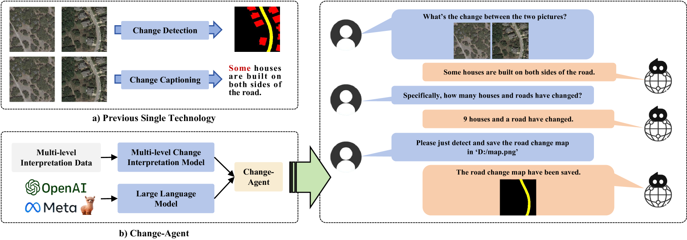
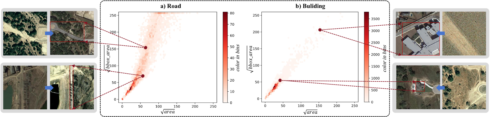
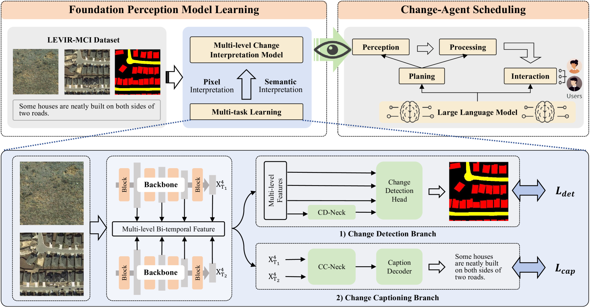
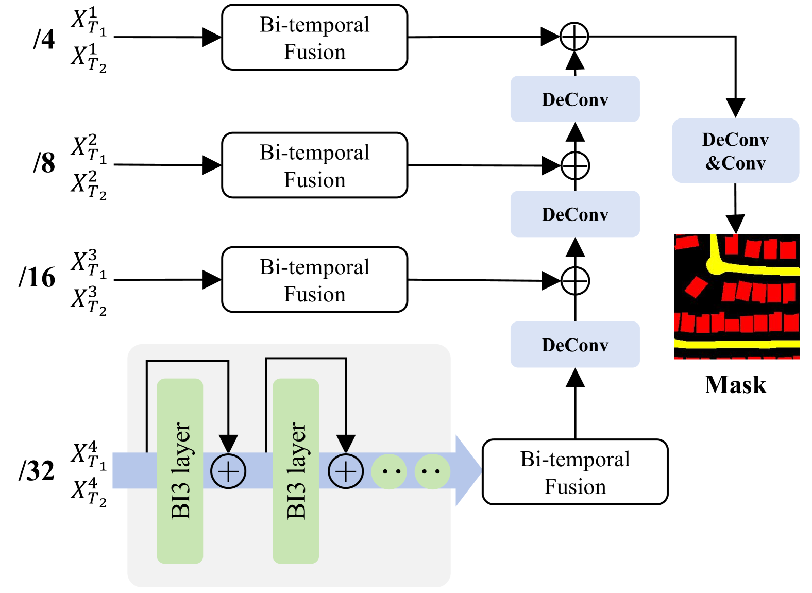
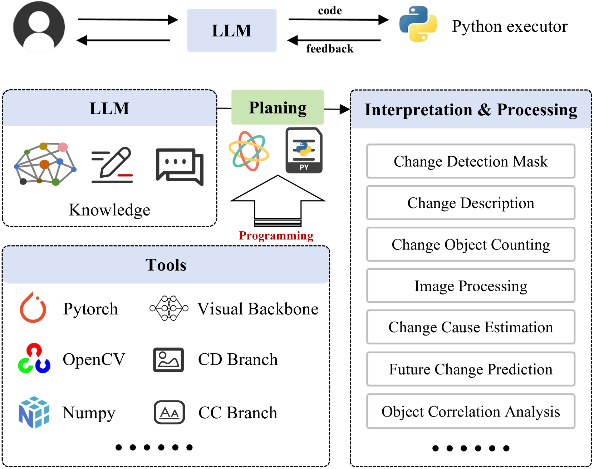
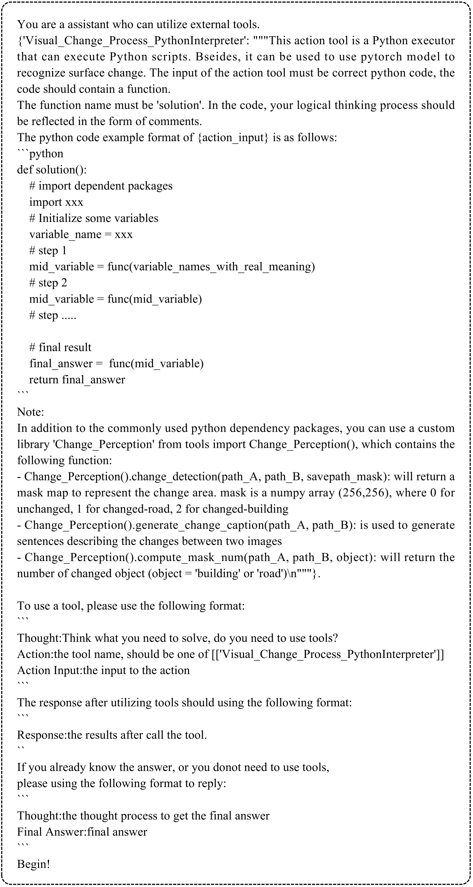
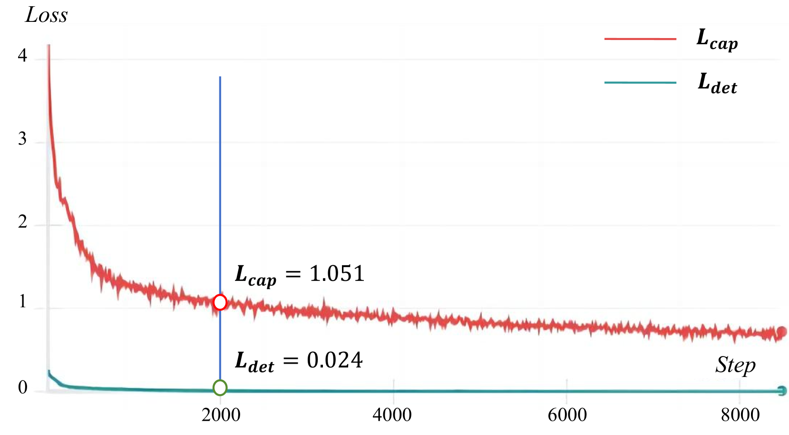
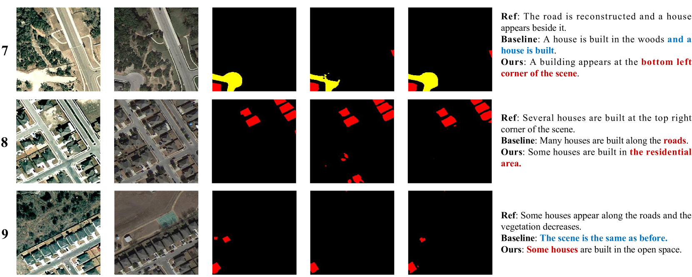
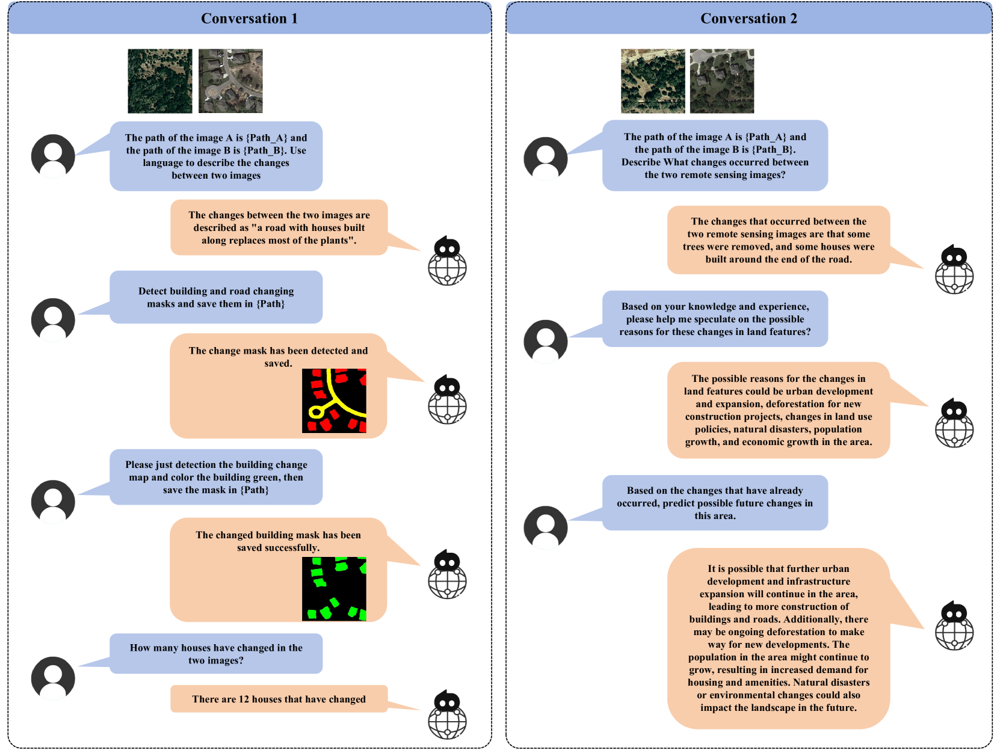
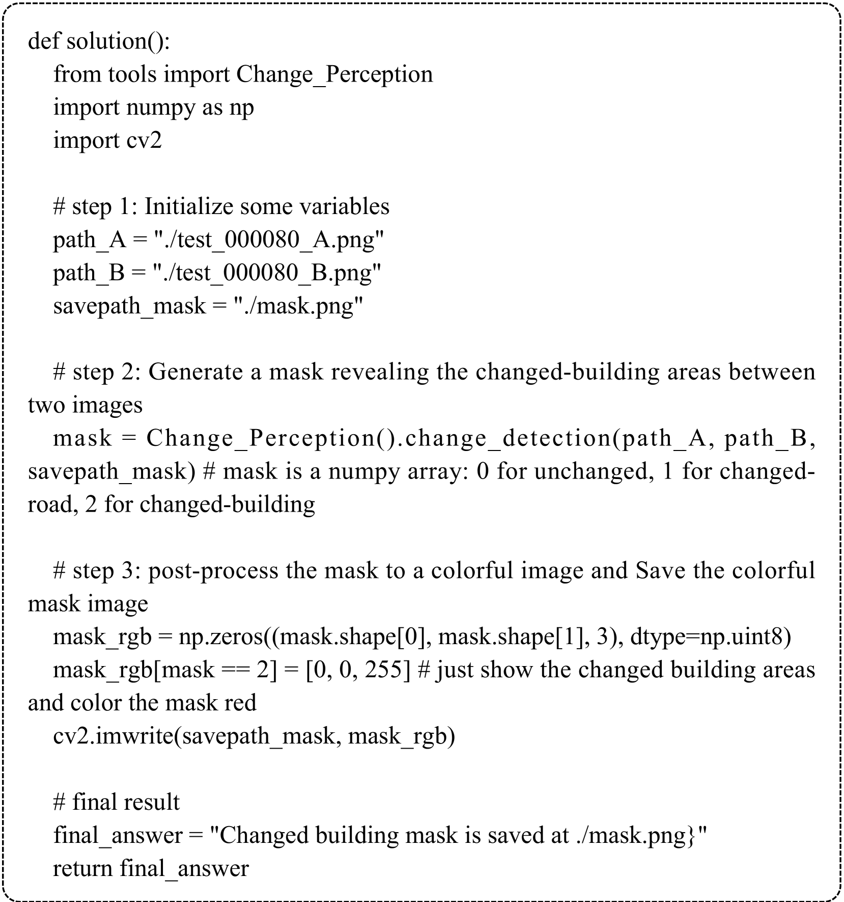

# 变革先锋：探索通过变化侦测与变化描述实现交互式、全面的变革解读与分析。

发布时间：2024年03月28日

`Agent` `地理信息系统`

> Change-Agent: Towards Interactive Comprehensive Change Interpretation and Analysis from Change Detection and Change Captioning

# 摘要

> 地球表面变化的监测对于揭示自然现象和人类活动的影响极为关键，这要求我们采用精确而全面的方法进行解读。遥感卫星图像在这方面提供了一个独特的视角，催生了遥感图像变化解读（RSICI）领域的兴起。现有的RSICI技术，如变化检测和变化描述，尽管有所应用，但在全面性解读方面仍有局限。为此，我们设计了一个互动式变化代理，它融合了多层次变化解读（MCI）模型来洞察细节，并以大型语言模型（LLM）作为智慧中枢。该代理能够遵循用户指令，进行深入的变化分析和解读，包括但不限于变化检测、描述、对象计数以及原因分析等。我们的MCI模型结合了像素级变化检测和语义级变化描述两大分支，通过BI时序迭代交互（BI3）层，运用局部感知增强（LPE）和全局差异融合注意力（GDFA）模块，极大提升了模型的特征辨识能力。为训练MCI模型，我们创建了LEVIR-MCI数据集，内含双时相图像的变化掩码和描述。一系列实验验证了我们变化解读模型的有效性，并展示了变化代理在辅助深入、智能地解读地表变化方面的巨大潜力。我们将在https://github.com/Chen-Yang-Liu/Change-Agent上公开数据集和模型代码，以推动后续研究。

> Monitoring changes in the Earth's surface is crucial for understanding natural processes and human impacts, necessitating precise and comprehensive interpretation methodologies. Remote sensing satellite imagery offers a unique perspective for monitoring these changes, leading to the emergence of remote sensing image change interpretation (RSICI) as a significant research focus. Current RSICI technology encompasses change detection and change captioning, each with its limitations in providing comprehensive interpretation. To address this, we propose an interactive Change-Agent which integrates a multi-level change interpretation (MCI) model as eyes and a large language model (LLM) as the brain. Our Change-Agent can follow user instructions to achieve comprehensive change interpretation and insightful analysis according to user instructions, such as change detection and change captioning, change object counting, change cause analysis, etc. Our proposed MCI model contains two branches of pixel-level change detection and semantic-level change captioning, in which multiple BI-temporal Iterative Interaction (BI3) layers utilize Local Perception Enhancement (LPE) and the Global Difference Fusion Attention (GDFA) modules to enhance the model's discriminative feature representation capabilities. To train the MCI model, we build the LEVIR-MCI dataset with change masks and captions of bi-temporal images. Extensive experiments demonstrate the effectiveness of the proposed change interpretation model and highlight the promising potential of our Change-Agent in facilitating comprehensive and intelligent interpretation of surface changes. We will make our dataset and codebase of the change interpretation model and Change-Agent publicly available to facilitate future research at https://github.com/Chen-Yang-Liu/Change-Agent

[Arxiv](https://arxiv.org/abs/2403.19646)