# ChatTracer：借助强大语言模型实现的实时蓝牙设备追踪系统

发布时间：2024年03月28日

`LLM应用` `物联网` `无线传感器网络`

> ChatTracer: Large Language Model Powered Real-time Bluetooth Device Tracking System

# 摘要

> 大型语言模型（LLM），例如 OpenAI ChatGPT 和 Google Bard，彻底革新了我们与网络技术的互动模式。本文探讨了将 LLM 与无线传感器网络（WSN）相结合的潜力。这样一个设计将把 LLM 的知识领域扩展到现实世界，并可能引领人类与 WSN 互动的新革命。我们介绍了 ChatTracer——一款由 LLM 驱动的实时蓝牙设备追踪系统。它由蓝牙嗅探节点阵列、数据库和精细调整的 LLM 三大部分构成。基于我们观察到的商用 Apple/Android 设备即使在闲置状态下也会持续广播大量 BLE 数据包的现象，我们设计了 ChatTracer。其创新之处在于：一是高效可靠的 BLE 数据包分组算法；二是结合了监督微调和基于人类反馈的强化学习（RLHF）的 LLM 微调策略。我们已构建了配备四个嗅探节点的 ChatTracer 原型，实验结果显示，ChatTracer 不仅在定位精度上超越了现有技术，还为用户提供了一个智能化的交互界面。

> Large language models (LLMs), exemplified by OpenAI ChatGPT and Google Bard, have transformed the way we interact with cyber technologies. In this paper, we study the possibility of connecting LLM with wireless sensor networks (WSN). A successful design will not only extend LLM's knowledge landscape to the physical world but also revolutionize human interaction with WSN. To the end, we present ChatTracer, an LLM-powered real-time Bluetooth device tracking system. ChatTracer comprises three key components: an array of Bluetooth sniffing nodes, a database, and a fine-tuned LLM. ChatTracer was designed based on our experimental observation that commercial Apple/Android devices always broadcast hundreds of BLE packets per minute even in their idle status. Its novelties lie in two aspects: i) a reliable and efficient BLE packet grouping algorithm; and ii) an LLM fine-tuning strategy that combines both supervised fine-tuning (SFT) and reinforcement learning with human feedback (RLHF). We have built a prototype of ChatTracer with four sniffing nodes. Experimental results show that ChatTracer not only outperforms existing localization approaches, but also provides an intelligent interface for user interaction.

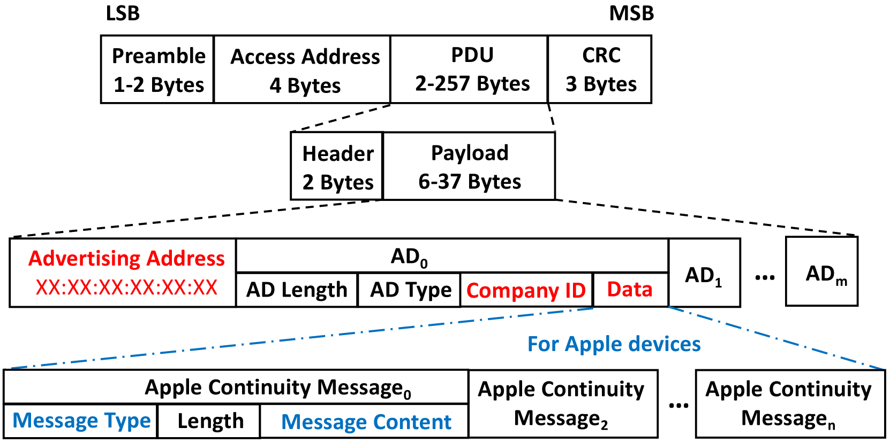

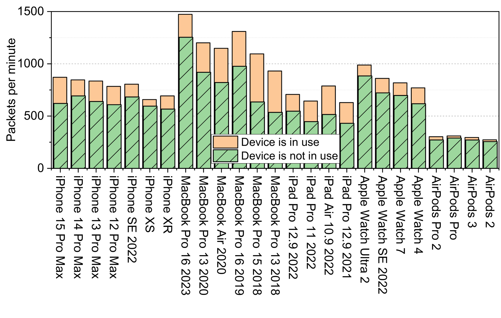

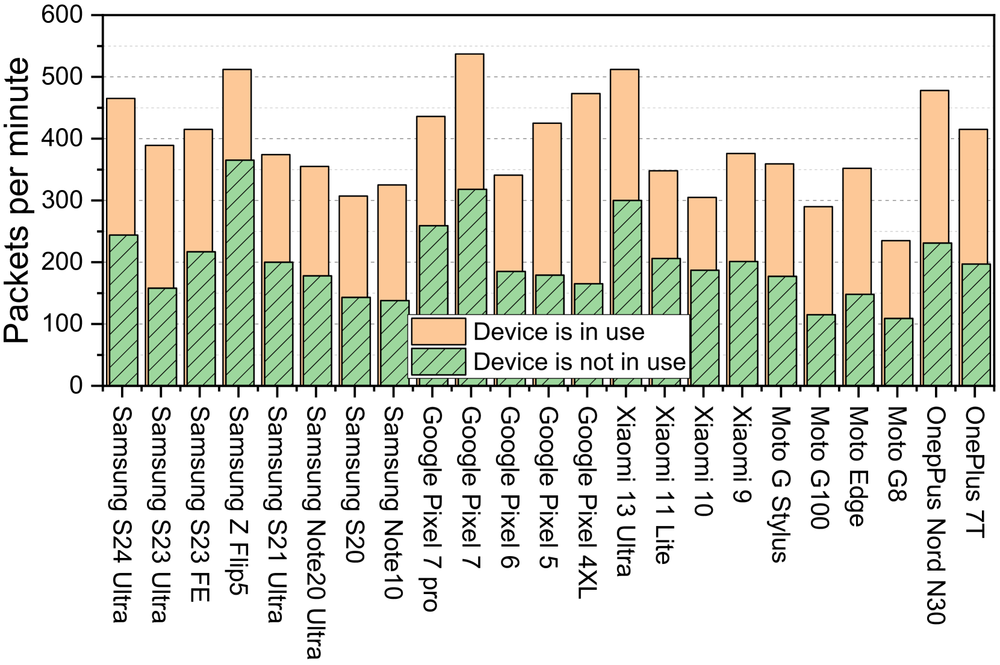

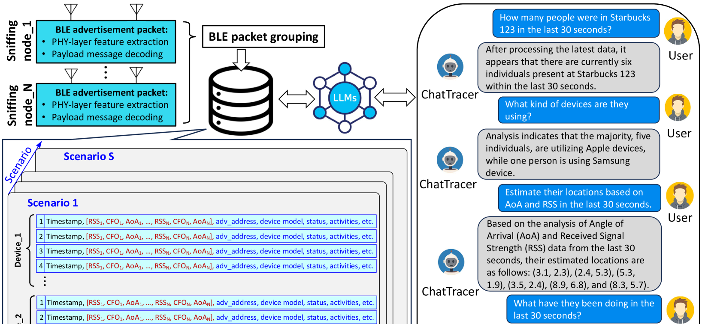

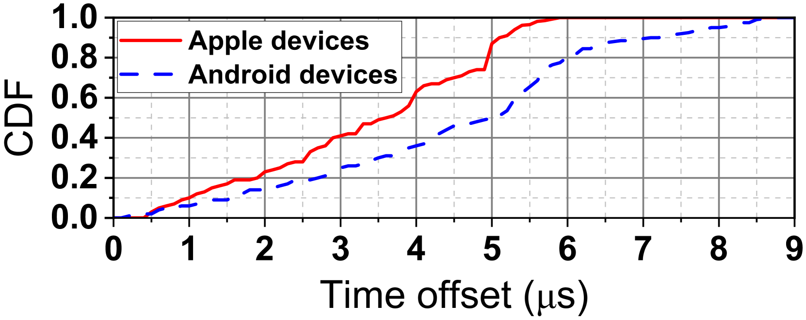

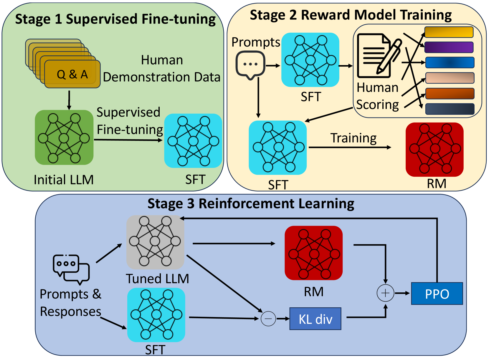

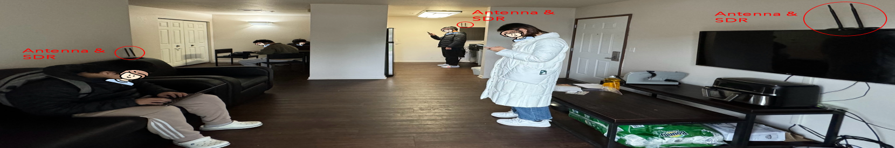

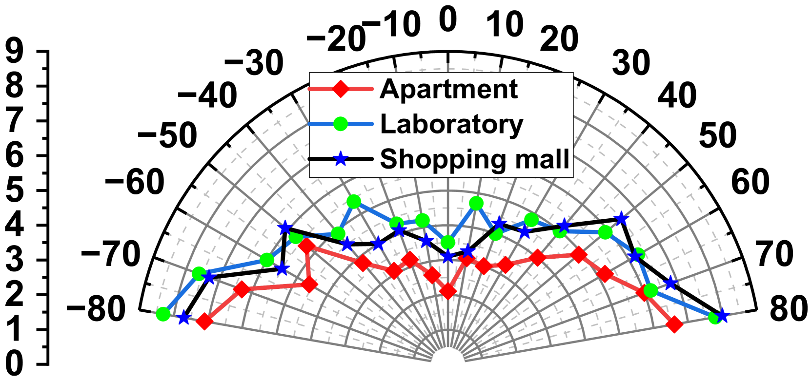

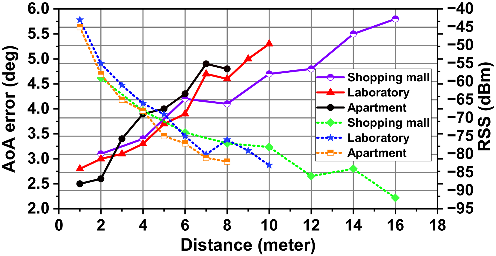

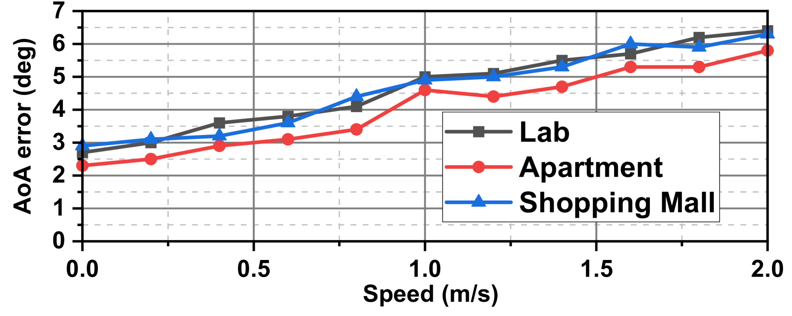

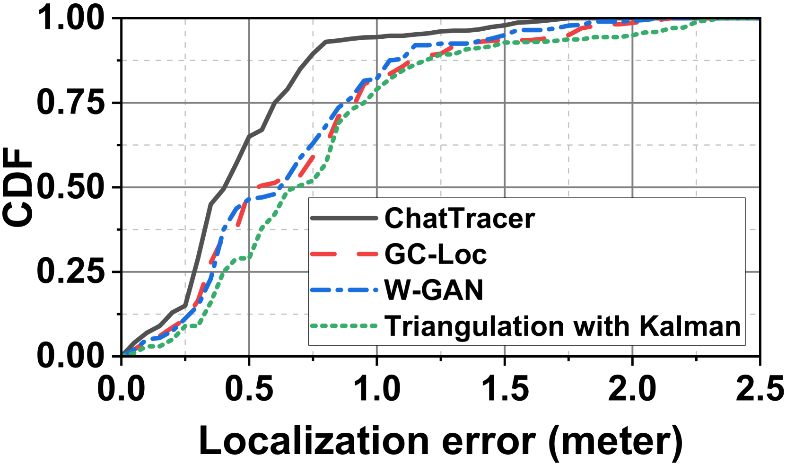

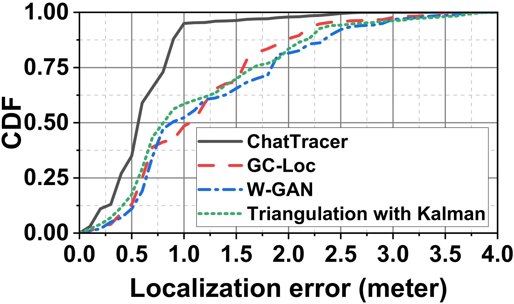

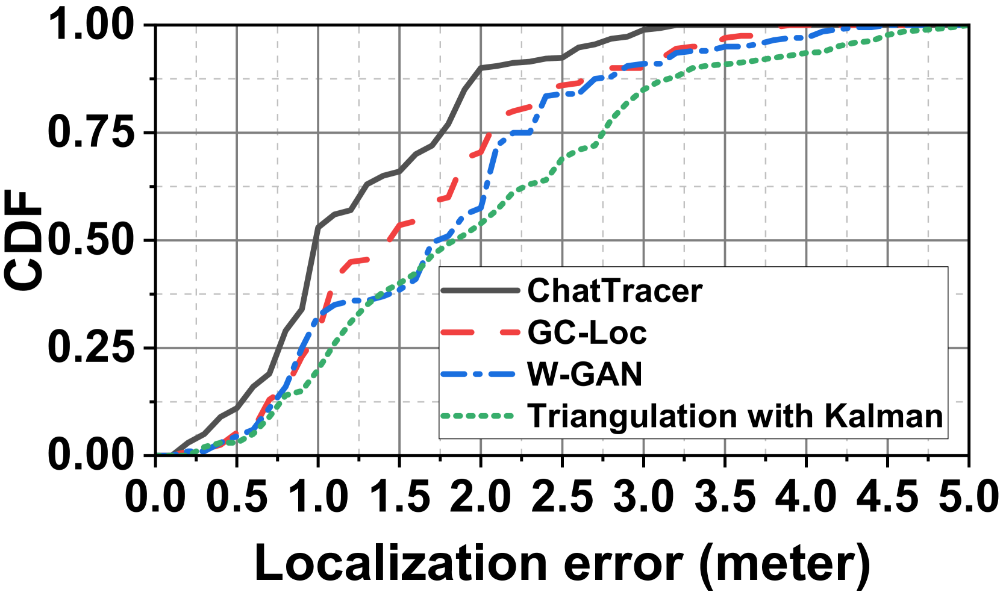

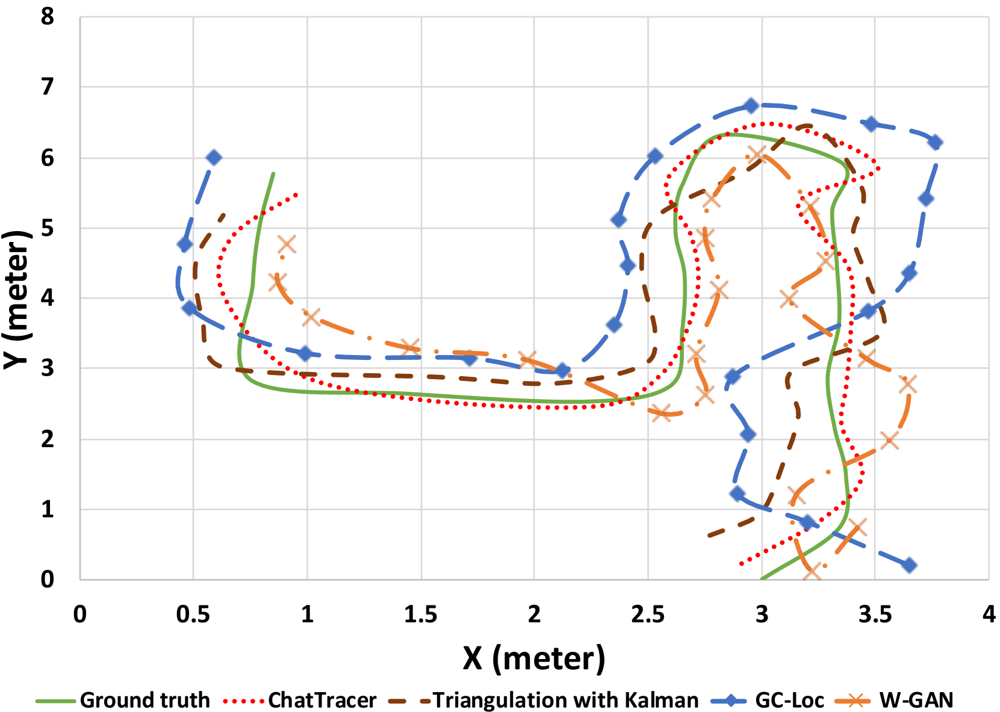

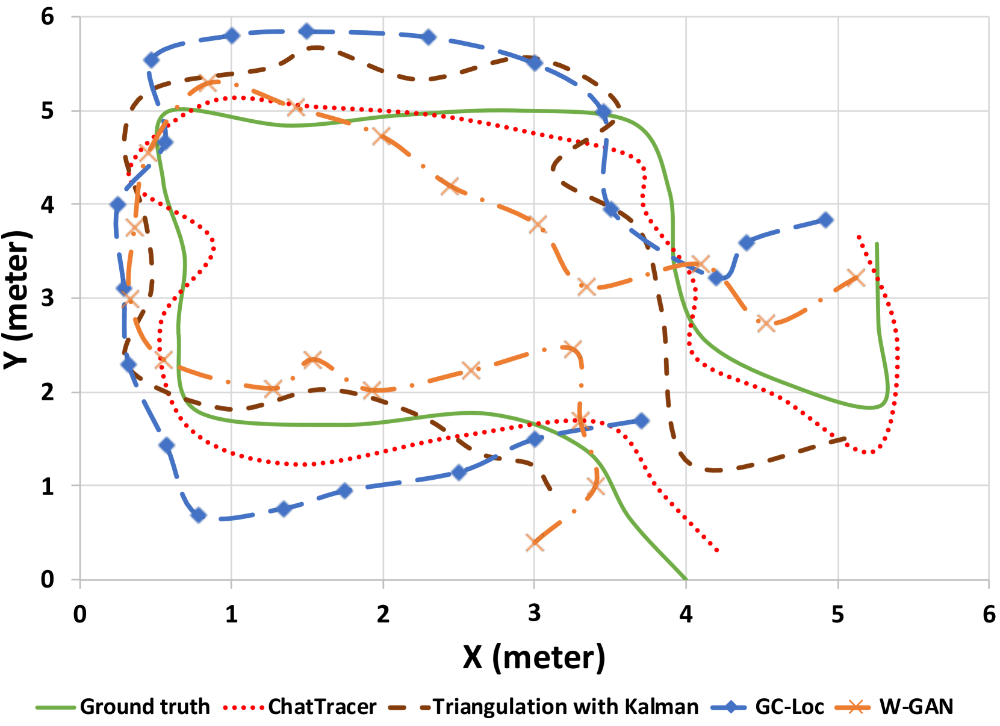

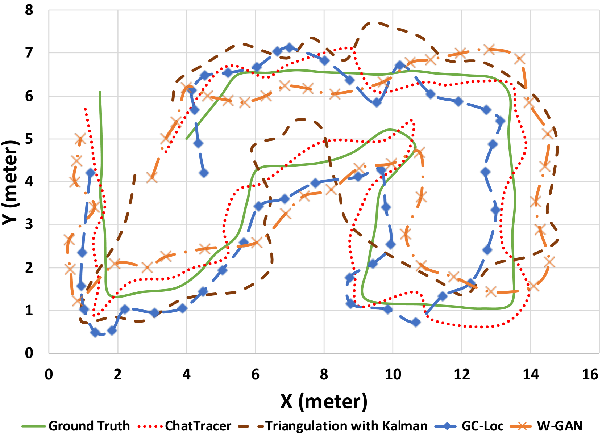

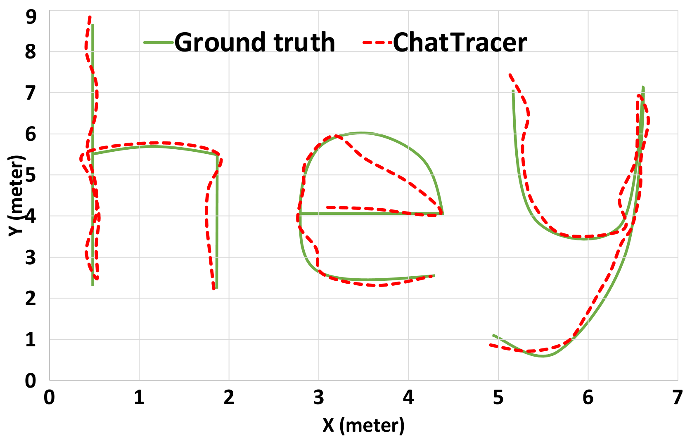

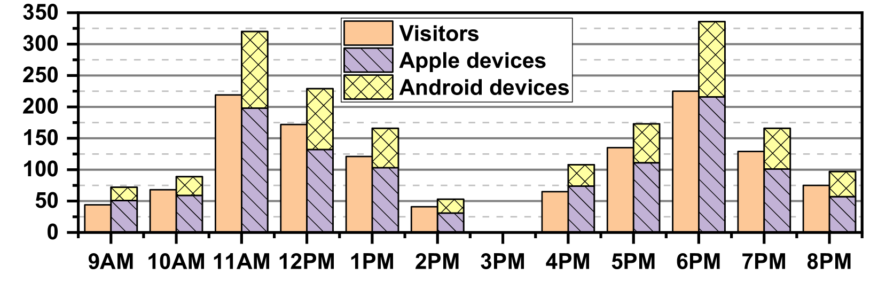

[Arxiv](https://arxiv.org/abs/2403.19833)