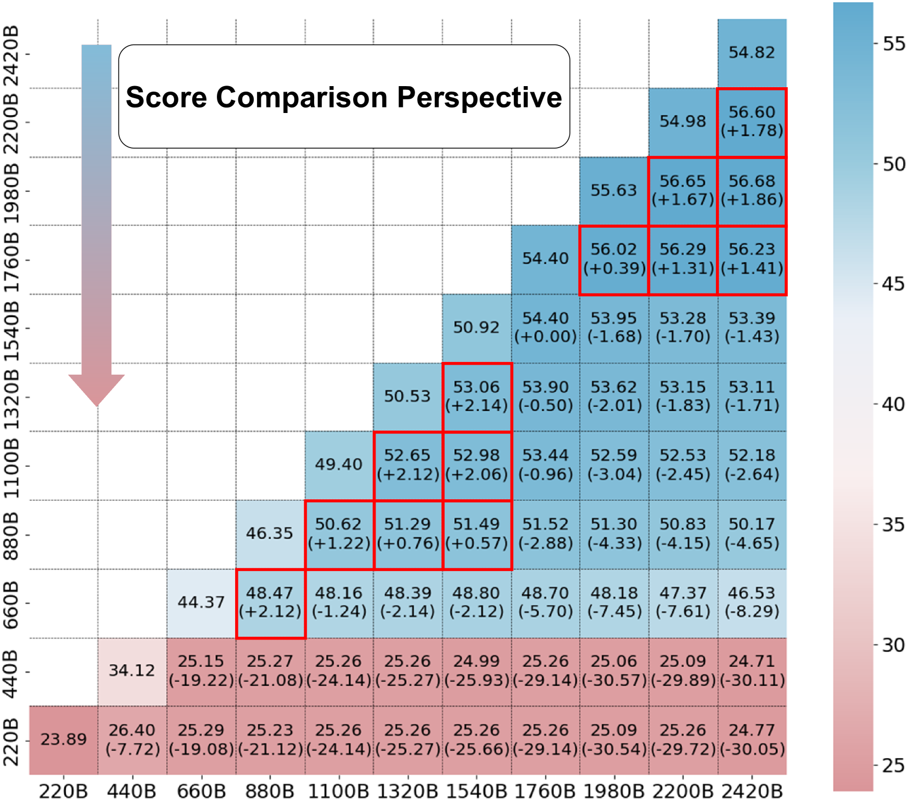
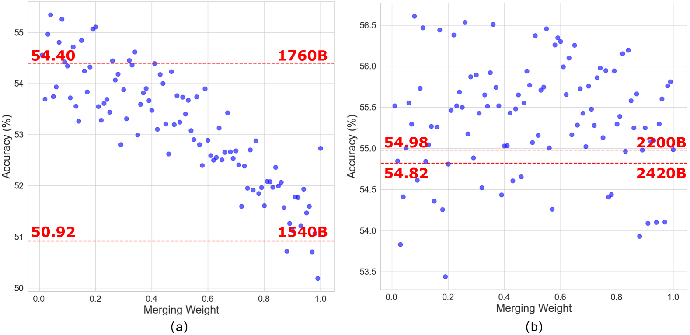
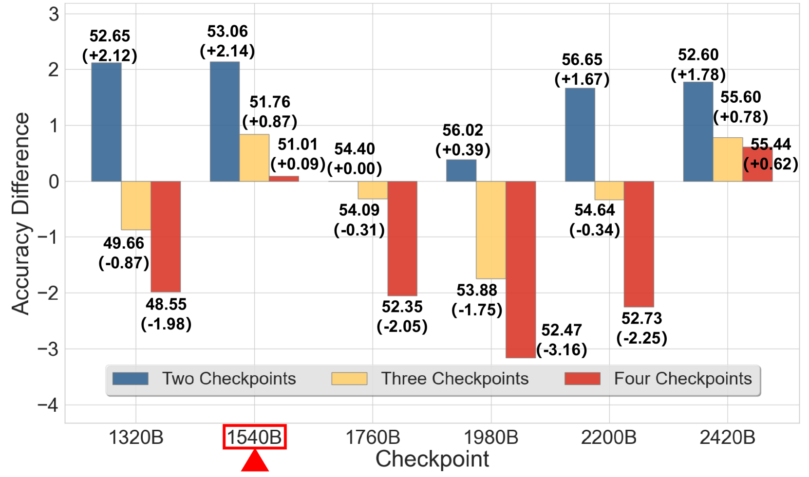
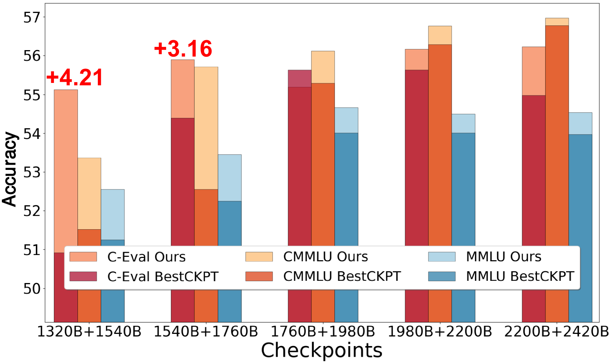
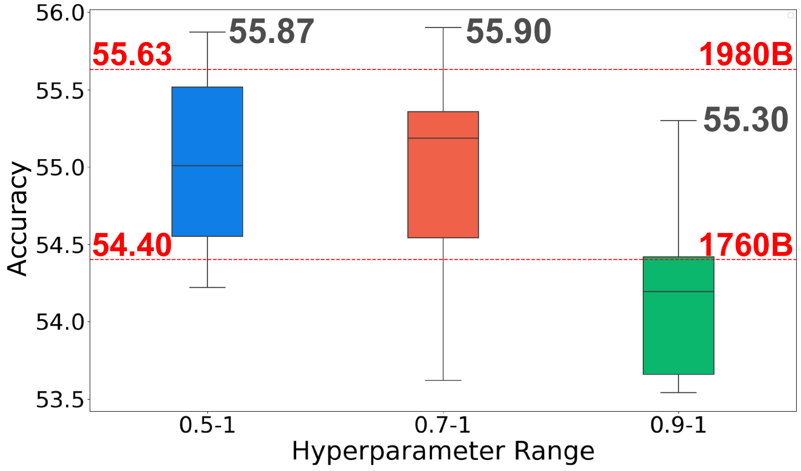
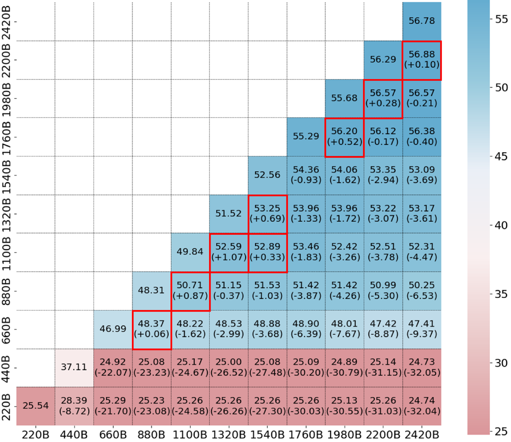
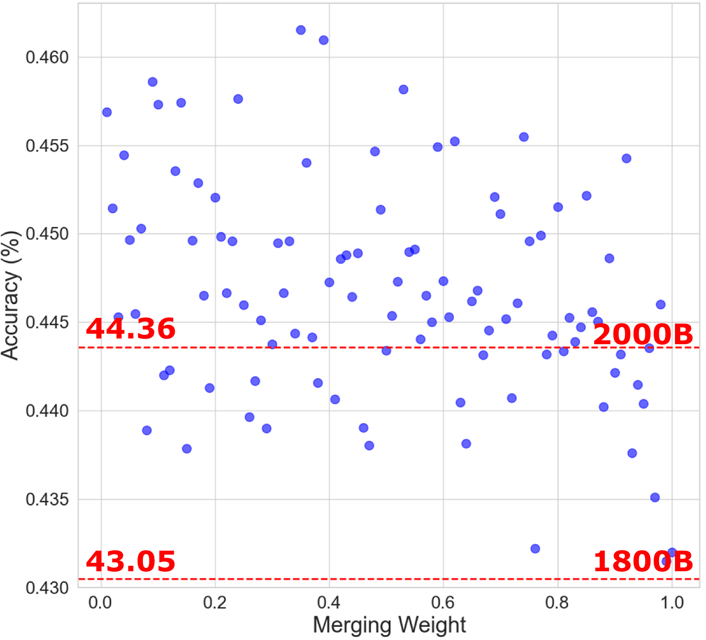

# 在大型语言模型预训练阶段，我们采用贝叶斯优化技术来实现检查点的融合。

发布时间：2024年03月28日

`LLM理论` `预训练` `资源优化`

> Checkpoint Merging via Bayesian Optimization in LLM Pretraining

# 摘要

> 随着 GPT-4、Gemini 等大型语言模型的风靡，其训练过程中对资源的巨大需求引发了严峻挑战，原因在于其高昂的计算和环境代价。为此，我们提出了一种预训练 LLM 时的检查点合并策略。该策略通过共享训练路径的 LLM 检查点，并采用贝叶斯优化在广阔的搜索空间内寻找最优合并权重。实验表明，这种方法不仅能有效提升预训练效果，实现低成本高回报，而且在需要特定测试数据集的情况下，仍能展现出跨领域的强大泛化能力，这对于预训练至关重要。

> The rapid proliferation of large language models (LLMs) such as GPT-4 and Gemini underscores the intense demand for resources during their training processes, posing significant challenges due to substantial computational and environmental costs. To alleviate this issue, we propose checkpoint merging in pretraining LLM. This method utilizes LLM checkpoints with shared training trajectories, and is rooted in an extensive search space exploration for the best merging weight via Bayesian optimization. Through various experiments, we demonstrate that: (1) Our proposed methodology exhibits the capacity to augment pretraining, presenting an opportunity akin to obtaining substantial benefits at minimal cost; (2) Our proposed methodology, despite requiring a given held-out dataset, still demonstrates robust generalization capabilities across diverse domains, a pivotal aspect in pretraining.

[Arxiv](https://arxiv.org/abs/2403.19390)