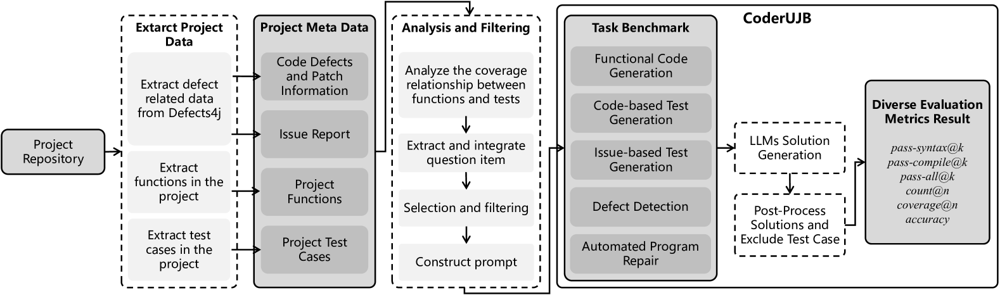
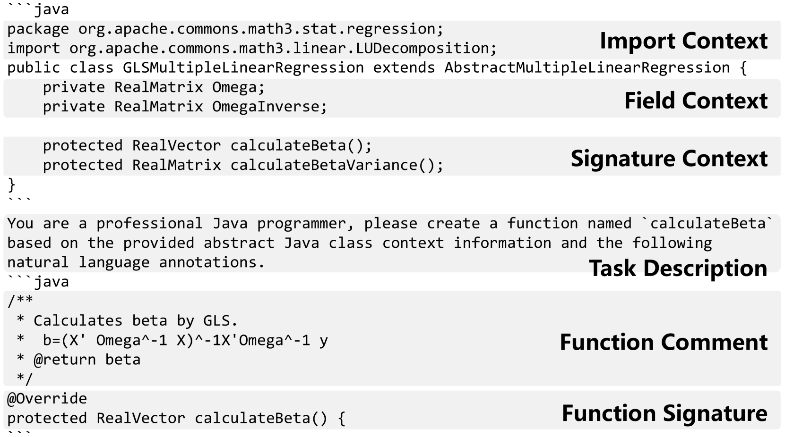
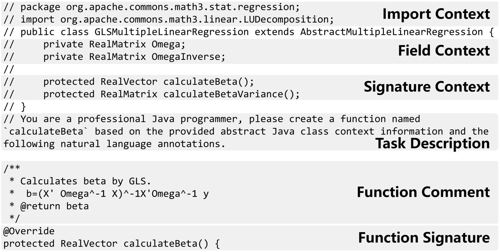
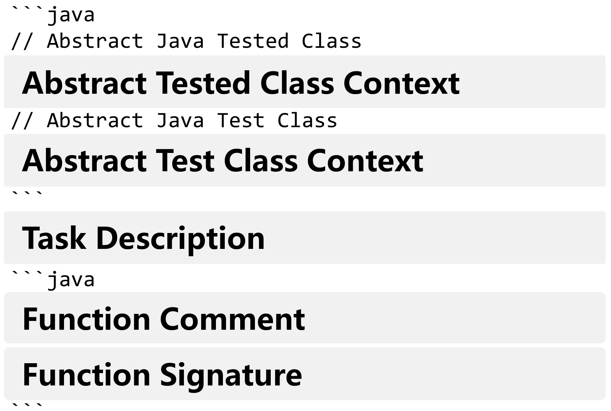
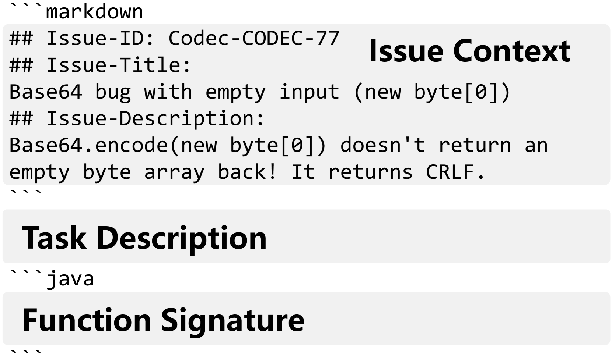
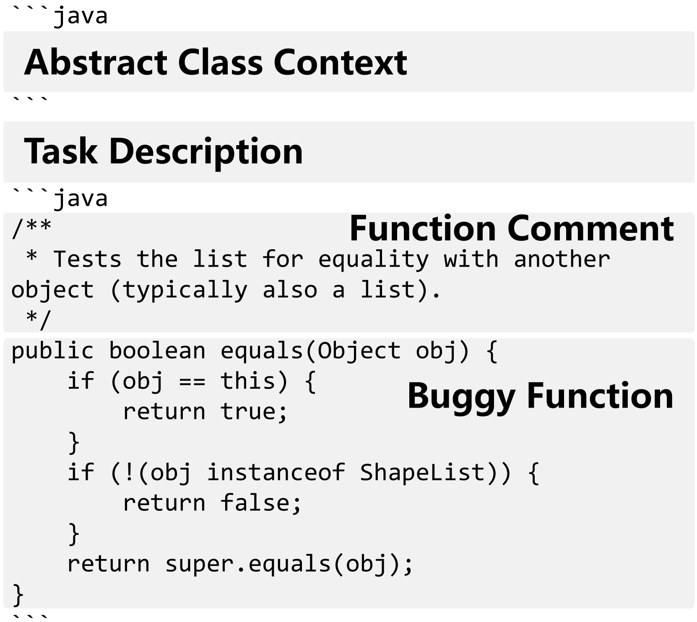
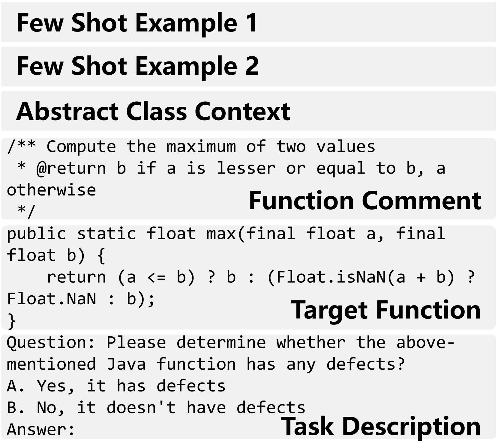
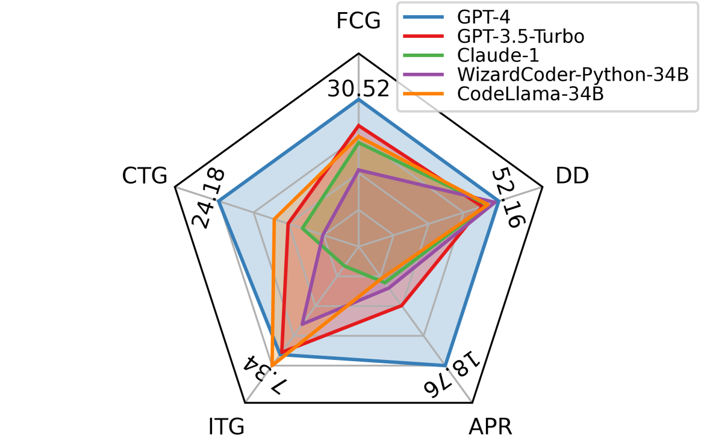

# CoderUJB 是一个实用的 Java 基准测试工具，它能够统一执行各种实际编程任务。

发布时间：2024年03月28日

`LLM应用` `软件工程` `编程语言`

> CoderUJB: An Executable and Unified Java Benchmark for Practical Programming Scenarios

# 摘要

> 在软件工程领域，为大型语言模型（LLMs）量身定制的模型正不断发展，迫切需要一套能真实反映实际开发环境的基准测试。现有的基准测试要么太简化，要么无法充分体现软件开发的多任务特点。针对这一问题，我们推出了 CoderUJB，这是一个全新的基准测试，旨在全面评估LLMs 在实际开发场景中执行多样化Java编程任务的能力，这一测试充分考虑到Java在现实软件开发中的广泛应用。CoderUJB 包含了来自17个真实开源Java项目的2,239个编程问题，覆盖了五个实用的编程任务。我们通过这个基准测试对各类开源和闭源LLMs 的编码技能进行了实证研究，探讨了在特定编程语言代码上持续预训练和指令微调对模型性能的影响。研究发现，尽管LLMs 展现出巨大的潜力，但在非功能性代码生成（如测试生成和缺陷检测）方面仍面临挑战。值得注意的是，我们在特定编程语言的持续预训练和指令微调方面提出了谨慎建议，因为这些方法可能会影响模型在某些任务上的表现，这暗示我们需要采取更为精细的策略。CoderUJB 的推出，为评估LLMs 在编程能力方面提供了更加真实的基准，我们的研究为这些模型在未来软件工程领域的进一步发展提供了重要的洞见。

> In the evolving landscape of large language models (LLMs) tailored for software engineering, the need for benchmarks that accurately reflect real-world development scenarios is paramount. Current benchmarks are either too simplistic or fail to capture the multi-tasking nature of software development. To address this, we introduce CoderUJB, a new benchmark designed to evaluate LLMs across diverse Java programming tasks that are executable and reflective of actual development scenarios, acknowledging Java's prevalence in real-world software production. CoderUJB comprises 2,239 programming questions derived from 17 real open-source Java projects and spans five practical programming tasks. Our empirical study on this benchmark investigates the coding abilities of various open-source and closed-source LLMs, examining the effects of continued pre-training in specific programming languages code and instruction fine-tuning on their performance. The findings indicate that while LLMs exhibit strong potential, challenges remain, particularly in non-functional code generation (e.g., test generation and defect detection). Importantly, our results advise caution in the specific programming languages continued pre-training and instruction fine-tuning, as these techniques could hinder model performance on certain tasks, suggesting the need for more nuanced strategies. CoderUJB thus marks a significant step towards more realistic evaluations of programming capabilities in LLMs, and our study provides valuable insights for the future development of these models in software engineering.

[Arxiv](https://arxiv.org/abs/2403.19287)