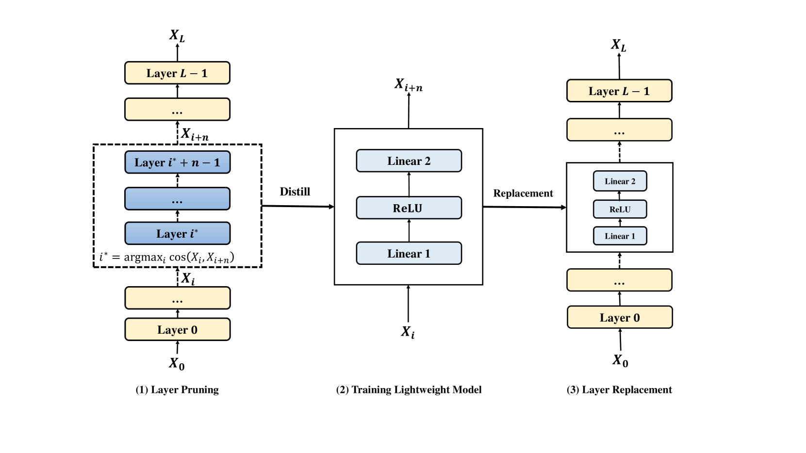

# 本研究探讨了通过剔除大型语言模型中非关键层级，实现模型压缩的新方法。

发布时间：2024年03月28日

`LLM理论` `模型压缩`

> Compressing Large Language Models by Streamlining the Unimportant Layer

# 摘要

> 大型语言模型（LLM）在自然语言处理任务中得到了广泛应用，但其庞大的参数量限制了其应用范围。因此，研究者们开始关注那些体积小巧、性能卓越的紧凑模型。本研究发现，LLM的不同层次对隐藏状态的扰动程度各异，这让我们得以筛选出相对不那么关键的层次。据此，我们推出了LLM-Streamline方案，包括两个步骤：首先进行层剪枝，剔除模型中重要性最低的连续层次，以达到预定的稀疏度目标；其次进行层替换，训练一个轻量级模型来填补剪枝后的空缺，以减少性能损失。实验中，我们采用多层感知器（MLP）和变换器层等轻量级结构，最终证实单一MLP足以胜任填补剪枝层次的任务。广泛的实验结果显示，LLM-Streamline方案在性能上超越了现有的最先进模型剪枝技术。

> Large language models (LLM) have been extensively applied in various natural language tasks and domains, but their applicability is constrained by the large number of parameters of the models. Consequently, there is an increasing emphasis on compact models that exhibit high performance. In this study, we observe that different layers in LLM have varying degrees of perturbation on the hidden states, which allows us to identify less important layers. Based on this phenomenon, we propose LLM-Streamline, which consists of two parts: layer pruning, where we remove a set of consecutive layers with the lowest importance in the model according to the target sparsity; and layer replacement, where we train a lightweight model to substitute the pruned layers, thereby mitigating the performance degradation caused by pruning. In our experiments, we utilize structures such as a multi-layer perceptron (MLP) and a transformer layer as lightweight models and ultimately demonstrate that a single MLP can effectively fit the pruned layers. Comprehensive experiments show that our proposed method, LLM-Streamline, outperforms previous state-of-the-art (SOTA) model pruning methods.

[Arxiv](https://arxiv.org/abs/2403.19135)