# 借助视觉-语言模型，我们对神经网络进行基于概念的深入分析。

发布时间：2024年03月28日

`RAG` `计算机视觉` `多模态学习`

> Concept-based Analysis of Neural Networks via Vision-Language Models

# 摘要

> 对基于视觉的深度神经网络（DNNs）进行严谨分析虽备受期待，却因视觉任务规范难以界定和缺乏高效的验证流程而充满挑战。本文提出运用新兴的多模态视觉-语言基础模型（VLMs）来透视视觉模型的内在逻辑。VLMs得益于在大量图像及对应文本描述上的训练，隐含地掌握了描述图像的高层次、人类易懂概念。我们设计了逻辑规范语言$\texttt{Con}_{\texttt{spec}}$，以便基于这些概念来编写规范。为了界定并严格检验$\texttt{Con}_{\texttt{spec}}$规范，我们借助VLM的能力，对视觉模型的自然语言特性进行编码和高效验证。我们通过在RIVAL-10数据集上训练的基于ResNet的分类器，并以CLIP作为多模态模型，展示了我们的技术。

> Formal analysis of vision-based deep neural networks (DNNs) is highly desirable but it is very challenging due to the difficulty of expressing formal specifications for vision tasks and the lack of efficient verification procedures. In this paper, we propose to leverage emerging multimodal, vision-language, foundation models (VLMs) as a lens through which we can reason about vision models. VLMs have been trained on a large body of images accompanied by their textual description, and are thus implicitly aware of high-level, human-understandable concepts describing the images. We describe a logical specification language $\texttt{Con}_{\texttt{spec}}$ designed to facilitate writing specifications in terms of these concepts. To define and formally check $\texttt{Con}_{\texttt{spec}}$ specifications, we leverage a VLM, which provides a means to encode and efficiently check natural-language properties of vision models. We demonstrate our techniques on a ResNet-based classifier trained on the RIVAL-10 dataset leveraging CLIP as the multimodal model.

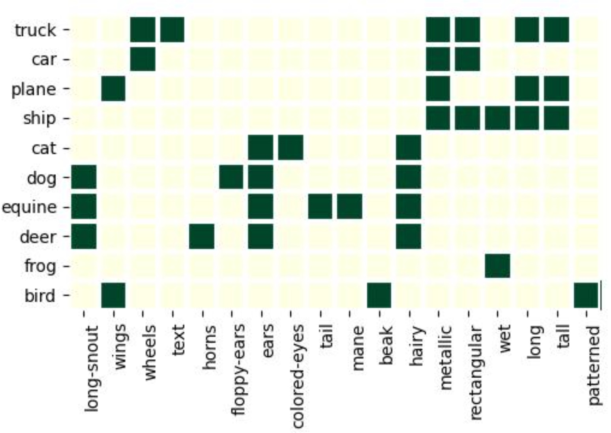

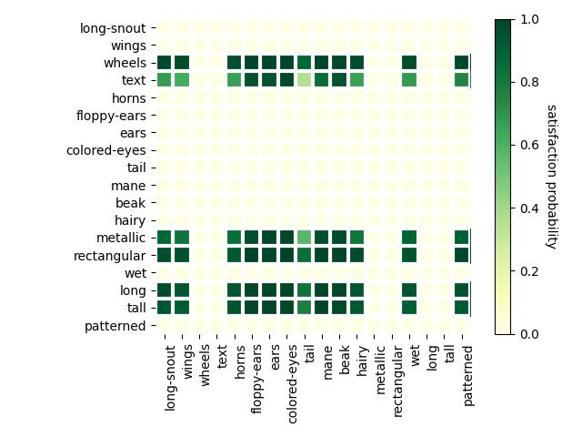

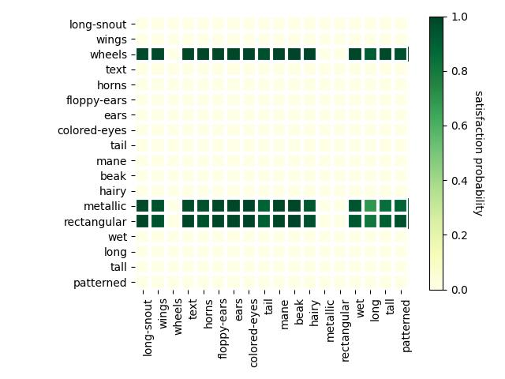

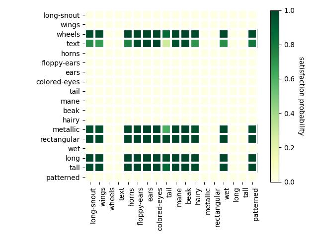

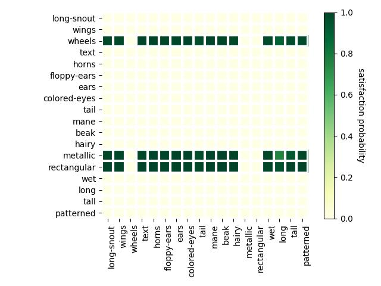

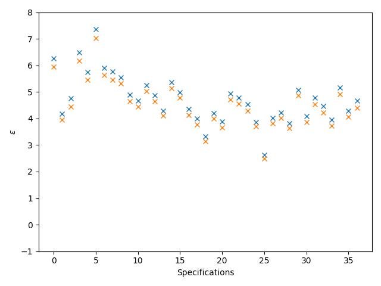

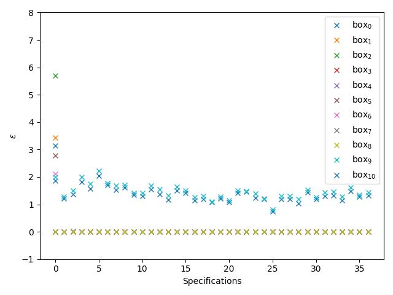

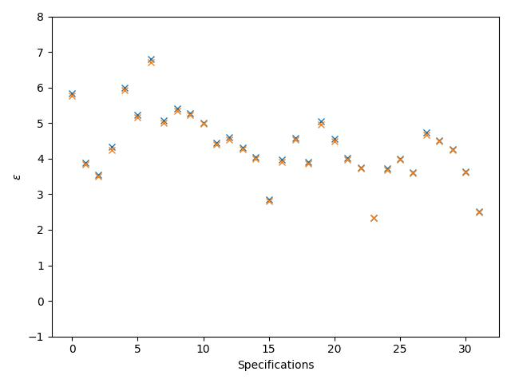

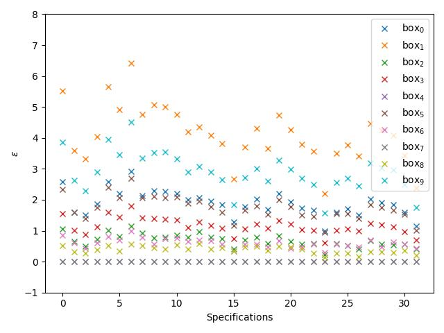

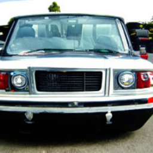

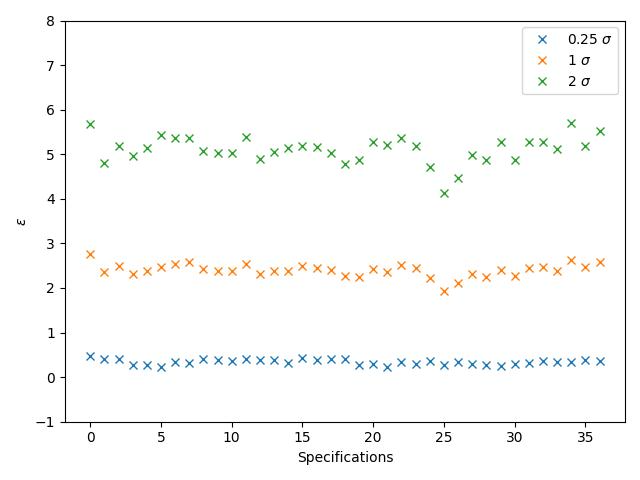

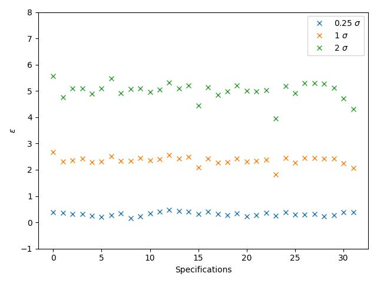

[Arxiv](https://arxiv.org/abs/2403.19837)